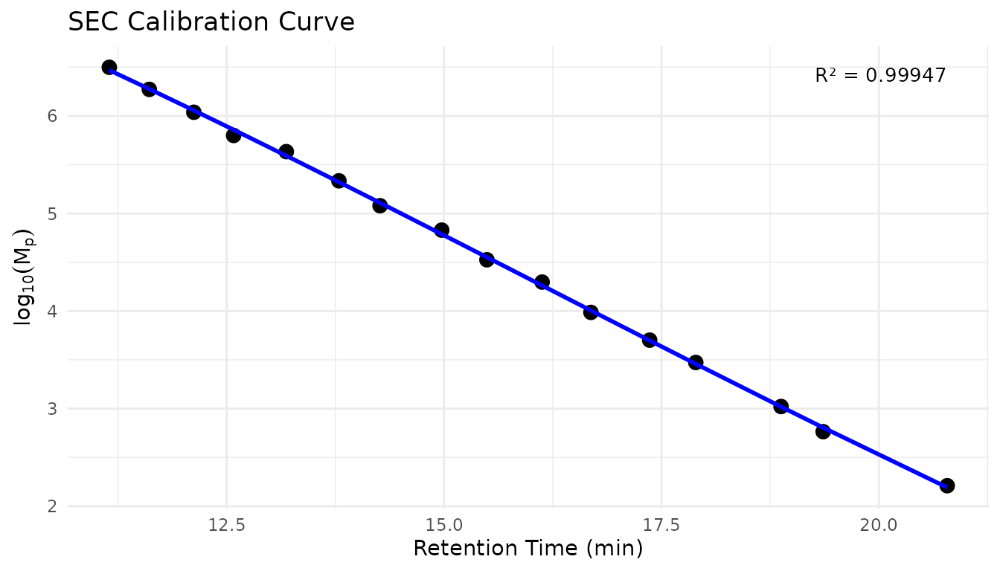
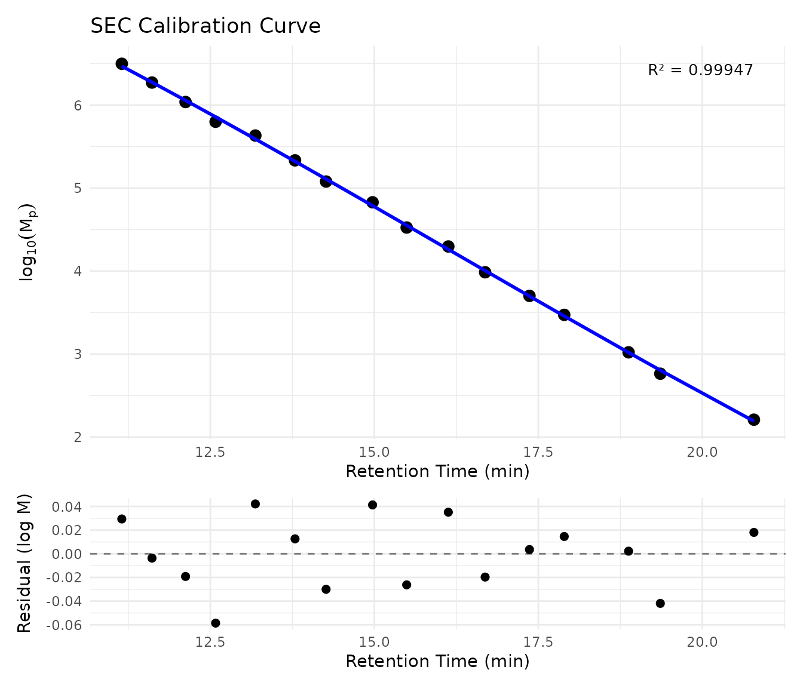

# Calibration Management

## Overview

This guide shows you how to save, load, and reuse SEC calibrations with
measure.sec. Key tasks covered:

1.  Save a calibration from a prepped recipe
2.  Load and reuse a saved calibration
3.  Inspect calibration quality
4.  Compare calibrations over time

## Setup

``` r
library(measure)
#> Loading required package: recipes
#> Loading required package: dplyr
#> 
#> Attaching package: 'dplyr'
#> The following objects are masked from 'package:stats':
#> 
#>     filter, lag
#> The following objects are masked from 'package:base':
#> 
#>     intersect, setdiff, setequal, union
#> 
#> Attaching package: 'recipes'
#> The following object is masked from 'package:stats':
#> 
#>     step
library(measure.sec)
library(recipes)
library(dplyr)
library(ggplot2)
```

## How to Create and Save a Calibration

### Step 1: Fit a Calibration

First, create a recipe with calibration standards and prep it to fit the
calibration:

``` r
# Load polystyrene standards
data(sec_ps_standards)

# View the standards
sec_ps_standards |>
  select(standard_name, mp, log_mp, retention_time) |>
  head(8)
#> # A tibble: 8 × 4
#>   standard_name      mp log_mp retention_time
#>   <chr>           <dbl>  <dbl>          <dbl>
#> 1 PS-3150000    3150000   6.50           11.2
#> 2 PS-1870000    1870000   6.27           11.6
#> 3 PS-1090000    1090000   6.04           12.1
#> 4 PS-630000      630000   5.80           12.6
#> 5 PS-430000      430000   5.63           13.2
#> 6 PS-216000      216000   5.33           13.8
#> 7 PS-120000      120000   5.08           14.3
#> 8 PS-67500        67500   4.83           15.0
```

``` r
# Prepare standards with required column names
# The step expects 'retention' and 'log_mw' columns
ps_cal_standards <- sec_ps_standards |>
  select(retention = retention_time, log_mw = log_mp)

# Create a simple data frame for the recipe
# (In practice, this would be your chromatogram data)
sample_data <- tibble(
  sample_id = "test",
  elution_time = seq(10, 20, by = 0.01),
  ri_signal = dnorm(seq(10, 20, by = 0.01), mean = 14, sd = 1)
)

# Create and prep a recipe with conventional calibration
rec <- recipe(~ ., data = sample_data) |>
  step_measure_input_long(
    ri_signal,
    location = vars(elution_time),
    col_name = "ri"
  ) |>
  step_sec_conventional_cal(
    standards = ps_cal_standards,
    fit_type = "cubic"
  )

# Prep the recipe (this fits the calibration)
prepped <- prep(rec)
#> Warning: Standard at 12.58 has 14.4% MW deviation.
#> ℹ Consider removing outlier standards or using a different fit type.
#> Warning: 115 points (11.5%) are outside calibration range.
#> ℹ Calibration range: 11.15 to 20.79
```

### Step 2: Save the Calibration

Use
[`save_sec_calibration()`](https://jameshwade.github.io/measure-sec/reference/save_sec_calibration.md)
to extract and save the calibration for reuse:

``` r
# Create a temporary file for this example
cal_file <- tempfile(fileext = ".rds")

# Save with metadata for traceability
save_sec_calibration(
 prepped,
  cal_file,
  metadata = list(
    column = "PLgel 5um Mixed-C",
    instrument = "Agilent 1260",
    analyst = "JW",
    notes = "Monthly calibration - January 2024"
  )
)
#> ✔ Saved cubic calibration to /tmp/RtmpRLDlD3/file214024031a9.rds
```

### Format Options

Two formats are supported:

| Format | Extension | Best For                                 |
|--------|-----------|------------------------------------------|
| RDS    | `.rds`    | Default. Preserves all R objects exactly |
| YAML   | `.yaml`   | Human-readable, good for version control |

``` r
# Save as YAML for human readability
save_sec_calibration(prepped, "calibration.yaml")
```

## How to Load and Reuse a Calibration

### Load a Saved Calibration

``` r
# Load the calibration
cal <- load_sec_calibration(cal_file)
#> ℹ Loaded cubic calibration (R\u00b2 = 0.9995)

# View calibration details
print(cal)
#> 
#> ── SEC Calibration ─────────────────────────────────────────────────────────────
#> Fit type: cubic (degree 3)
#> Calibration range: 11.15 to 20.79
#> Standards: 16
#> 
#> ── Fit Quality ──
#> 
#> R\u00b2: 0.999466
#> RMSE (log MW): 0.0294
#> Max % deviation: 14.43%
#> 
#> ── Settings ──
#> 
#> Extrapolation: warn
#> Output column: mw
#> Log output: TRUE
#> 
#> ── Metadata ──
#> 
#> Created: 2026-01-05 01:49:01
#> measure.sec version: 0.0.0.9000
#> 
#> ── User Metadata
#> column: PLgel 5um Mixed-C
#> instrument: Agilent 1260
#> analyst: JW
#> notes: Monthly calibration - January 2024
```

### Use in a New Recipe

Pass the loaded calibration to
[`step_sec_conventional_cal()`](https://jameshwade.github.io/measure-sec/reference/step_sec_conventional_cal.md)
to skip fitting:

``` r
# New sample data
new_samples <- tibble(
  sample_id = "unknown_polymer",
  elution_time = seq(10, 20, by = 0.01),
  ri_signal = dnorm(seq(10, 20, by = 0.01), mean = 15, sd = 0.8)
)

# Create recipe using saved calibration (no fitting needed)
rec_new <- recipe(~ ., data = new_samples) |>
  step_measure_input_long(
    ri_signal,
    location = vars(elution_time),
    col_name = "ri"
  ) |>
  step_sec_conventional_cal(calibration = cal)

# Prep and bake
prepped_new <- prep(rec_new)
#> ℹ Using pre-loaded cubic calibration (R\u00b2 = 0.9995)
#> Warning: 115 points (11.5%) are outside calibration range.
#> ℹ Calibration range: 11.15 to 20.79
result <- bake(prepped_new, new_data = NULL)
```

## How to Inspect Calibration Quality

### View Fit Diagnostics

``` r
# Summary shows per-standard results
summary(cal)
#> 
#> ── SEC Calibration ─────────────────────────────────────────────────────────────
#> Fit type: cubic (degree 3)
#> Calibration range: 11.15 to 20.79
#> Standards: 16
#> 
#> ── Fit Quality ──
#> 
#> R\u00b2: 0.999466
#> RMSE (log MW): 0.0294
#> Max % deviation: 14.43%
#> 
#> ── Settings ──
#> 
#> Extrapolation: warn
#> Output column: mw
#> Log output: TRUE
#> 
#> ── Metadata ──
#> 
#> Created: 2026-01-05 01:49:01
#> measure.sec version: 0.0.0.9000
#> 
#> ── User Metadata
#> column: PLgel 5um Mixed-C
#> instrument: Agilent 1260
#> analyst: JW
#> notes: Monthly calibration - January 2024
#> 
#> ── Per-Standard Results ──
#> 
#> # A tibble: 16 × 10
#>    location actual_log_mw predicted_log_mw residual_log_mw actual_mw
#>       <dbl>         <dbl>            <dbl>           <dbl>     <dbl>
#>  1     11.2          6.50             6.47         0.0294   3150000.
#>  2     11.6          6.27             6.28        -0.00364  1870000.
#>  3     12.1          6.04             6.06        -0.0192   1090000 
#>  4     12.6          5.80             5.86        -0.0585    630000.
#>  5     13.2          5.63             5.59         0.0421    430000.
#>  6     13.8          5.33             5.32         0.0126    216000 
#>  7     14.3          5.08             5.11        -0.0300    120000.
#>  8     15.0          4.83             4.79         0.0413     67500.
#>  9     15.5          4.53             4.55        -0.0262     33500.
#> 10     16.1          4.30             4.26         0.0352     19800 
#> 11     16.7          3.99             4.01        -0.0197      9680 
#> 12     17.4          3.70             3.70         0.00359     5030 
#> 13     17.9          3.47             3.46         0.0146      2970 
#> 14     18.9          3.02             3.02         0.00222     1050 
#> 15     19.4          2.76             2.81        -0.0419       580 
#> 16     20.8          2.21             2.19         0.0181       162 
#> # ℹ 5 more variables: predicted_mw <dbl>, pct_deviation <dbl>,
#> #   prediction_se <dbl>, ci_lower_log_mw <dbl>, ci_upper_log_mw <dbl>
```

### Key Quality Metrics

| Metric          | Good Value | Meaning                       |
|-----------------|------------|-------------------------------|
| R²              | \> 0.999   | Fit explains variance         |
| RMSE (log MW)   | \< 0.05    | Prediction error in log units |
| Max % deviation | \< 5%      | Worst individual standard     |

### Visualize the Calibration Curve

``` r
# Plot calibration curve from standards data
plot_sec_calibration(sec_ps_standards)
```



``` r
# With residuals panel to check for systematic errors
plot_sec_calibration(sec_ps_standards, show_residuals = TRUE)
```



## When to Recalibrate vs. Reuse

### Reuse Existing Calibration When:

- Same column and mobile phase
- Column performance is stable (check plate count)
- Within your lab’s validated timeframe (typically 1-4 weeks)
- Running routine samples

### Recalibrate When:

- New column installed
- Mobile phase composition changed
- Column performance has degraded
- Significant time has passed
- Method validation requires fresh calibration
- Results seem inconsistent

## Best Practices

### Naming Conventions

Use descriptive, consistent file names:

``` r
# Good: includes key information
"ps_plgel-mixed-c_2024-01-15.rds"
"pmma_superose6_instrument2_2024-01.yaml"

# Avoid: ambiguous names
"calibration.rds"
"cal_new.rds"
```

### Include Metadata

Always add metadata for traceability:

``` r
save_sec_calibration(
  prepped,
  "ps_calibration.rds",
  metadata = list(
    column = "PLgel 5um Mixed-C, S/N ABC123",
    instrument = "Agilent 1260 #2",
    analyst = "Jane Doe",
    date = Sys.Date(),
    mobile_phase = "THF + 0.1% BHT",
    flow_rate = "1.0 mL/min",
    temperature = "35C",
    notes = "Monthly recalibration after column flush"
  )
)
```

### Version Control (YAML Format)

For labs using git or similar version control:

``` r
# YAML format is diff-friendly
save_sec_calibration(prepped, "calibrations/ps_current.yaml")

# Git will show meaningful diffs when calibration changes
```

### Lab Workflow Integration

A typical workflow:

1.  **Monthly**: Run calibration standards, save new calibration with
    date
2.  **Daily**: Load current calibration for sample analysis
3.  **Archive**: Keep old calibrations for historical reference
4.  **Compare**: Periodically compare calibrations to detect drift

``` r
# Monthly calibration routine
monthly_cal <- prep(calibration_recipe)
save_sec_calibration(
  monthly_cal,
  sprintf("calibrations/ps_%s.rds", format(Sys.Date(), "%Y-%m")),
  metadata = list(analyst = Sys.info()["user"])
)

# Daily sample analysis
cal <- load_sec_calibration("calibrations/ps_2024-01.rds")
samples_recipe <- recipe(...) |>
  step_sec_conventional_cal(calibration = cal) |>
  prep()
```

## Cleanup

``` r
# Remove temporary file
unlink(cal_file)
```

## See Also

- [Getting
  Started](https://jameshwade.github.io/measure-sec/articles/getting-started.md) -
  Basic SEC workflow and concepts
- [System
  Suitability](https://jameshwade.github.io/measure-sec/articles/system-suitability.md) -
  Validate column performance
- [Multi-Detector
  SEC](https://jameshwade.github.io/measure-sec/articles/triple-detection.md) -
  Absolute MW without calibration
- [Exporting
  Results](https://jameshwade.github.io/measure-sec/articles/exporting-results.md) -
  Summary tables and reports

## Session Info

``` r
sessionInfo()
#> R version 4.5.2 (2025-10-31)
#> Platform: x86_64-pc-linux-gnu
#> Running under: Ubuntu 24.04.3 LTS
#> 
#> Matrix products: default
#> BLAS:   /usr/lib/x86_64-linux-gnu/openblas-pthread/libblas.so.3 
#> LAPACK: /usr/lib/x86_64-linux-gnu/openblas-pthread/libopenblasp-r0.3.26.so;  LAPACK version 3.12.0
#> 
#> locale:
#>  [1] LC_CTYPE=C.UTF-8       LC_NUMERIC=C           LC_TIME=C.UTF-8       
#>  [4] LC_COLLATE=C.UTF-8     LC_MONETARY=C.UTF-8    LC_MESSAGES=C.UTF-8   
#>  [7] LC_PAPER=C.UTF-8       LC_NAME=C              LC_ADDRESS=C          
#> [10] LC_TELEPHONE=C         LC_MEASUREMENT=C.UTF-8 LC_IDENTIFICATION=C   
#> 
#> time zone: UTC
#> tzcode source: system (glibc)
#> 
#> attached base packages:
#> [1] stats     graphics  grDevices utils     datasets  methods   base     
#> 
#> other attached packages:
#> [1] ggplot2_4.0.1          measure.sec_0.0.0.9000 measure_0.0.1.9001    
#> [4] recipes_1.3.1          dplyr_1.1.4           
#> 
#> loaded via a namespace (and not attached):
#>  [1] gtable_0.3.6        xfun_0.55           bslib_0.9.0        
#>  [4] lattice_0.22-7      vctrs_0.6.5         tools_4.5.2        
#>  [7] generics_0.1.4      parallel_4.5.2      tibble_3.3.0       
#> [10] pkgconfig_2.0.3     Matrix_1.7-4        data.table_1.18.0  
#> [13] RColorBrewer_1.1-3  S7_0.2.1            desc_1.4.3         
#> [16] lifecycle_1.0.4     compiler_4.5.2      farver_2.1.2       
#> [19] textshaping_1.0.4   codetools_0.2-20    htmltools_0.5.9    
#> [22] class_7.3-23        sass_0.4.10         yaml_2.3.12        
#> [25] prodlim_2025.04.28  tidyr_1.3.2         pillar_1.11.1      
#> [28] pkgdown_2.2.0       jquerylib_0.1.4     MASS_7.3-65        
#> [31] cachem_1.1.0        gower_1.0.2         rpart_4.1.24       
#> [34] parallelly_1.46.0   lava_1.8.2          tidyselect_1.2.1   
#> [37] digest_0.6.39       future_1.68.0       purrr_1.2.0        
#> [40] listenv_0.10.0      labeling_0.4.3      splines_4.5.2      
#> [43] fastmap_1.2.0       grid_4.5.2          cli_3.6.5          
#> [46] magrittr_2.0.4      patchwork_1.3.2     utf8_1.2.6         
#> [49] survival_3.8-3      future.apply_1.20.1 withr_3.0.2        
#> [52] scales_1.4.0        lubridate_1.9.4     timechange_0.3.0   
#> [55] rmarkdown_2.30      globals_0.18.0      nnet_7.3-20        
#> [58] timeDate_4051.111   ragg_1.5.0          evaluate_1.0.5     
#> [61] knitr_1.51          hardhat_1.4.2       rlang_1.1.6        
#> [64] Rcpp_1.1.0          glue_1.8.0          ipred_0.9-15       
#> [67] jsonlite_2.0.0      R6_2.6.1            systemfonts_1.3.1  
#> [70] fs_1.6.6
```
