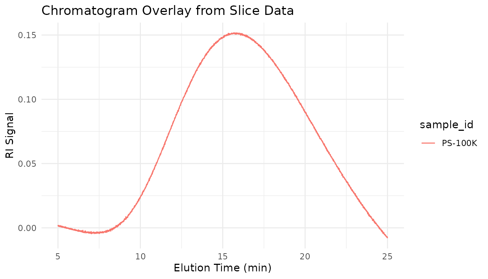

# Exporting Results

## Overview

After processing SEC data with measure.sec, you’ll need to export
results for reports, further analysis, or regulatory submissions. This
guide covers:

1.  Creating summary tables with MW averages
2.  Extracting slice-by-slice data for detailed analysis
3.  Comparing multiple samples side-by-side
4.  Generating automated reports
5.  Exporting to Excel, CSV, and other formats

## Quick Reference: Export Functions

| Function                                                                                                         | Purpose                 | Output                              |
|------------------------------------------------------------------------------------------------------------------|-------------------------|-------------------------------------|
| [`measure_sec_summary_table()`](https://jameshwade.github.io/measure-sec/reference/measure_sec_summary_table.md) | Per-sample MW averages  | Tibble with Mn, Mw, Mz, dispersity  |
| [`measure_sec_slice_table()`](https://jameshwade.github.io/measure-sec/reference/measure_sec_slice_table.md)     | Point-by-point data     | Long or wide format tibble          |
| [`measure_sec_compare()`](https://jameshwade.github.io/measure-sec/reference/measure_sec_compare.md)             | Multi-sample comparison | Summary, differences, optional plot |
| [`measure_sec_report()`](https://jameshwade.github.io/measure-sec/reference/measure_sec_report.md)               | Automated reports       | HTML, PDF, or Word document         |

## Setup

``` r
library(measure)
#> Loading required package: recipes
#> Loading required package: dplyr
#> 
#> Attaching package: 'dplyr'
#> The following objects are masked from 'package:stats':
#> 
#>     filter, lag
#> The following objects are masked from 'package:base':
#> 
#>     intersect, setdiff, setequal, union
#> 
#> Attaching package: 'recipes'
#> The following object is masked from 'package:stats':
#> 
#>     step
library(measure.sec)
library(recipes)
library(dplyr)
library(ggplot2)
```

## Creating Processed Data for Export

In a real workflow, you’d process SEC data through calibration and MW
averaging steps (see the [Getting
Started](https://jameshwade.github.io/measure-sec/articles/getting-started.md)
vignette). Here, we’ll create representative processed data to
demonstrate the export functions.

``` r
# Simulate processed SEC results with realistic MW values
# In practice, these columns come from step_sec_mw_averages()

processed <- tibble::tibble(
  sample_id = c("PS-50K", "PS-100K", "PS-200K"),
  polymer_type = "polystyrene",
  # MW averages (typical for narrow PS standards)
  mw_mn = c(48500, 97200, 195000),
  mw_mw = c(50200, 101000, 203000),
  mw_mz = c(52100, 105000, 211000),
  mw_dispersity = c(1.035, 1.039, 1.041),
  # Additional metadata
  injection_volume = 100,  # µL
  concentration = 2.0      # mg/mL
)

processed
#> # A tibble: 3 × 8
#>   sample_id polymer_type  mw_mn  mw_mw  mw_mz mw_dispersity injection_volume
#>   <chr>     <chr>         <dbl>  <dbl>  <dbl>         <dbl>            <dbl>
#> 1 PS-50K    polystyrene   48500  50200  52100          1.03              100
#> 2 PS-100K   polystyrene   97200 101000 105000          1.04              100
#> 3 PS-200K   polystyrene  195000 203000 211000          1.04              100
#> # ℹ 1 more variable: concentration <dbl>
```

For multi-sample comparisons, let’s create data for different polymer
types:

``` r
# Three batches with slight variations (typical QC scenario)
batch1 <- tibble::tibble(
  sample_id = "Batch-001",
  mw_mn = 48200, mw_mw = 50100, mw_mz = 52000, mw_dispersity = 1.039
)

batch2 <- tibble::tibble(
  sample_id = "Batch-002",
  mw_mn = 49100, mw_mw = 51200, mw_mz = 53100, mw_dispersity = 1.043
)

batch3 <- tibble::tibble(
  sample_id = "Batch-003",
  mw_mn = 47800, mw_mw = 49800, mw_mz = 51900, mw_dispersity = 1.042
)
```

## Summary Tables

### Basic Summary Table

[`measure_sec_summary_table()`](https://jameshwade.github.io/measure-sec/reference/measure_sec_summary_table.md)
creates a one-row-per-sample table with key metrics:

``` r
# Create summary table - automatically finds MW columns
summary_tbl <- measure_sec_summary_table(
  processed,
  sample_id = "sample_id"
)

print(summary_tbl)
#> SEC Analysis Summary
#> ============================================================ 
#> Samples: 3 
#> 
#> # A tibble: 3 × 5
#>   sample_id  mw_mn  mw_mw  mw_mz mw_dispersity
#>   <chr>      <dbl>  <dbl>  <dbl>         <dbl>
#> 1 PS-50K     48500  50200  52100          1.03
#> 2 PS-100K    97200 101000 105000          1.04
#> 3 PS-200K   195000 203000 211000          1.04
```

### Including Additional Columns

You can include any numeric column from your data:

``` r
# Include method metadata alongside MW results
summary_with_meta <- measure_sec_summary_table(
  processed,
  sample_id = "sample_id",
  additional_cols = c("injection_volume", "concentration")
)

print(summary_with_meta)
#> SEC Analysis Summary
#> ============================================================ 
#> Samples: 3 
#> 
#> # A tibble: 3 × 7
#>   sample_id  mw_mn  mw_mw  mw_mz mw_dispersity injection_volume concentration
#>   <chr>      <dbl>  <dbl>  <dbl>         <dbl>            <dbl>         <dbl>
#> 1 PS-50K     48500  50200  52100          1.03              100             2
#> 2 PS-100K    97200 101000 105000          1.04              100             2
#> 3 PS-200K   195000 203000 211000          1.04              100             2
```

### Controlling Decimal Places

For regulatory submissions that require specific precision:

``` r
# Higher precision for documentation
summary_precise <- measure_sec_summary_table(
  processed,
  sample_id = "sample_id",
  digits = 0  # Whole numbers for MW
)

print(summary_precise)
#> SEC Analysis Summary
#> ============================================================ 
#> Samples: 3 
#> 
#> # A tibble: 3 × 5
#>   sample_id  mw_mn  mw_mw  mw_mz mw_dispersity
#>   <chr>      <dbl>  <dbl>  <dbl>         <dbl>
#> 1 PS-50K     48500  50200  52100             1
#> 2 PS-100K    97200 101000 105000             1
#> 3 PS-200K   195000 203000 211000             1
```

## Slice Tables: Point-by-Point Data

### Understanding Slice Data

SEC analysis works on a point-by-point basis across the chromatogram.
Each “slice” represents one data point with its elution time and
corresponding signal values. Use
[`measure_sec_slice_table()`](https://jameshwade.github.io/measure-sec/reference/measure_sec_slice_table.md)
to extract this detailed data from recipes that produce `measure_list`
columns.

### Creating Slice Data

First, let’s process actual chromatogram data to demonstrate slice
extraction:

``` r
# Load and process actual chromatogram data
data(sec_triple_detect)

# Process a single sample
ps_sample <- sec_triple_detect |>
  filter(sample_id == "PS-100K")

rec <- recipe(
  ri_signal + elution_time ~ sample_id,
  data = ps_sample
) |>
  update_role(sample_id, new_role = "id") |>
  step_measure_input_long(
    ri_signal,
    location = vars(elution_time),
    col_name = "ri"
  ) |>
  step_sec_baseline(measures = "ri")

chromatogram_data <- prep(rec) |> bake(new_data = NULL)
```

### Long Format (Default)

Long format is best for plotting with ggplot2:

``` r
# Extract slice data in long format
slices_long <- measure_sec_slice_table(
  chromatogram_data,
  measures = "ri",
  sample_id = "sample_id"
)

# View structure - one row per data point
head(slices_long, 10)
#> # A tibble: 10 × 5
#>    sample_id slice location measure   value
#>    <chr>     <int>    <dbl> <chr>     <dbl>
#>  1 PS-100K       1     5    ri      0.00132
#>  2 PS-100K       2     5.01 ri      0.00189
#>  3 PS-100K       3     5.02 ri      0.00156
#>  4 PS-100K       4     5.03 ri      0.00123
#>  5 PS-100K       5     5.04 ri      0.00157
#>  6 PS-100K       6     5.05 ri      0.00116
#>  7 PS-100K       7     5.06 ri      0.00188
#>  8 PS-100K       8     5.07 ri      0.00110
#>  9 PS-100K       9     5.08 ri      0.00135
#> 10 PS-100K      10     5.09 ri      0.00126
```

``` r
# Plot using the slice table
ggplot(slices_long, aes(x = location, y = value)) +
  geom_line(color = "#2E86AB") +
  labs(
    x = "Elution Time (min)",
    y = "RI Signal (baseline corrected)",
    title = "Chromatogram from Slice Data"
  ) +
  theme_minimal()
```



### Wide Format

Wide format is better for spreadsheet export or correlating multiple
measures:

``` r
# Wide format puts each measure in its own column
slices_wide <- measure_sec_slice_table(
  chromatogram_data,
  measures = "ri",
  sample_id = "sample_id",
  pivot = TRUE
)

head(slices_wide)
#> # A tibble: 6 × 4
#>   sample_id slice location      ri
#>   <chr>     <int>    <dbl>   <dbl>
#> 1 PS-100K       1     5    0.00132
#> 2 PS-100K       2     5.01 0.00189
#> 3 PS-100K       3     5.02 0.00156
#> 4 PS-100K       4     5.03 0.00123
#> 5 PS-100K       5     5.04 0.00157
#> 6 PS-100K       6     5.05 0.00116
```

### Exporting Slice Data to CSV

``` r
# Export for external analysis
write.csv(slices_long, "sec_slice_data.csv", row.names = FALSE)

# Or use readr for consistent formatting
readr::write_csv(slices_long, "sec_slice_data.csv")
```

## Comparing Multiple Samples

### Basic Comparison

[`measure_sec_compare()`](https://jameshwade.github.io/measure-sec/reference/measure_sec_compare.md)
provides side-by-side comparison with differences from a reference:

``` r
# Compare the three batches we created earlier
comparison <- measure_sec_compare(
  batch1, batch2, batch3,
  samples = c("Batch 001", "Batch 002", "Batch 003"),
  metrics = "mw_averages",
  plot = FALSE
)

print(comparison)
#> SEC Multi-Sample Comparison
#> ============================================================ 
#> Samples: 3 
#> Reference: Batch 001 
#> 
#> Summary:
#> # A tibble: 3 × 5
#>   sample    mw_mn mw_mw mw_mz mw_dispersity
#>   <chr>     <dbl> <dbl> <dbl>         <dbl>
#> 1 Batch 001 48200 50100 52000          1.04
#> 2 Batch 002 49100 51200 53100          1.04
#> 3 Batch 003 47800 49800 51900          1.04
#> 
#> Differences from reference:
#> # A tibble: 3 × 9
#>   sample    mw_mn_diff mw_mn_pct mw_mw_diff mw_mw_pct mw_mz_diff mw_mz_pct
#>   <chr>          <dbl>     <dbl>      <dbl>     <dbl>      <dbl>     <dbl>
#> 1 Batch 001          0       0            0       0            0       0  
#> 2 Batch 002        900       1.9       1100       2.2       1100       2.1
#> 3 Batch 003       -400      -0.8       -300      -0.6       -100      -0.2
#> # ℹ 2 more variables: mw_dispersity_diff <dbl>, mw_dispersity_pct <dbl>
```

### Understanding the Comparison Output

The comparison object contains:

- **`$summary`**: All samples with their metrics
- **`$differences`**: Absolute and percent differences from reference
- **`$plot`**: MWD overlay (if requested and available)
- **`$reference`**: Which sample is the reference

``` r
# Access individual components
comparison$summary      # Metrics for all samples
comparison$differences  # Differences from reference
comparison$reference    # Reference sample name
```

### Setting a Different Reference

By default, the first sample is the reference. You can change this:

``` r
# Use PS 500K as reference
comparison_ref <- measure_sec_compare(
  ps100k, ps500k, pmma,
  samples = c("PS 100K", "PS 500K", "PMMA High"),
  reference = "PS 500K"
)
```

### Batch-to-Batch Comparison

A common use case is comparing production batches to a reference lot:

``` r
# Compare production batches
batch_comparison <- measure_sec_compare(
  reference_lot,
  batch_001,
  batch_002,
  batch_003,
  samples = c("Reference", "Batch 001", "Batch 002", "Batch 003"),
  reference = "Reference"
)

# Check for significant deviations
batch_comparison$differences |>
  filter(abs(mw_mw_pct) > 5)  # Flag batches > 5% different
```

## Automated Reports

### Available Templates

``` r
# See available report templates
list_sec_templates()
#> # A tibble: 3 × 3
#>   template description                                         formats        
#>   <chr>    <chr>                                               <chr>          
#> 1 standard Summary table, chromatogram, and MWD plot           html, pdf, docx
#> 2 detailed All plots, multi-detector view, optional slice data html, pdf, docx
#> 3 qc       System suitability with pass/fail metrics           html, pdf, docx
```

### Standard Report

The standard template includes: - Summary table with MW averages -
Chromatogram overlay - Molecular weight distribution plot

``` r
# Generate HTML report
measure_sec_report(
  processed,
  template = "standard",
  output_format = "html",
  title = "Polymer SEC Analysis",
  author = "Lab Analyst"
)
```

### Detailed Report

For more comprehensive documentation:

``` r
measure_sec_report(
  processed,
  template = "detailed",
  output_format = "pdf",
  title = "Comprehensive SEC Report",
  sample_id = "sample_id",
  include_slice_table = TRUE  # Append raw data
)
```

### QC Report

For system suitability testing:

``` r
measure_sec_report(
  sst_data,
  template = "qc",
  output_format = "html",
  specs = list(
    plate_count_min = 10000,
    asymmetry_min = 0.8,
    asymmetry_max = 1.5,
    resolution_min = 1.5
  )
)
```

### Saving Reports to Specific Locations

``` r
# Save to a specific path
measure_sec_report(
  processed,
  template = "standard",
  output_file = "reports/polymer_analysis_2024-01-15.html",
  open = FALSE  # Don't open automatically
)
```

## Integration with Other Tools

### Export to Excel

For spreadsheet-based workflows:

``` r
# Requires writexl package
library(writexl)

# Create a workbook with multiple sheets
write_xlsx(
  list(
    "Summary" = summary_tbl,
    "Slice Data" = slices_long
  ),
  "sec_results.xlsx"
)
```

### Export to Database

For LIMS integration:

``` r
# Using DBI for database connection
library(DBI)

con <- dbConnect(RSQLite::SQLite(), "lims.db")

# Write summary to database
dbWriteTable(con, "sec_results", summary_tbl, append = TRUE)

dbDisconnect(con)
```

### Export for GraphPad Prism

Prism prefers wide format with specific column arrangements:

``` r
# Create Prism-friendly format
prism_data <- slices_long |>
  select(location, sample_id, value) |>
  tidyr::pivot_wider(names_from = sample_id, values_from = value)

write.csv(prism_data, "sec_for_prism.csv", row.names = FALSE)
```

### Export for Python Analysis

For interoperability with Python workflows:

``` r
# Save as feather for fast Python loading
arrow::write_feather(slices_long, "sec_data.feather")

# Or as parquet for columnar storage
arrow::write_parquet(slices_long, "sec_data.parquet")
```

## Best Practices

### Traceability

Always include metadata for regulatory compliance:

``` r
# Add audit trail information
summary_with_audit <- summary_tbl |>
  mutate(
    analysis_date = Sys.Date(),
    analyst = "JW",
    instrument = "Agilent 1260",
    column = "PLgel Mixed-C",
    software_version = packageVersion("measure.sec")
  )
```

### File Naming Conventions

Use descriptive, consistent file names:

``` r
# Good: includes key information
"sec_summary_batch123_2024-01-15.xlsx"
"mwd_comparison_stability_t12m.pdf"

# Avoid: ambiguous names
"results.xlsx"
"output.csv"
```

### Version Control for Reports

Save report parameters for reproducibility:

``` r
# Save analysis parameters alongside results
analysis_params <- list(
  date = Sys.time(),
  calibration = "ps_2024-01.rds",
  baseline_method = "linear",
  integration_limits = c(8, 18),
  package_version = packageVersion("measure.sec")
)

saveRDS(analysis_params, "sec_analysis_params.rds")
```

## Troubleshooting

### Missing Columns in Summary

If MW columns are missing from your summary table, check that you’ve run
the calibration and MW averaging steps:

``` r
# Ensure you have MW data
names(processed)  # Should include Mn, Mw, Mz, or mw_mn, mw_mw, mw_mz
```

### Empty Slice Tables

If
[`measure_sec_slice_table()`](https://jameshwade.github.io/measure-sec/reference/measure_sec_slice_table.md)
returns no data:

``` r
# Check that measure columns exist
find_measure_cols <- function(data) {
  names(data)[vapply(data, inherits, logical(1), "measure_list")]
}
find_measure_cols(processed)
```

### Report Generation Fails

If
[`measure_sec_report()`](https://jameshwade.github.io/measure-sec/reference/measure_sec_report.md)
fails:

1.  Verify Quarto is installed:
    [`quarto::quarto_version()`](https://quarto-dev.github.io/quarto-r/reference/quarto_version.html)
2.  For PDF output, ensure LaTeX is installed
3.  Check data has required columns

## See Also

- [Getting
  Started](https://jameshwade.github.io/measure-sec/articles/getting-started.md) -
  Basic SEC workflow and concepts
- [Calibration
  Management](https://jameshwade.github.io/measure-sec/articles/calibration-management.md) -
  Save and reuse calibrations
- [System
  Suitability](https://jameshwade.github.io/measure-sec/articles/system-suitability.md) -
  QC metrics and column performance
- [Comprehensive SEC
  Analysis](https://jameshwade.github.io/measure-sec/articles/sec-analysis.md) -
  Complete reference with all functions

## Session Info

``` r
sessionInfo()
#> R version 4.5.2 (2025-10-31)
#> Platform: x86_64-pc-linux-gnu
#> Running under: Ubuntu 24.04.3 LTS
#> 
#> Matrix products: default
#> BLAS:   /usr/lib/x86_64-linux-gnu/openblas-pthread/libblas.so.3 
#> LAPACK: /usr/lib/x86_64-linux-gnu/openblas-pthread/libopenblasp-r0.3.26.so;  LAPACK version 3.12.0
#> 
#> locale:
#>  [1] LC_CTYPE=C.UTF-8       LC_NUMERIC=C           LC_TIME=C.UTF-8       
#>  [4] LC_COLLATE=C.UTF-8     LC_MONETARY=C.UTF-8    LC_MESSAGES=C.UTF-8   
#>  [7] LC_PAPER=C.UTF-8       LC_NAME=C              LC_ADDRESS=C          
#> [10] LC_TELEPHONE=C         LC_MEASUREMENT=C.UTF-8 LC_IDENTIFICATION=C   
#> 
#> time zone: UTC
#> tzcode source: system (glibc)
#> 
#> attached base packages:
#> [1] stats     graphics  grDevices utils     datasets  methods   base     
#> 
#> other attached packages:
#> [1] ggplot2_4.0.1          measure.sec_0.0.0.9000 measure_0.0.1.9002    
#> [4] recipes_1.3.1          dplyr_1.1.4           
#> 
#> loaded via a namespace (and not attached):
#>  [1] gtable_0.3.6        xfun_0.55           bslib_0.9.0        
#>  [4] lattice_0.22-7      vctrs_0.6.5         tools_4.5.2        
#>  [7] generics_0.1.4      parallel_4.5.2      tibble_3.3.0       
#> [10] pkgconfig_2.0.3     Matrix_1.7-4        data.table_1.18.0  
#> [13] RColorBrewer_1.1-3  S7_0.2.1            desc_1.4.3         
#> [16] lifecycle_1.0.5     compiler_4.5.2      farver_2.1.2       
#> [19] textshaping_1.0.4   codetools_0.2-20    htmltools_0.5.9    
#> [22] class_7.3-23        sass_0.4.10         yaml_2.3.12        
#> [25] prodlim_2025.04.28  tidyr_1.3.2         pillar_1.11.1      
#> [28] pkgdown_2.2.0       jquerylib_0.1.4     MASS_7.3-65        
#> [31] cachem_1.1.0        gower_1.0.2         rpart_4.1.24       
#> [34] parallelly_1.46.1   lava_1.8.2          tidyselect_1.2.1   
#> [37] digest_0.6.39       future_1.68.0       purrr_1.2.0        
#> [40] listenv_0.10.0      labeling_0.4.3      splines_4.5.2      
#> [43] fastmap_1.2.0       grid_4.5.2          cli_3.6.5          
#> [46] magrittr_2.0.4      utf8_1.2.6          survival_3.8-3     
#> [49] future.apply_1.20.1 withr_3.0.2         scales_1.4.0       
#> [52] lubridate_1.9.4     timechange_0.3.0    rmarkdown_2.30     
#> [55] globals_0.18.0      nnet_7.3-20         timeDate_4051.111  
#> [58] ragg_1.5.0          evaluate_1.0.5      knitr_1.51         
#> [61] hardhat_1.4.2       rlang_1.1.6         Rcpp_1.1.0         
#> [64] glue_1.8.0          ipred_0.9-15        jsonlite_2.0.0     
#> [67] R6_2.6.1            systemfonts_1.3.1   fs_1.6.6
```
