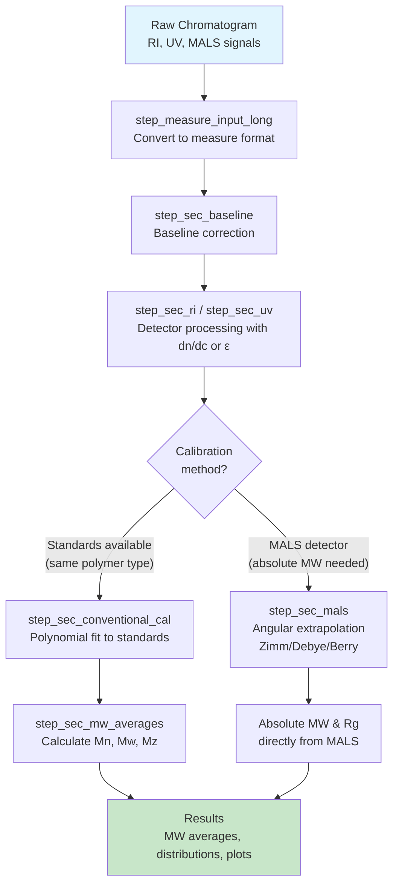

# Getting Started with measure.sec

## What You’ll Learn

By the end of this tutorial, you will be able to:

1.  **Load and convert** SEC chromatogram data into the measure format
2.  **Build a recipe** that processes your detector signals
3.  **Apply calibration** to convert retention time to molecular weight
4.  **Calculate MW averages** (Mn, Mw, Mz, dispersity)

**Time to complete**: ~15 minutes

## Prerequisites

Before starting, you should have: - Basic R knowledge (data frames,
pipes, functions) - R and RStudio installed - No prior SEC/GPC knowledge
required (we’ll cover the basics)

## Overview

**measure.sec** provides preprocessing steps for Size Exclusion
Chromatography (SEC) and Gel Permeation Chromatography (GPC) data
analysis. It extends the
[measure](https://github.com/JamesHWade/measure) package using the
[recipes](https://recipes.tidymodels.org/) framework.

## What is SEC/GPC?

**Size Exclusion Chromatography (SEC)**, also known as **Gel Permeation
Chromatography (GPC)**, separates molecules by size. Larger molecules
elute faster (excluded from pores), smaller molecules elute slower
(enter pores). This lets you determine **molecular weight averages**
(Mn, Mw, Mz) and **dispersity** (distribution breadth).

SEC data consists of **chromatograms** (detector response vs. elution
time). Common detectors include **RI** (concentration), **UV**
(chromophores), and **light scattering** (absolute MW). This package
processes these signals to extract molecular weight information.

## Workflow Overview

The typical SEC analysis workflow follows these steps:

    ┌─────────────────────────────────────────────────────────────────────────┐
    │                        SEC Analysis Workflow                            │
    └─────────────────────────────────────────────────────────────────────────┘

      ┌──────────────┐     ┌──────────────┐     ┌──────────────┐
      │   Raw Data   │────▶│ Preprocess   │────▶│  Calibrate   │
      │ (CSV/Export) │     │  Signals     │     │   MW Scale   │
      └──────────────┘     └──────────────┘     └──────────────┘
             │                    │                    │
             │                    │                    │
             ▼                    ▼                    ▼
       • Detector signals   • Baseline correct  • Apply standards
       • Elution times      • Align detectors   • Or use MALS for
       • Sample metadata    • Convert units       absolute MW
                                                       │
                                                       ▼
                            ┌──────────────────────────────────────┐
                            │          Calculate Results           │
                            │  • MW averages (Mn, Mw, Mz)         │
                            │  • Dispersity                        │
                            │  • MW distribution                   │
                            │  • Aggregate/fragment %              │
                            └──────────────────────────────────────┘

In measure.sec, each box becomes one or more **recipe steps**. You chain
these steps together into a reproducible analysis pipeline.

### Basic Workflow Overview

A typical SEC analysis starts with raw detector signals, converts them
to the measure format, applies baseline correction, processes detector
signals with appropriate normalization factors, then either applies
calibration from standards (conventional) or uses light scattering for
absolute molecular weight (MALS).



*Choose **conventional calibration** when you have narrow MW standards
of the same polymer type. Choose **MALS** when you need absolute MW
without polymer-specific standards or when analyzing unknown polymers.*

## Installation

``` r
# Install from GitHub
# install.packages("pak")
pak::pak("JamesHWade/measure")
pak::pak("JamesHWade/measure-sec")
```

## Setup

``` r
library(measure)
#> Loading required package: recipes
#> Loading required package: dplyr
#> 
#> Attaching package: 'dplyr'
#> The following objects are masked from 'package:stats':
#> 
#>     filter, lag
#> The following objects are masked from 'package:base':
#> 
#>     intersect, setdiff, setequal, union
#> 
#> Attaching package: 'recipes'
#> The following object is masked from 'package:stats':
#> 
#>     step
library(measure.sec)
library(recipes)
library(dplyr)
library(ggplot2)
```

## The Data Model

SEC data in measure.sec uses the **measure** package’s nested tibble
structure. Understanding this structure is key to working effectively
with the package.

### measure_tbl: A Single Chromatogram

A **`measure_tbl`** is a tibble (data frame) representing a single
chromatogram with two required columns:

- **`location`**: The x-axis values—typically elution time (minutes) or
  elution volume (mL)
- **`value`**: The y-axis values—detector response (mV, AU, or processed
  units)

Think of it as one line on a chromatogram plot. For example, an RI
detector signal from one injection is stored as a `measure_tbl`.

### measure_list: Multiple Chromatograms (Internal Format)

A **`measure_list`** is a list column containing multiple `measure_tbl`
objects. This is the **internal format** used by measure.sec recipe
steps—you typically won’t create this yourself. Instead,
[`step_measure_input_long()`](https://jameshwade.github.io/measure/reference/step_measure_input_long.html)
converts your raw data into this format automatically.

**After conversion**, your data will look like this:

    ┌──────────────────────────────────────────────────────────────┐
    │  sample_id   known_mw   dn_dc       ri                      │
    ├──────────────────────────────────────────────────────────────┤
    │  "PS-50K"    50000      0.185       <measure_list[1]>       │
    │  "PS-100K"   100000     0.185       <measure_list[1]>       │
    │  "PMMA-75K"  75000      0.084       <measure_list[1]>       │
    └──────────────────────────────────────────────────────────────┘
                                               │
                                               ▼
                                Each entry contains a measure_tbl:
                                  location │ value
                                  ─────────┼────────
                                  5.0      │ 0.002
                                  5.1      │ 0.015
                                  5.2      │ 0.089
                                  ...      │ ...

This nested structure has several advantages:

1.  **Tidy organization**: Each row is one sample with all its metadata
    and chromatogram(s)
2.  **Batch processing**: Apply the same recipe to many samples at once
3.  **Multiple detectors**: Store RI, UV, and MALS signals as separate
    nested columns
4.  **Metadata preservation**: Sample properties like `dn_dc` or
    `known_mw` travel with the chromatogram

## Example Dataset

The package includes `sec_triple_detect`, a synthetic multi-detector SEC
dataset in **long format** (one row per time point). This is a good
starting point for learning the workflow before analyzing your own data.

``` r
# Load the example dataset
data(sec_triple_detect, package = "measure.sec")

# View the structure - this is LONG format data (one row per time point)
# The signal columns (ri_signal, uv_signal, mals_signal) are numeric vectors
glimpse(sec_triple_detect)
#> Rows: 24,012
#> Columns: 11
#> $ sample_id        <chr> "PS-1K", "PS-1K", "PS-1K", "PS-1K", "PS-1K", "PS-1K",…
#> $ sample_type      <chr> "standard", "standard", "standard", "standard", "stan…
#> $ polymer_type     <chr> "polystyrene", "polystyrene", "polystyrene", "polysty…
#> $ elution_time     <dbl> 5.00, 5.01, 5.02, 5.03, 5.04, 5.05, 5.06, 5.07, 5.08,…
#> $ ri_signal        <dbl> 6.926392e-04, 0.000000e+00, 3.199253e-04, 4.197175e-0…
#> $ uv_signal        <dbl> 0.0002034583, 0.0000000000, 0.0000000000, 0.000000000…
#> $ mals_signal      <dbl> 3.370385e-05, 3.483481e-05, 3.102092e-05, 3.261962e-0…
#> $ known_mw         <dbl> 1000, 1000, 1000, 1000, 1000, 1000, 1000, 1000, 1000,…
#> $ known_dispersity <dbl> 1.05, 1.05, 1.05, 1.05, 1.05, 1.05, 1.05, 1.05, 1.05,…
#> $ dn_dc            <dbl> 0.185, 0.185, 0.185, 0.185, 0.185, 0.185, 0.185, 0.18…
#> $ extinction_coef  <dbl> 1.2, 1.2, 1.2, 1.2, 1.2, 1.2, 1.2, 1.2, 1.2, 1.2, 1.2…
```

The dataset contains:

- **12 polymer samples**: polystyrene (PS), PMMA, PEG, and copolymers
- **~2,000 time points per sample**: giving 24,012 total rows
- **Three detector signals**: RI, UV, and MALS (as numeric columns)
- **Known molecular weights**: For validating your analysis
- **Optical constants**: dn/dc and extinction coefficients (needed for
  quantitative analysis)

``` r
# View the unique samples in the dataset
# Each sample_id represents one injection; the chromatogram spans many rows
sec_triple_detect |>
  distinct(sample_id, sample_type, polymer_type) |>
  print(n = 12)
#> # A tibble: 12 × 3
#>    sample_id sample_type polymer_type
#>    <chr>     <chr>       <chr>       
#>  1 PS-1K     standard    polystyrene 
#>  2 PS-10K    standard    polystyrene 
#>  3 PS-50K    standard    polystyrene 
#>  4 PS-100K   standard    polystyrene 
#>  5 PS-500K   standard    polystyrene 
#>  6 PMMA-Low  sample      pmma        
#>  7 PMMA-Med  sample      pmma        
#>  8 PMMA-High sample      pmma        
#>  9 PEG-5K    sample      peg         
#> 10 PEG-20K   sample      peg         
#> 11 Copoly-A  sample      copolymer   
#> 12 Copoly-B  sample      copolymer
```

## Basic Workflow: RI Detector Analysis

Let’s walk through a complete analysis of a polystyrene sample using the
RI detector. This demonstrates the core pattern you’ll use for all SEC
analysis.

``` r
# Select a single polystyrene standard for this example
# In practice, you'd often process many samples at once
ps_sample <- sec_triple_detect |>
  filter(sample_id == "PS-50K")

# View sample info - note this is still long format (many rows per sample)
ps_sample |>
  select(sample_id, polymer_type, known_mw, elution_time, ri_signal) |>
  head()
#> # A tibble: 6 × 5
#>   sample_id polymer_type known_mw elution_time ri_signal
#>   <chr>     <chr>           <dbl>        <dbl>     <dbl>
#> 1 PS-50K    polystyrene     50000         5     0       
#> 2 PS-50K    polystyrene     50000         5.01  0.000279
#> 3 PS-50K    polystyrene     50000         5.02  0       
#> 4 PS-50K    polystyrene     50000         5.03  0       
#> 5 PS-50K    polystyrene     50000         5.04  0.000842
#> 6 PS-50K    polystyrene     50000         5.05  0.000483
```

### Step 1: Create a Recipe

**Recipes** define a sequence of preprocessing steps. Think of a recipe
as a blueprint for your analysis—it describes *what* to do, but doesn’t
do it yet. This separation lets you define the workflow once and apply
it to many samples.

``` r
# Start a recipe with your data
# The formula specifies: predictor columns ~ grouping column
# sample_id identifies which rows belong to each chromatogram
rec <- recipe(
  ri_signal + elution_time + dn_dc ~ sample_id,
  data = ps_sample
) |>
  update_role(sample_id, new_role = "id") |>
  # Convert the ri_signal column to measure format
  # This step tells recipes how to interpret your chromatogram data
  step_measure_input_long(
    ri_signal,
    location = vars(elution_time),
    col_name = "ri"
  )
```

### Step 2: Add Preprocessing Steps

Chain additional steps using the pipe (`|>`). Each step transforms the
data in sequence:

``` r
rec <- recipe(
  ri_signal + elution_time + dn_dc ~ sample_id,
  data = ps_sample
) |>
  update_role(sample_id, new_role = "id") |>
  # First: convert raw signal to measure format
  step_measure_input_long(
    ri_signal,
    location = vars(elution_time),
    col_name = "ri"
  ) |>
  # Second: correct the baseline (removes drift and offset)
  step_sec_baseline(measures = "ri") |>
  # Third: process RI signal using the sample's dn/dc value
  # Dividing by dn/dc converts the RI signal to concentration-proportional units
  step_sec_ri(measures = "ri", dn_dc_column = "dn_dc")
```

### Step 3: Prep and Bake

Two functions execute your recipe:

- **[`prep()`](https://recipes.tidymodels.org/reference/prep.html)**:
  Learns any required parameters from the training data (like baseline
  fit coefficients)
- **[`bake()`](https://recipes.tidymodels.org/reference/bake.html)**:
  Applies the transformations to produce results

``` r
# Prep: Learn parameters from the data
prepped <- prep(rec)

# Bake: Apply transformations (new_data = NULL means use the training data)
result <- bake(prepped, new_data = NULL)

# View the processed data - ri now contains the baseline-corrected,
# concentration-converted chromatogram
result |>
  select(sample_id, ri)
#> # A tibble: 1 × 2
#>   sample_id          ri
#>   <chr>          <meas>
#> 1 PS-50K    [2,001 × 2]
```

> **Why two steps?** This design lets you prep once on training data
> (like calibration standards), then bake on new samples without
> re-learning parameters. It also makes your analysis reproducible.

------------------------------------------------------------------------

**✓ Checkpoint**: You’ve successfully converted raw detector data into
the measure format and applied baseline correction. Your `result` tibble
now contains a processed `ri` column ready for calibration.

------------------------------------------------------------------------

## Molecular Weight Averages

The most common outputs from SEC analysis are **molecular weight
averages**: - **Mn (number-average)**: Emphasizes lower MW species -
**Mw (weight-average)**: Emphasizes higher MW species - **Mz
(z-average)**: Even more sensitive to high MW species - **Dispersity
(Mw/Mn)**: Measures breadth of the MW distribution (1.0 = monodisperse)

Use
[`step_sec_mw_averages()`](https://jameshwade.github.io/measure-sec/reference/step_sec_mw_averages.md)
to calculate these. This step requires that the x-axis (location) values
already represent log₁₀(MW)—which is what
[`step_sec_conventional_cal()`](https://jameshwade.github.io/measure-sec/reference/step_sec_conventional_cal.md)
provides. See the Calibration section below for the complete workflow.

## Calibration Curves

Most SEC analysis requires **calibration** to convert retention time to
molecular weight. The most common approach uses **narrow
standards**—polymers with known molecular weights and low dispersity—to
build a calibration curve.

> **Note**: If you have a light scattering detector (MALS), you can
> determine absolute molecular weights without calibration. See
> [`vignette("triple-detection")`](https://jameshwade.github.io/measure-sec/articles/triple-detection.md)
> for details.

``` r
# Load polystyrene narrow standards
# These are well-characterized polymers used to build the calibration curve
data(sec_ps_standards, package = "measure.sec")

# View the standards - each has a known peak molecular weight (Mp)
sec_ps_standards |>
  select(standard_name, mp, log_mp, retention_time) |>
  print(n = 8)
#> # A tibble: 16 × 4
#>   standard_name      mp log_mp retention_time
#>   <chr>           <dbl>  <dbl>          <dbl>
#> 1 PS-3150000    3150000   6.50           11.2
#> 2 PS-1870000    1870000   6.27           11.6
#> 3 PS-1090000    1090000   6.04           12.1
#> 4 PS-630000      630000   5.80           12.6
#> 5 PS-430000      430000   5.63           13.2
#> 6 PS-216000      216000   5.33           13.8
#> 7 PS-120000      120000   5.08           14.3
#> 8 PS-67500        67500   4.83           15.0
#> # ℹ 8 more rows

# Visualize the calibration curve
# The relationship between log(MW) and retention time is typically linear
# or slightly curved, so we fit a polynomial
ggplot(sec_ps_standards, aes(retention_time, log_mp)) +
  geom_point(size = 3, color = "#2E86AB") +
  geom_smooth(
    method = "lm",
    formula = y ~ poly(x, 3),
    se = TRUE,
    color = "#A23B72",
    fill = "#A23B72",
    alpha = 0.2
  ) +
  labs(
    x = "Retention Time (min)",
    y = expression(log[10](M[p])),
    title = "Polystyrene Calibration Curve"
  ) +
  theme_minimal()
```


Apply the calibration using
[`step_sec_conventional_cal()`](https://jameshwade.github.io/measure-sec/reference/step_sec_conventional_cal.md):

``` r
# Prepare standards in the format expected by the calibration step
# Needs columns: retention (time/volume) and log_mw
ps_cal <- sec_ps_standards |>
  select(retention = retention_time, log_mw = log_mp)

rec_cal <- recipe(
  ri_signal + elution_time + dn_dc ~ sample_id,
  data = ps_sample
) |>
  update_role(sample_id, new_role = "id") |>
  step_measure_input_long(
    ri_signal,
    location = vars(elution_time),
    col_name = "ri"
  ) |>
  step_sec_baseline(measures = "ri") |>
  # Apply conventional calibration using polystyrene standards
  # This converts retention time to log10(MW) on the x-axis
  # fit_type options: "linear", "quadratic", "cubic" (most common)
  step_sec_conventional_cal(
    standards = ps_cal,
    fit_type = "cubic"
  ) |>
  # Calculate MW averages from the calibrated chromatogram
  # The calibration step converted location values to log10(MW)
  step_sec_mw_averages()

prepped_cal <- prep(rec_cal)
#> Warning: Standard at 12.58 has 14.4% MW deviation.
#> ℹ Consider removing outlier standards or using a different fit type.
#> Warning: 1037 points (51.8%) are outside calibration range.
#> ℹ Calibration range: 11.15 to 20.79
result_cal <- bake(prepped_cal, new_data = NULL)

# View molecular weight results
# New columns are added with mw_ prefix
result_cal |>
  select(sample_id, mw_mn, mw_mw, mw_mz, mw_dispersity)
#> # A tibble: 1 × 5
#>   sample_id      mw_mn   mw_mw   mw_mz mw_dispersity
#>   <chr>          <dbl>   <dbl>   <dbl>         <dbl>
#> 1 PS-50K    419927756. 8.24e21 7.81e23       1.96e13
```

> **Important**: Conventional calibration assumes your sample has
> similar hydrodynamic behavior to your standards. Polystyrene standards
> work well for other flexible polymers in THF, but for proteins in
> aqueous SEC, use protein standards or light scattering.

------------------------------------------------------------------------

**✓ Checkpoint**: You’ve completed a full SEC analysis! Your
`result_cal` tibble contains molecular weight averages (Mn, Mw, Mz) and
dispersity calculated from your chromatogram using conventional
calibration.

------------------------------------------------------------------------

## Available Steps

The package provides a comprehensive set of recipe steps. Here’s a quick
reference organized by function:

### Preprocessing

- [`step_sec_baseline()`](https://jameshwade.github.io/measure-sec/reference/step_sec_baseline.md):
  SEC-optimized baseline correction
- [`step_sec_detector_delay()`](https://jameshwade.github.io/measure-sec/reference/step_sec_detector_delay.md):
  Correct inter-detector delays

### Detector Processing

- [`step_sec_ri()`](https://jameshwade.github.io/measure-sec/reference/step_sec_ri.md):
  RI detector with dn/dc
- [`step_sec_uv()`](https://jameshwade.github.io/measure-sec/reference/step_sec_uv.md):
  UV detector with extinction coefficient
- [`step_sec_mals()`](https://jameshwade.github.io/measure-sec/reference/step_sec_mals.md),
  [`step_sec_lals()`](https://jameshwade.github.io/measure-sec/reference/step_sec_lals.md),
  [`step_sec_rals()`](https://jameshwade.github.io/measure-sec/reference/step_sec_rals.md):
  Light scattering
- [`step_sec_dls()`](https://jameshwade.github.io/measure-sec/reference/step_sec_dls.md):
  Dynamic light scattering
- [`step_sec_viscometer()`](https://jameshwade.github.io/measure-sec/reference/step_sec_viscometer.md):
  Differential viscometer

### Molecular Weight

- [`step_sec_mw_averages()`](https://jameshwade.github.io/measure-sec/reference/step_sec_mw_averages.md):
  Mn, Mw, Mz, dispersity
- [`step_sec_mw_fractions()`](https://jameshwade.github.io/measure-sec/reference/step_sec_mw_fractions.md):
  MW fractions above/below cutoffs
- [`step_sec_mw_distribution()`](https://jameshwade.github.io/measure-sec/reference/step_sec_mw_distribution.md):
  Differential/cumulative MWD
- [`step_sec_conventional_cal()`](https://jameshwade.github.io/measure-sec/reference/step_sec_conventional_cal.md):
  Narrow standard calibration
- [`step_sec_universal_cal()`](https://jameshwade.github.io/measure-sec/reference/step_sec_universal_cal.md):
  Universal calibration

### Composition & Protein

- [`step_sec_uv_ri_ratio()`](https://jameshwade.github.io/measure-sec/reference/step_sec_uv_ri_ratio.md):
  UV/RI ratio for heterogeneity
- [`step_sec_composition()`](https://jameshwade.github.io/measure-sec/reference/step_sec_composition.md):
  Copolymer composition
- [`step_sec_aggregates()`](https://jameshwade.github.io/measure-sec/reference/step_sec_aggregates.md):
  HMWS/monomer/LMWS quantitation
- [`step_sec_protein()`](https://jameshwade.github.io/measure-sec/reference/step_sec_protein.md):
  Complete protein SEC workflow

## Troubleshooting

**Common issues and quick fixes:**

| Problem                    | Solution                                                                                                                                   |
|----------------------------|--------------------------------------------------------------------------------------------------------------------------------------------|
| “Column not found”         | Check column names match exactly (case-sensitive)                                                                                          |
| “No measure columns found” | Add [`step_measure_input_long()`](https://jameshwade.github.io/measure/reference/step_measure_input_long.html) at the start of your recipe |
| NA values in MW results    | Check calibration range covers your retention times                                                                                        |
| Recipe won’t prep          | Try prepping with fewer steps to isolate the issue                                                                                         |

``` r
# Debugging tips:
names(your_data)                    # Check column names
measure::find_measure_cols(result)  # Find measure columns after bake
result$ri[[1]] |> summary()         # Inspect chromatogram data
```

## Next Steps

Now that you understand the basics, explore these vignettes for
specialized workflows:

| Vignette                                                                                              | Use when you need to…                       |
|-------------------------------------------------------------------------------------------------------|---------------------------------------------|
| [Multi-Detector SEC](https://jameshwade.github.io/measure-sec/articles/triple-detection.md)           | Integrate multiple detectors (RI + UV + LS) |
| [MALS Detection](https://jameshwade.github.io/measure-sec/articles/mals-detection.md)                 | Get absolute MW and radius of gyration      |
| [LALS/RALS Detection](https://jameshwade.github.io/measure-sec/articles/lals-rals-detection.md)       | Use single-angle light scattering           |
| [Protein SEC](https://jameshwade.github.io/measure-sec/articles/protein-sec.md)                       | Analyze aggregates (HMWS/monomer/LMWS)      |
| [Copolymer Composition](https://jameshwade.github.io/measure-sec/articles/copolymer-analysis.md)      | Determine composition via UV/RI ratio       |
| [Calibration Management](https://jameshwade.github.io/measure-sec/articles/calibration-management.md) | Save, load, and reuse calibrations          |
| [System Suitability](https://jameshwade.github.io/measure-sec/articles/system-suitability.md)         | Set up QC checks and column monitoring      |
| [Exporting Results](https://jameshwade.github.io/measure-sec/articles/exporting-results.md)           | Generate summary tables and reports         |

You can also browse all available functions with:

``` r
# See all SEC/GPC steps registered with measure
measure::measure_steps(techniques = "SEC/GPC")
```

## Session Info

``` r
sessionInfo()
#> R version 4.5.2 (2025-10-31)
#> Platform: x86_64-pc-linux-gnu
#> Running under: Ubuntu 24.04.3 LTS
#> 
#> Matrix products: default
#> BLAS:   /usr/lib/x86_64-linux-gnu/openblas-pthread/libblas.so.3 
#> LAPACK: /usr/lib/x86_64-linux-gnu/openblas-pthread/libopenblasp-r0.3.26.so;  LAPACK version 3.12.0
#> 
#> locale:
#>  [1] LC_CTYPE=C.UTF-8       LC_NUMERIC=C           LC_TIME=C.UTF-8       
#>  [4] LC_COLLATE=C.UTF-8     LC_MONETARY=C.UTF-8    LC_MESSAGES=C.UTF-8   
#>  [7] LC_PAPER=C.UTF-8       LC_NAME=C              LC_ADDRESS=C          
#> [10] LC_TELEPHONE=C         LC_MEASUREMENT=C.UTF-8 LC_IDENTIFICATION=C   
#> 
#> time zone: UTC
#> tzcode source: system (glibc)
#> 
#> attached base packages:
#> [1] stats     graphics  grDevices utils     datasets  methods   base     
#> 
#> other attached packages:
#> [1] ggplot2_4.0.1          measure.sec_0.0.0.9000 measure_0.0.1.9001    
#> [4] recipes_1.3.1          dplyr_1.1.4           
#> 
#> loaded via a namespace (and not attached):
#>  [1] gtable_0.3.6        xfun_0.55           bslib_0.9.0        
#>  [4] lattice_0.22-7      vctrs_0.6.5         tools_4.5.2        
#>  [7] generics_0.1.4      parallel_4.5.2      tibble_3.3.0       
#> [10] pkgconfig_2.0.3     Matrix_1.7-4        data.table_1.18.0  
#> [13] RColorBrewer_1.1-3  S7_0.2.1            desc_1.4.3         
#> [16] lifecycle_1.0.4     compiler_4.5.2      farver_2.1.2       
#> [19] textshaping_1.0.4   codetools_0.2-20    htmltools_0.5.9    
#> [22] class_7.3-23        sass_0.4.10         yaml_2.3.12        
#> [25] prodlim_2025.04.28  tidyr_1.3.2         pillar_1.11.1      
#> [28] pkgdown_2.2.0       jquerylib_0.1.4     MASS_7.3-65        
#> [31] cachem_1.1.0        gower_1.0.2         rpart_4.1.24       
#> [34] nlme_3.1-168        parallelly_1.46.0   lava_1.8.2         
#> [37] tidyselect_1.2.1    digest_0.6.39       future_1.68.0      
#> [40] purrr_1.2.0         listenv_0.10.0      labeling_0.4.3     
#> [43] splines_4.5.2       fastmap_1.2.0       grid_4.5.2         
#> [46] cli_3.6.5           magrittr_2.0.4      utf8_1.2.6         
#> [49] survival_3.8-3      future.apply_1.20.1 withr_3.0.2        
#> [52] scales_1.4.0        lubridate_1.9.4     timechange_0.3.0   
#> [55] rmarkdown_2.30      globals_0.18.0      nnet_7.3-20        
#> [58] timeDate_4051.111   ragg_1.5.0          evaluate_1.0.5     
#> [61] knitr_1.51          hardhat_1.4.2       mgcv_1.9-3         
#> [64] rlang_1.1.6         Rcpp_1.1.0          glue_1.8.0         
#> [67] ipred_0.9-15        jsonlite_2.0.0      R6_2.6.1           
#> [70] systemfonts_1.3.1   fs_1.6.6
```
