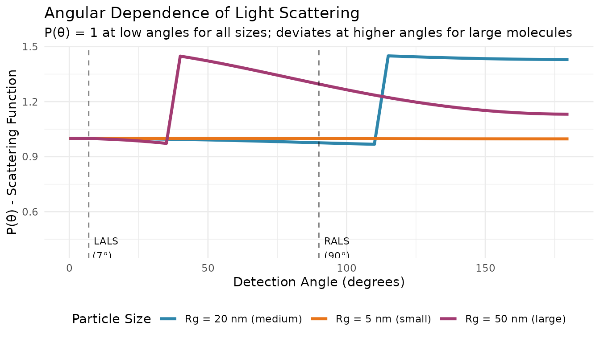
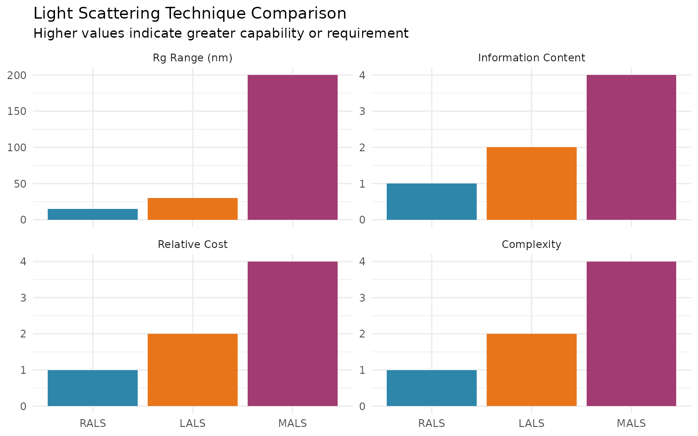
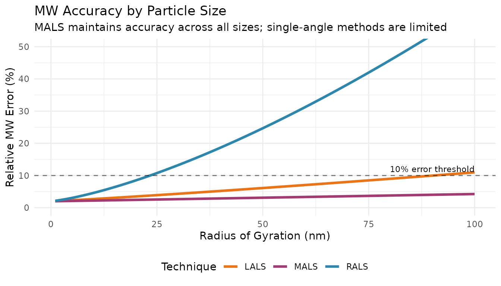

# Single-Angle Light Scattering: LALS and RALS

## Overview

Single-angle light scattering detectors (LALS and RALS) provide a
simpler, cost-effective alternative to multi-angle detection (MALS) for
determining absolute molecular weight. While they don’t provide radius
of gyration (Rg) information, they can be excellent choices for routine
analysis of smaller molecules.

This vignette covers:

1.  LALS (Low-Angle Light Scattering) principles and usage
2.  RALS (Right-Angle Light Scattering) principles and usage
3.  When to choose each technique
4.  Comparison with MALS

## Setup

``` r
library(measure)
#> Loading required package: recipes
#> Loading required package: dplyr
#> 
#> Attaching package: 'dplyr'
#> The following objects are masked from 'package:stats':
#> 
#>     filter, lag
#> The following objects are masked from 'package:base':
#> 
#>     intersect, setdiff, setequal, union
#> 
#> Attaching package: 'recipes'
#> The following object is masked from 'package:stats':
#> 
#>     step
library(measure.sec)
library(recipes)
library(dplyr)
library(ggplot2)
```

## The Angular Dependence Problem

Light scattering from polymer molecules is angle-dependent. For larger
molecules, the scattered intensity varies with detection angle due to
intramolecular interference. This is described by the particle
scattering function P(θ):



**Key insight**: At low angles (approaching 0°), P(θ) → 1 regardless of
particle size. This is why LALS can measure MW without knowing Rg.

## LALS: Low-Angle Light Scattering

### Principle

LALS detectors measure scattering at a low angle (typically 7-15°). At
these angles, the particle scattering function P(θ) ≈ 1 for most polymer
sizes, eliminating the need for angular extrapolation.

The simplified equation becomes:

$$M_{w} = \frac{R(\theta)}{K \cdot c}$$

Where: - R(θ) = Rayleigh ratio (scattered intensity) - K = optical
constant - c = concentration

### When to Use LALS

| Advantage                        | Limitation                             |
|----------------------------------|----------------------------------------|
| No angular extrapolation needed  | No Rg information                      |
| Simple, single-angle measurement | Less accurate for very large molecules |
| Faster data acquisition          | Requires calibration constant          |
| Lower cost than MALS             | More sensitive to dust/aggregates      |

**Best for:** - Proteins and peptides (Rg \< 10 nm) - Small synthetic
polymers - Routine screening applications - When Rg is not needed

### LALS Workflow

``` r
# LALS workflow example
# Note: Requires LALS detector data

# Simulate sample data structure
lals_samples <- tibble(
  sample_id = "Protein-A",
  ri_signal = list(c(0.1, 0.5, 1.0, 0.5, 0.1)),
  lals_signal = list(c(0.05, 0.25, 0.5, 0.25, 0.05)),
  elution_time = list(c(8, 9, 10, 11, 12)),
  dn_dc = 0.185
)

rec_lals <- recipe(
  ri_signal + lals_signal + elution_time + dn_dc ~ sample_id,
  data = lals_samples
) |>
  update_role(sample_id, new_role = "id") |>
  # Convert signals to measure format
  step_measure_input_long(ri_signal, location = vars(elution_time), col_name = "ri") |>
  step_measure_input_long(lals_signal, location = vars(elution_time), col_name = "lals") |>
  # Baseline correction
  step_sec_baseline(measures = c("ri", "lals")) |>
  # Process RI for concentration
  step_sec_ri(measures = "ri", dn_dc_column = "dn_dc") |>
  step_sec_concentration(
    measures = "ri",
    detector = "ri",
    injection_volume = 100,
    sample_concentration = 2.0
  ) |>
  # Process LALS for MW
  step_sec_lals(
    measures = "lals",
    concentration_col = "ri",
    angle = 7,                        # Detection angle
    laser_wavelength = 670,           # nm
    dn_dc = 0.185,                    # mL/g
    solvent_ri = 1.333,               # Water
    calibration_constant = 1.5e-5     # From instrument calibration
  )

prepped_lals <- prep(rec_lals)
result_lals <- bake(prepped_lals, new_data = NULL)
```

### Key Parameters

| Parameter              | Typical Value       | Notes                       |
|------------------------|---------------------|-----------------------------|
| `angle`                | 7-15°               | Must be \< 20° for LALS     |
| `laser_wavelength`     | 670 nm              | Check your instrument specs |
| `calibration_constant` | Instrument-specific | Required for absolute MW    |

## RALS: Right-Angle Light Scattering

### Principle

RALS detectors measure scattering at 90°. While this angle shows more
angular dependence than low angles, it offers practical advantages: less
sensitivity to stray light and easier optical design.

For small molecules where Rg \<\< λ/20 (roughly Rg \< 15 nm at 670 nm),
the angular dependence is minimal and RALS provides reasonable MW
estimates.

### When to Use RALS

| Advantage                          | Limitation                               |
|------------------------------------|------------------------------------------|
| Less sensitive to dust/stray light | Underestimates MW for large molecules    |
| Common, cost-effective detector    | No Rg information                        |
| Good for small molecules           | Angular correction needed for large MW   |
| Often included in GPC systems      | Less accurate than LALS for medium sizes |

**Best for:** - Small molecules (Rg \< 15 nm) - Quality control
screening - Cost-sensitive applications - When combined with other
detectors

### RALS Workflow

``` r
# RALS workflow example
# Note: Requires RALS detector data

# Simulate sample data structure
rals_samples <- tibble(
  sample_id = "Polymer-X",
  ri_signal = list(c(0.1, 0.5, 1.0, 0.5, 0.1)),
  rals_signal = list(c(0.04, 0.20, 0.40, 0.20, 0.04)),
  elution_time = list(c(8, 9, 10, 11, 12)),
  dn_dc = 0.185
)

rec_rals <- recipe(
  ri_signal + rals_signal + elution_time + dn_dc ~ sample_id,
  data = rals_samples
) |>
  update_role(sample_id, new_role = "id") |>
  # Convert signals to measure format
  step_measure_input_long(ri_signal, location = vars(elution_time), col_name = "ri") |>
  step_measure_input_long(rals_signal, location = vars(elution_time), col_name = "rals") |>
  # Baseline correction
  step_sec_baseline(measures = c("ri", "rals")) |>
  # Process RI for concentration
  step_sec_ri(measures = "ri", dn_dc_column = "dn_dc") |>
  step_sec_concentration(
    measures = "ri",
    detector = "ri",
    injection_volume = 100,
    sample_concentration = 2.0
  ) |>
  # Process RALS for MW
  step_sec_rals(
    measures = "rals",
    concentration_col = "ri",
    angle = 90,                       # Right angle
    laser_wavelength = 670,           # nm
    dn_dc = 0.185,                    # mL/g
    solvent_ri = 1.333,               # Water
    calibration_constant = 1.2e-5     # From instrument calibration
  )

prepped_rals <- prep(rec_rals)
result_rals <- bake(prepped_rals, new_data = NULL)
```

## Choosing the Right Technique

### Decision Guide



### Quick Reference

| Your Sample                       | Recommended Technique |
|-----------------------------------|-----------------------|
| Proteins, peptides (MW \< 50 kDa) | RALS or LALS          |
| Small polymers (Rg \< 15 nm)      | RALS                  |
| Medium polymers (Rg 15-30 nm)     | LALS                  |
| Large polymers (Rg \> 30 nm)      | MALS                  |
| Need Rg information               | MALS                  |
| Routine QC screening              | RALS                  |
| Budget-constrained                | RALS or LALS          |

### MW Accuracy by Technique



## Combining LALS/RALS with MALS

Some instruments include both low-angle and right-angle detectors
alongside MALS. This provides:

1.  **Redundancy**: Cross-check MW values
2.  **Extended range**: LALS for low angles, MALS for extrapolation
3.  **Sensitivity optimization**: Use optimal detector for each MW range

``` r
# Combined LALS + RALS + MALS workflow
rec_combined <- recipe(
  ri_signal + lals_signal + rals_signal + mals_signal + elution_time + dn_dc ~ sample_id,
  data = multi_detector_samples
) |>
  update_role(sample_id, new_role = "id") |>
  # Input all detectors
  step_measure_input_long(ri_signal, location = vars(elution_time), col_name = "ri") |>
  step_measure_input_long(lals_signal, location = vars(elution_time), col_name = "lals") |>
  step_measure_input_long(rals_signal, location = vars(elution_time), col_name = "rals") |>
  step_measure_input_long(mals_signal, location = vars(elution_time), col_name = "mals") |>
  # Baseline and concentration
  step_sec_baseline(measures = c("ri", "lals", "rals", "mals")) |>
  step_sec_ri(measures = "ri", dn_dc_column = "dn_dc") |>
  step_sec_concentration(
    measures = "ri",
    detector = "ri",
    injection_volume = 100,
    sample_concentration = 2.0
  ) |>
  # Process each LS detector
  step_sec_lals(measures = "lals", concentration_col = "ri", dn_dc = 0.185) |>
  step_sec_rals(measures = "rals", concentration_col = "ri", dn_dc = 0.185) |>
  step_sec_mals(mals_col = "mals", dn_dc_column = "dn_dc")
```

## Calibration Constants

Both
[`step_sec_lals()`](https://jameshwade.github.io/measure-sec/reference/step_sec_lals.md)
and
[`step_sec_rals()`](https://jameshwade.github.io/measure-sec/reference/step_sec_rals.md)
require a `calibration_constant` for absolute MW values. Without it,
results are in relative units.

### Determining Calibration Constants

1.  **Use a well-characterized standard** (e.g., BSA, narrow PS
    standard)
2.  **Run the standard** under your experimental conditions
3.  **Calculate the constant** that yields the known MW

``` r
# Example: Calibrating with BSA (MW = 66,430 Da)
# 1. Measure BSA with known concentration
# 2. Calculate: cal_constant = (known_MW * K * c) / raw_signal

bsa_mw <- 66430  # Da
bsa_conc <- 1.0  # mg/mL
dn_dc_bsa <- 0.185
solvent_ri <- 1.333
wavelength <- 670

# Calculate K
K <- 4 * pi^2 * solvent_ri^2 * dn_dc_bsa^2 / (6.022e23 * (wavelength * 1e-7)^4)

# If raw_signal at peak = 0.5, then:
# cal_constant = bsa_mw * K * bsa_conc / raw_signal
```

## Troubleshooting

### Common Issues

| Problem              | Possible Cause    | Solution                       |
|----------------------|-------------------|--------------------------------|
| MW too high          | Aggregates, dust  | Filter samples, check baseline |
| MW too low           | Poor dn/dc value  | Measure dn/dc accurately       |
| Noisy signal         | Low concentration | Increase injection mass        |
| Inconsistent results | Calibration drift | Recalibrate with standard      |

### Signal-to-Noise Considerations

Single-angle detectors are more sensitive to noise than MALS (which
averages multiple angles). Ensure:

- Adequate sample concentration
- Clean mobile phase (filtered, degassed)
- Stable flow rate
- Regular calibration

## See Also

- [MALS
  Detection](https://jameshwade.github.io/measure-sec/articles/mals-detection.md) -
  Multi-angle detection for Rg and large molecules
- [Triple
  Detection](https://jameshwade.github.io/measure-sec/articles/triple-detection.md) -
  Combined RI + Viscometer + LS workflows
- [Getting
  Started](https://jameshwade.github.io/measure-sec/articles/getting-started.md) -
  Basic SEC workflow and concepts
- [Calibration
  Management](https://jameshwade.github.io/measure-sec/articles/calibration-management.md) -
  Save and reuse calibrations

## Session Info

``` r
sessionInfo()
#> R version 4.5.2 (2025-10-31)
#> Platform: x86_64-pc-linux-gnu
#> Running under: Ubuntu 24.04.3 LTS
#> 
#> Matrix products: default
#> BLAS:   /usr/lib/x86_64-linux-gnu/openblas-pthread/libblas.so.3 
#> LAPACK: /usr/lib/x86_64-linux-gnu/openblas-pthread/libopenblasp-r0.3.26.so;  LAPACK version 3.12.0
#> 
#> locale:
#>  [1] LC_CTYPE=C.UTF-8       LC_NUMERIC=C           LC_TIME=C.UTF-8       
#>  [4] LC_COLLATE=C.UTF-8     LC_MONETARY=C.UTF-8    LC_MESSAGES=C.UTF-8   
#>  [7] LC_PAPER=C.UTF-8       LC_NAME=C              LC_ADDRESS=C          
#> [10] LC_TELEPHONE=C         LC_MEASUREMENT=C.UTF-8 LC_IDENTIFICATION=C   
#> 
#> time zone: UTC
#> tzcode source: system (glibc)
#> 
#> attached base packages:
#> [1] stats     graphics  grDevices utils     datasets  methods   base     
#> 
#> other attached packages:
#> [1] ggplot2_4.0.1          measure.sec_0.0.0.9000 measure_0.0.1.9002    
#> [4] recipes_1.3.1          dplyr_1.1.4           
#> 
#> loaded via a namespace (and not attached):
#>  [1] gtable_0.3.6        xfun_0.55           bslib_0.9.0        
#>  [4] lattice_0.22-7      vctrs_0.6.5         tools_4.5.2        
#>  [7] generics_0.1.4      parallel_4.5.2      tibble_3.3.1       
#> [10] pkgconfig_2.0.3     Matrix_1.7-4        data.table_1.18.0  
#> [13] RColorBrewer_1.1-3  S7_0.2.1            desc_1.4.3         
#> [16] lifecycle_1.0.5     compiler_4.5.2      farver_2.1.2       
#> [19] textshaping_1.0.4   codetools_0.2-20    htmltools_0.5.9    
#> [22] class_7.3-23        sass_0.4.10         yaml_2.3.12        
#> [25] prodlim_2025.04.28  tidyr_1.3.2         pillar_1.11.1      
#> [28] pkgdown_2.2.0       jquerylib_0.1.4     MASS_7.3-65        
#> [31] cachem_1.1.0        gower_1.0.2         rpart_4.1.24       
#> [34] parallelly_1.46.1   lava_1.8.2          tidyselect_1.2.1   
#> [37] digest_0.6.39       future_1.68.0       purrr_1.2.1        
#> [40] listenv_0.10.0      labeling_0.4.3      splines_4.5.2      
#> [43] fastmap_1.2.0       grid_4.5.2          cli_3.6.5          
#> [46] magrittr_2.0.4      survival_3.8-3      future.apply_1.20.1
#> [49] withr_3.0.2         scales_1.4.0        lubridate_1.9.4    
#> [52] timechange_0.3.0    rmarkdown_2.30      globals_0.18.0     
#> [55] nnet_7.3-20         timeDate_4051.111   ragg_1.5.0         
#> [58] evaluate_1.0.5      knitr_1.51          hardhat_1.4.2      
#> [61] rlang_1.1.7         Rcpp_1.1.1          glue_1.8.0         
#> [64] ipred_0.9-15        jsonlite_2.0.0      R6_2.6.1           
#> [67] systemfonts_1.3.1   fs_1.6.6
```
