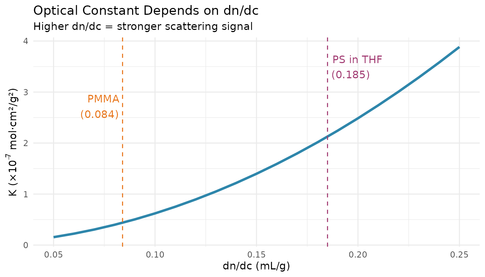
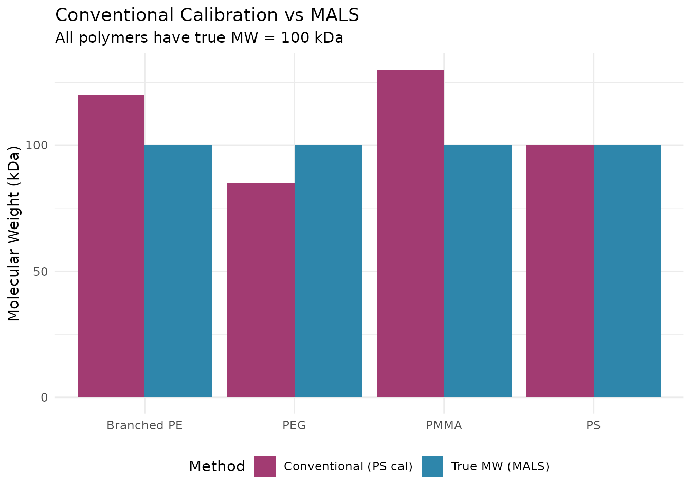
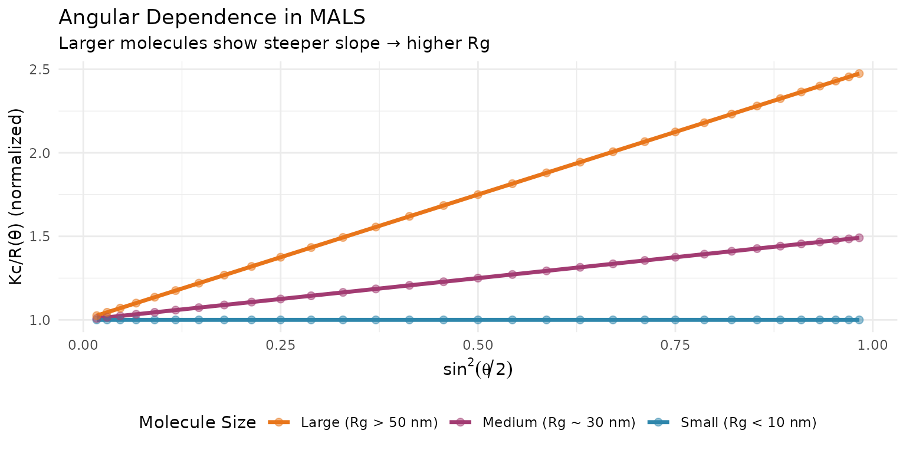
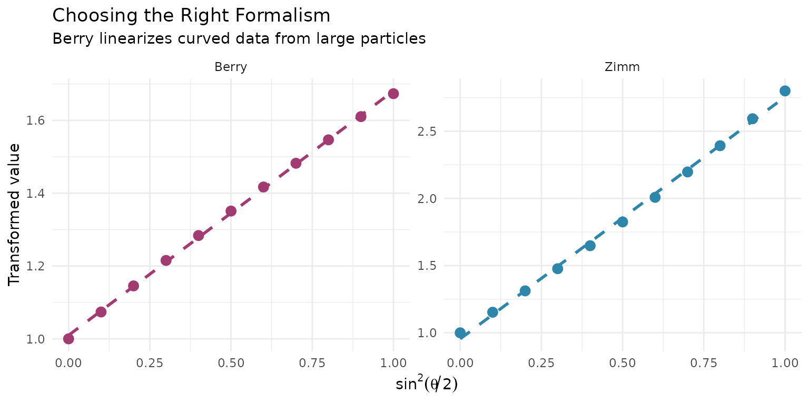
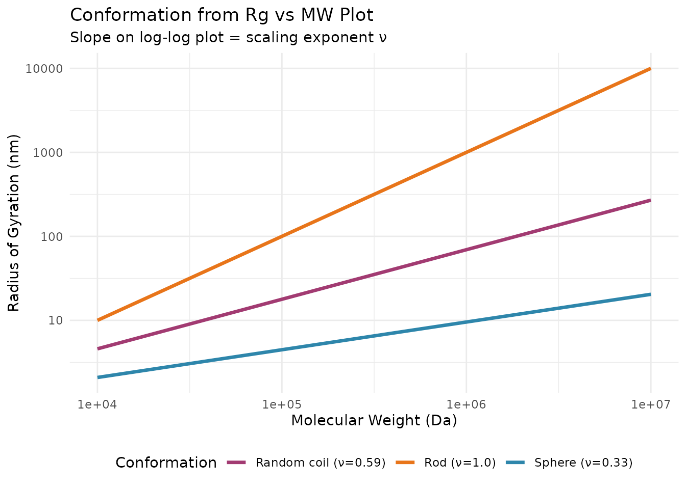

# Multi-Angle Light Scattering (MALS) for Absolute Molecular Weight

## Overview

Multi-Angle Light Scattering (MALS) is a powerful technique that
provides **absolute molecular weight** without calibration standards.
Unlike conventional calibration (which gives MW relative to polymer
standards), MALS measures the actual molecular weight of your sample
based on fundamental light scattering physics. This vignette covers:

1.  How MALS measures absolute molecular weight

2.  Key parameters: dn/dc, wavelength, angles

3.  Zimm, Debye, and Berry formalisms

4.  Radius of gyration (Rg) from angular dependence

5.  Practical workflows with
    [`step_sec_mals()`](https://jameshwade.github.io/measure-sec/reference/step_sec_mals.md)

## Setup

``` r
library(measure)
#> Loading required package: recipes
#> Loading required package: dplyr
#> 
#> Attaching package: 'dplyr'
#> The following objects are masked from 'package:stats':
#> 
#>     filter, lag
#> The following objects are masked from 'package:base':
#> 
#>     intersect, setdiff, setequal, union
#> 
#> Attaching package: 'recipes'
#> The following object is masked from 'package:stats':
#> 
#>     step
library(measure.sec)
library(recipes)
library(dplyr)
library(ggplot2)
```

## How MALS Works

### The Light Scattering Principle

When light passes through a polymer solution, molecules scatter light in
all directions. The intensity of scattered light depends on:

- **Molecular weight**: Larger molecules scatter more light
- **Concentration**: More molecules = more scattering
- **Scattering angle**: Angular dependence reveals molecular size

The fundamental relationship is the **Rayleigh-Debye equation**:

$$\frac{Kc}{R(\theta)} = \frac{1}{M_{w} \cdot P(\theta)} + 2A_{2}c$$

Where:

| Symbol | Meaning                                                  |
|--------|----------------------------------------------------------|
| K      | Optical constant (depends on dn/dc, wavelength, solvent) |
| c      | Concentration (g/mL)                                     |
| R(θ)   | Excess Rayleigh ratio (scattered intensity)              |
| Mw     | Weight-average molecular weight                          |
| P(θ)   | Particle scattering function (angular dependence)        |
| A₂     | Second virial coefficient                                |

### The Optical Constant K

The optical constant depends on your experimental setup:

$$K = \frac{4\pi^{2}n_{0}^{2}(dn/dc)^{2}}{N_{A}\lambda^{4}}$$

Where:

- **n₀**: Solvent refractive index
- **dn/dc**: Refractive index increment of the polymer
- **λ**: Laser wavelength
- **Nₐ**: Avogadro’s number



**Key insight**: Accurate dn/dc is critical. A 10% error in dn/dc causes
a ~20% error in MW.

## Why Use MALS?

### Conventional Calibration Limitations

Conventional (relative) calibration has significant limitations:



| Polymer Type        | Conventional Cal | MALS     |
|---------------------|------------------|----------|
| Same as standards   | Accurate         | Accurate |
| Different chemistry | **Biased**       | Accurate |
| Branched            | **Biased**       | Accurate |
| Copolymers          | **Biased**       | Accurate |

**MALS is essential when**: - Analyzing polymers different from your
calibration standards - Studying branched or star polymers -
Characterizing copolymers - Absolute MW is required for regulatory
submissions

## Angular Dependence and Rg

### Why Multiple Angles?

Large molecules (Rg \> λ/20) scatter light differently at different
angles. This angular dependence reveals the **radius of gyration
(Rg)** - a measure of molecular size.



### Calculating Rg

From the Zimm equation, the slope of Kc/R(θ) vs sin²(θ/2) gives Rg:

$$\frac{Kc}{R(\theta)} = \frac{1}{M_{w}}\left( 1 + \frac{16\pi^{2}n_{0}^{2}}{3\lambda^{2}}R_{g}^{2}\sin^{2}(\theta/2) \right)$$

The y-intercept gives 1/Mw, and the slope gives Rg².

## Formalisms for Angular Extrapolation

### Zimm, Debye, and Berry

Three common approaches for angular extrapolation:

| Formalism | Plot                 | Best For                         |
|-----------|----------------------|----------------------------------|
| **Zimm**  | Kc/R vs sin²(θ/2)    | Random coils, most polymers      |
| **Debye** | Kc/R vs sin²(θ/2)    | Similar to Zimm                  |
| **Berry** | √(Kc/R) vs sin²(θ/2) | Very large particles, aggregates |

    #> `geom_smooth()` using formula = 'y ~ x'



**Choosing a formalism:**

- **Start with Zimm** - works for most polymers
- **Use Berry** if Zimm plot shows significant curvature
- **Berry is essential** for Rg \> 50 nm or aggregates

## Example Dataset

``` r
data(sec_triple_detect, package = "measure.sec")

# Select samples with MALS data
mals_samples <- sec_triple_detect |>
  filter(sample_type == "sample")

glimpse(mals_samples)
#> Rows: 14,007
#> Columns: 11
#> $ sample_id        <chr> "PMMA-Low", "PMMA-Low", "PMMA-Low", "PMMA-Low", "PMMA…
#> $ sample_type      <chr> "sample", "sample", "sample", "sample", "sample", "sa…
#> $ polymer_type     <chr> "pmma", "pmma", "pmma", "pmma", "pmma", "pmma", "pmma…
#> $ elution_time     <dbl> 5.00, 5.01, 5.02, 5.03, 5.04, 5.05, 5.06, 5.07, 5.08,…
#> $ ri_signal        <dbl> 2.177879e-04, 0.000000e+00, 2.307149e-04, 1.490633e-0…
#> $ uv_signal        <dbl> 0.000000e+00, 0.000000e+00, 0.000000e+00, 6.442527e-0…
#> $ mals_signal      <dbl> 3.454417e-06, 1.210776e-05, 1.804800e-05, 2.001408e-0…
#> $ known_mw         <dbl> 25000, 25000, 25000, 25000, 25000, 25000, 25000, 2500…
#> $ known_dispersity <dbl> 1.8, 1.8, 1.8, 1.8, 1.8, 1.8, 1.8, 1.8, 1.8, 1.8, 1.8…
#> $ dn_dc            <dbl> 0.084, 0.084, 0.084, 0.084, 0.084, 0.084, 0.084, 0.08…
#> $ extinction_coef  <dbl> 0.1, 0.1, 0.1, 0.1, 0.1, 0.1, 0.1, 0.1, 0.1, 0.1, 0.1…
```

## MALS Workflow with measure.sec

### Basic MALS Analysis

``` r
# Complete MALS workflow for absolute MW
rec_mals <- recipe(
  ri_signal + mals_signal + elution_time + dn_dc ~ sample_id,
  data = mals_samples
) |>
  update_role(sample_id, new_role = "id") |>
  # Convert signals to measure format
  step_measure_input_long(ri_signal, location = vars(elution_time), col_name = "ri") |>
  step_measure_input_long(mals_signal, location = vars(elution_time), col_name = "mals") |>
  # Baseline correction
  step_sec_baseline(measures = c("ri", "mals")) |>
  # Process RI for concentration
  step_sec_ri(measures = "ri", dn_dc_column = "dn_dc") |>
  # Convert RI to concentration
  step_sec_concentration(
    measures = "ri",
    detector = "ri",
    injection_volume = 100,       # µL
    sample_concentration = 2.0    # mg/mL
  ) |>
  # MALS processing for absolute MW
  step_sec_mals(
    mals_col = "mals",
    dn_dc_column = "dn_dc",
    wavelength = 658,             # nm (common MALS laser)
    solvent_ri = 1.407,           # THF
    angles = 90                   # Single angle for this example
  )

prepped_mals <- prep(rec_mals)
result_mals <- bake(prepped_mals, new_data = NULL)

# View results
result_mals |>
  select(sample_id, ri, mals, mw_mals) |>
  head(3)
#> # A tibble: 3 × 4
#>   sample_id          ri        mals     mw_mals
#>   <chr>          <meas>      <meas>      <meas>
#> 1 PMMA-Low  [2,001 × 2] [2,001 × 2] [2,001 × 2]
#> 2 PMMA-Med  [2,001 × 2] [2,001 × 2] [2,001 × 2]
#> 3 PMMA-High [2,001 × 2] [2,001 × 2] [2,001 × 2]
```

### Key Parameters

| Parameter    | Description                | Typical Values                                        |
|--------------|----------------------------|-------------------------------------------------------|
| `dn_dc`      | Refractive index increment | 0.185 (PS/THF), 0.084 (PMMA/THF)                      |
| `wavelength` | Laser wavelength (nm)      | 658, 690, 785                                         |
| `solvent_ri` | Solvent refractive index   | 1.333 (water), 1.407 (THF)                            |
| `angles`     | Detection angle(s)         | 90 (single), c(35, 50, 75, 90, 105, 120, 145) (multi) |
| `formalism`  | Extrapolation method       | “zimm”, “debye”, “berry”                              |

## The Critical Role of dn/dc

### What is dn/dc?

The refractive index increment (dn/dc) is the change in solution
refractive index per unit concentration:

$$\frac{dn}{dc} = \frac{n_{solution} - n_{solvent}}{c}$$

### Typical dn/dc Values

| Polymer     | Solvent        | dn/dc (mL/g) |
|-------------|----------------|--------------|
| Polystyrene | THF            | 0.185        |
| PMMA        | THF            | 0.084        |
| PEG/PEO     | Water          | 0.135        |
| Proteins    | Aqueous buffer | ~0.185       |
| DNA         | Aqueous        | ~0.170       |

### Measuring dn/dc

For accurate MALS, measure dn/dc using:

1.  **Differential refractometer** with known concentrations
2.  **Batch-mode measurement** (most accurate)
3.  **Online measurement** during SEC (convenient but less accurate)

**Warning**: Using literature dn/dc values can introduce 5-20% error in
MW.

## Multi-Angle Detection

### Setting Up Multi-Angle Analysis

For Rg determination, provide multiple detection angles:

``` r
# Multi-angle MALS for MW and Rg
step_sec_mals(
  mals_col = "mals",
  dn_dc = 0.185,
  wavelength = 658,
  solvent_ri = 1.407,
  angles = c(35, 50, 75, 90, 105, 120, 145),  # Typical MALS detector angles
  formalism = "zimm"                           # Try "berry" for large particles
)
```

### Interpreting Rg Results

| Rg Range  | Interpretation                        |
|-----------|---------------------------------------|
| \< 10 nm  | Small molecules, Rg may be unreliable |
| 10-50 nm  | Typical random coil polymers          |
| 50-100 nm | Large polymers, branched structures   |
| \> 100 nm | Very large or aggregated species      |

## Conformation Analysis

### Rg vs MW Relationship

The relationship between Rg and MW reveals polymer conformation:

$$R_{g} = K \cdot M_{w}^{\nu}$$

Where ν (the scaling exponent) indicates conformation:

| ν Value | Conformation                   |
|---------|--------------------------------|
| 0.33    | Hard sphere                    |
| 0.5-0.6 | Random coil (theta conditions) |
| 0.6-0.7 | Random coil (good solvent)     |
| 1.0     | Rigid rod                      |



## Troubleshooting

### Common MALS Issues

| Problem         | Possible Causes         | Solutions                               |
|-----------------|-------------------------|-----------------------------------------|
| Noisy MW data   | Low concentration, dust | Increase conc, filter samples           |
| Negative MW     | Baseline issues         | Improve baseline, check alignment       |
| MW too high     | Aggregates, dust        | Filter samples, check for aggregation   |
| MW too low      | Wrong dn/dc             | Measure dn/dc accurately                |
| Inconsistent Rg | Poor signal, few angles | Use more angles, increase concentration |

### Signal-to-Noise Requirements

MALS requires good signal-to-noise for accurate results:

- **Minimum concentration**: 0.5-1 mg/mL for most polymers
- **Higher for low MW**: Small molecules scatter less
- **Lower for very high MW**: Large molecules scatter strongly

### Detector Alignment

Ensure proper detector alignment:

1.  **Inter-detector delay** - Correct for time offset between RI and
    MALS
2.  **Normalization** - Calibrate MALS using toluene or known standard
3.  **Angle calibration** - Verify detector angles are accurate

## When to Use MALS vs Conventional Calibration

| Scenario                         | Recommendation                            |
|----------------------------------|-------------------------------------------|
| Routine QC of known polymer      | Conventional cal is faster and sufficient |
| Different polymer from standards | **Use MALS**                              |
| Branched or complex architecture | **Use MALS**                              |
| Absolute MW required             | **Use MALS**                              |
| Characterizing new materials     | **Use MALS**                              |
| Regulatory submissions           | **Use MALS** for accuracy                 |

## See Also

- [Getting
  Started](https://jameshwade.github.io/measure-sec/articles/getting-started.md) -
  Basic SEC workflow
- [LALS and RALS
  Detection](https://jameshwade.github.io/measure-sec/articles/lals-rals-detection.md) -
  Simpler light scattering alternatives
- [Multi-Detector
  SEC](https://jameshwade.github.io/measure-sec/articles/triple-detection.md) -
  RI + Viscometer + LS workflows
- [System
  Suitability](https://jameshwade.github.io/measure-sec/articles/system-suitability.md) -
  QC metrics for MALS

## Session Info

``` r
sessionInfo()
#> R version 4.5.2 (2025-10-31)
#> Platform: x86_64-pc-linux-gnu
#> Running under: Ubuntu 24.04.3 LTS
#> 
#> Matrix products: default
#> BLAS:   /usr/lib/x86_64-linux-gnu/openblas-pthread/libblas.so.3 
#> LAPACK: /usr/lib/x86_64-linux-gnu/openblas-pthread/libopenblasp-r0.3.26.so;  LAPACK version 3.12.0
#> 
#> locale:
#>  [1] LC_CTYPE=C.UTF-8       LC_NUMERIC=C           LC_TIME=C.UTF-8       
#>  [4] LC_COLLATE=C.UTF-8     LC_MONETARY=C.UTF-8    LC_MESSAGES=C.UTF-8   
#>  [7] LC_PAPER=C.UTF-8       LC_NAME=C              LC_ADDRESS=C          
#> [10] LC_TELEPHONE=C         LC_MEASUREMENT=C.UTF-8 LC_IDENTIFICATION=C   
#> 
#> time zone: UTC
#> tzcode source: system (glibc)
#> 
#> attached base packages:
#> [1] stats     graphics  grDevices utils     datasets  methods   base     
#> 
#> other attached packages:
#> [1] ggplot2_4.0.1          measure.sec_0.0.0.9000 measure_0.0.1.9001    
#> [4] recipes_1.3.1          dplyr_1.1.4           
#> 
#> loaded via a namespace (and not attached):
#>  [1] gtable_0.3.6        xfun_0.55           bslib_0.9.0        
#>  [4] lattice_0.22-7      vctrs_0.6.5         tools_4.5.2        
#>  [7] generics_0.1.4      parallel_4.5.2      tibble_3.3.0       
#> [10] pkgconfig_2.0.3     Matrix_1.7-4        data.table_1.18.0  
#> [13] RColorBrewer_1.1-3  S7_0.2.1            desc_1.4.3         
#> [16] lifecycle_1.0.4     compiler_4.5.2      farver_2.1.2       
#> [19] textshaping_1.0.4   codetools_0.2-20    htmltools_0.5.9    
#> [22] class_7.3-23        sass_0.4.10         yaml_2.3.12        
#> [25] prodlim_2025.04.28  tidyr_1.3.2         pillar_1.11.1      
#> [28] pkgdown_2.2.0       jquerylib_0.1.4     MASS_7.3-65        
#> [31] cachem_1.1.0        gower_1.0.2         rpart_4.1.24       
#> [34] nlme_3.1-168        parallelly_1.46.0   lava_1.8.2         
#> [37] tidyselect_1.2.1    digest_0.6.39       future_1.68.0      
#> [40] purrr_1.2.0         listenv_0.10.0      labeling_0.4.3     
#> [43] splines_4.5.2       fastmap_1.2.0       grid_4.5.2         
#> [46] cli_3.6.5           magrittr_2.0.4      utf8_1.2.6         
#> [49] survival_3.8-3      future.apply_1.20.1 withr_3.0.2        
#> [52] scales_1.4.0        lubridate_1.9.4     timechange_0.3.0   
#> [55] rmarkdown_2.30      globals_0.18.0      nnet_7.3-20        
#> [58] timeDate_4051.111   ragg_1.5.0          evaluate_1.0.5     
#> [61] knitr_1.51          hardhat_1.4.2       mgcv_1.9-3         
#> [64] rlang_1.1.6         Rcpp_1.1.0          glue_1.8.0         
#> [67] ipred_0.9-15        jsonlite_2.0.0      R6_2.6.1           
#> [70] systemfonts_1.3.1   fs_1.6.6
```
