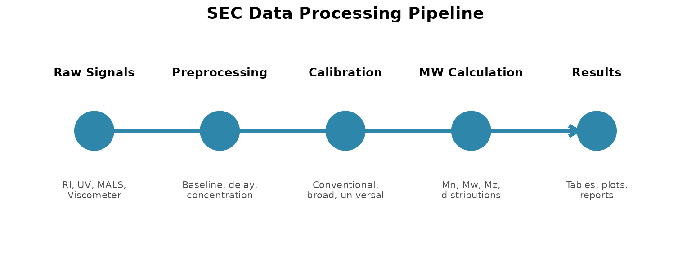
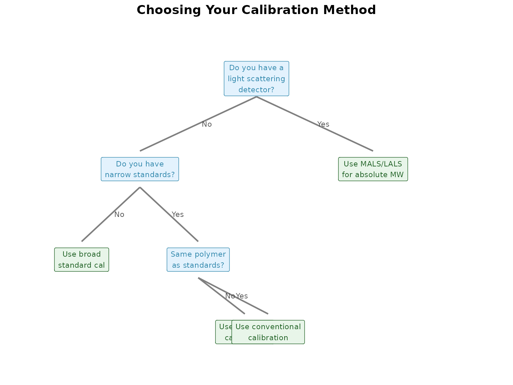

# SEC Concepts: A Practical Guide

## About This Guide

This guide explains SEC concepts from a practical perspective—what you
need to know to use `measure.sec` effectively. It’s not a textbook;
every concept ties back to package functionality with guidance on *when*
and *why* to use different approaches.

**Who this is for**: Users with a chemistry background who are new to
SEC or want to understand when to use which package features.

**How to use it**: Read straight through for a conceptual foundation, or
jump to specific sections when you need decision guidance.

## How SEC Data Flows Through measure.sec

### The Processing Pipeline

SEC data processing follows a consistent pattern: raw detector signals
are converted to a common format, processed to remove artifacts,
calibrated to molecular weight, and then used to calculate results.
Understanding this flow helps you build recipes that make sense.

    #> Warning in geom_segment(aes(x = 1.15, xend = 4.85, y = 1, yend = 1), arrow = arrow(length = unit(0.3, : All aesthetics have length 1, but the data has 5 rows.
    #> ℹ Please consider using `annotate()` or provide this layer with data containing
    #>   a single row.



### Stage 1: Input Signals

Every recipe starts by converting raw detector signals into `measure`
format using
[`step_measure_input_long()`](https://jameshwade.github.io/measure/reference/step_measure_input_long.html).
This standardizes different detectors into a common structure where each
measurement has a location (elution time or volume) and a value (signal
intensity).

``` r
recipe(...) |>
  step_measure_input_long(ri_signal, location = vars(elution_time), col_name = "ri") |>
  step_measure_input_long(uv_signal, location = vars(elution_time), col_name = "uv")
```

### Stage 2: Preprocessing

Before calibration, signals need cleaning:

| Step                                                                                                                                                                        | What It Does                   | When to Use                           |
|-----------------------------------------------------------------------------------------------------------------------------------------------------------------------------|--------------------------------|---------------------------------------|
| [`step_sec_detector_delay()`](https://jameshwade.github.io/measure-sec/reference/step_sec_detector_delay.md)                                                                | Aligns multi-detector signals  | Always with multiple detectors        |
| [`step_sec_baseline()`](https://jameshwade.github.io/measure-sec/reference/step_sec_baseline.md)                                                                            | Removes baseline drift         | Almost always                         |
| [`step_sec_ri()`](https://jameshwade.github.io/measure-sec/reference/step_sec_ri.md) / [`step_sec_uv()`](https://jameshwade.github.io/measure-sec/reference/step_sec_uv.md) | Normalizes by response factor  | Before concentration calculation      |
| [`step_sec_concentration()`](https://jameshwade.github.io/measure-sec/reference/step_sec_concentration.md)                                                                  | Converts to mass concentration | Before light scattering or viscometry |
| [`step_sec_band_broadening()`](https://jameshwade.github.io/measure-sec/reference/step_sec_band_broadening.md)                                                              | Corrects peak spreading        | High-resolution MW distributions      |

**Order matters**: Detector delay correction must come first. Baseline
correction should precede normalization. Concentration is needed before
MALS calculations.

### Stage 3: Calibration

Calibration converts elution time to molecular weight. The right
approach depends on your standards and goals:

| Method          | Function                                                                                                         | Best For                            |
|-----------------|------------------------------------------------------------------------------------------------------------------|-------------------------------------|
| Conventional    | [`step_sec_conventional_cal()`](https://jameshwade.github.io/measure-sec/reference/step_sec_conventional_cal.md) | Narrow standards, same polymer type |
| Broad standard  | [`step_sec_broad_standard()`](https://jameshwade.github.io/measure-sec/reference/step_sec_broad_standard.md)     | Single characterized reference      |
| Universal       | [`step_sec_universal_cal()`](https://jameshwade.github.io/measure-sec/reference/step_sec_universal_cal.md)       | Different polymer types             |
| Absolute (MALS) | [`step_sec_mals()`](https://jameshwade.github.io/measure-sec/reference/step_sec_mals.md)                         | True MW, no standards needed        |

### Stage 4: MW Calculation

With calibration complete, calculate molecular weight results:

| Step                                                                                                           | Output                             |
|----------------------------------------------------------------------------------------------------------------|------------------------------------|
| [`step_sec_mw_averages()`](https://jameshwade.github.io/measure-sec/reference/step_sec_mw_averages.md)         | Mn, Mw, Mz, dispersity             |
| [`step_sec_mw_distribution()`](https://jameshwade.github.io/measure-sec/reference/step_sec_mw_distribution.md) | d(W)/d(log M) curve                |
| [`step_sec_mw_fractions()`](https://jameshwade.github.io/measure-sec/reference/step_sec_mw_fractions.md)       | Cumulative fractions at MW cutoffs |

### Stage 5: Export and Visualization

Extract results for reporting:

- [`measure_sec_summary_table()`](https://jameshwade.github.io/measure-sec/reference/measure_sec_summary_table.md):
  Publication-ready summary statistics
- [`measure_sec_slice_table()`](https://jameshwade.github.io/measure-sec/reference/measure_sec_slice_table.md):
  Point-by-point data for custom analysis
- `plot_sec_*()` family: Chromatograms, MWDs, calibration curves

## Choosing Your Calibration Approach

Calibration is where most users face their first major decision. This
section helps you choose the right approach.

### Decision Tree



### Conventional Calibration

**When to use**: You have narrow MW standards (low dispersity) of the
*same polymer type* as your samples.

**How it works**: Fit a polynomial relationship between log(MW) and
elution time using standards. Apply this curve to unknown samples.

``` r
step_sec_conventional_cal(
  standards_data = standards,
  degree = 3              # Polynomial order (usually 3)
)
```

**Advantages**: Simple, well-understood, widely used. Calibration curve
provides diagnostics (R², residuals).

**Limitations**: Assumes your sample behaves like the standards. A
branched polymer will report incorrect MW because it elutes later than a
linear polymer of the same MW.

**Best practices**:

- Use 5+ standards spanning your MW range of interest
- Check residuals—systematic patterns indicate poor fit
- Don’t extrapolate far beyond your calibration range

### Broad Standard Calibration

**When to use**: You have one well-characterized broad-distribution
reference material instead of multiple narrow standards.

**How it works**: Uses the known MWD of the reference to establish the
MW-elution relationship in a single injection.

``` r
step_sec_broad_standard(
  reference_mwd = known_distribution,
  reference_mn = 50000,
  reference_mw = 150000
)
```

**Advantages**: Single injection, good for routine QC. Convenient when
narrow standards aren’t available.

**Limitations**: Accuracy depends entirely on how well you know the
reference material’s MWD. Any error in the reference propagates to all
samples.

### Universal Calibration

**When to use**: Your samples are a *different polymer type* than your
available standards.

**How it works**: Calibrates on hydrodynamic volume (\[η\] × M) rather
than molecular weight directly. Uses Mark-Houwink parameters to convert
between polymer types.

``` r
step_sec_universal_cal(
  # Calibration standards (e.g., polystyrene)
  reference_k = 1.14e-4,
  reference_a = 0.716,
  # Your sample (e.g., PMMA)
  sample_k = 6.0e-5,
  sample_a = 0.73
)
```

**Requires**: Intrinsic viscosity data (from viscometer) AND
Mark-Houwink parameters for both polymer types.

**Advantages**: Accurate MW for different polymer types using common
standards.

**Limitations**: You need reliable K and a values for your sample, which
may require literature search or independent measurement. Doesn’t work
well for highly branched polymers where Mark-Houwink parameters aren’t
constant.

### Absolute MW (Light Scattering)

**When to use**: You need true molecular weight independent of polymer
structure, or have no appropriate standards.

**How it works**: Light scattering intensity is directly proportional to
molecular weight × concentration. No column calibration needed.

``` r
step_sec_mals(
  dn_dc_column = "dn_dc"   # Refractive index increment
)
```

**Requires**: Light scattering detector (MALS, LALS, or RALS), accurate
dn/dc value, good signal quality.

**Advantages**: True absolute MW. Works for any polymer type. Reveals
branching through Rg-MW relationships. Required for proteins and complex
polymers.

**Limitations**: More expensive instrumentation. Sensitive to dust and
bubbles. Low MW samples may have weak scattering signal.

## Understanding Your Detectors

Each detector type provides different information. Knowing what each
measures helps you interpret results and troubleshoot problems.

### Concentration Detectors

These tell you *how much* material is present at each elution slice.

#### Refractive Index (RI)

**What it measures**: Change in refractive index proportional to
concentration.

**Key parameter**: dn/dc (refractive index increment, mL/g)

``` r
step_sec_ri(dn_dc_column = "dn_dc")
```

| Pros                               | Cons                                  |
|------------------------------------|---------------------------------------|
| Universal—responds to all polymers | Sensitive to temperature              |
| Mass-based response                | Sensitive to mobile phase composition |
| Most common detector               | Baseline drift common                 |

**When to use**: Default concentration detector for most polymer SEC.
Essential for MW calculations.

#### UV Detector

**What it measures**: Absorbance at specific wavelength(s).

**Key parameter**: Extinction coefficient (ε, mL/(g·cm))

``` r
step_sec_uv(extinction_column = "extinction_coef", wavelength = 280)
```

| Pros            | Cons                                    |
|-----------------|-----------------------------------------|
| Very sensitive  | Only detects UV-active chromophores     |
| Selective       | Response depends on chromophore content |
| Stable baseline | May need multiple wavelengths           |

**When to use**: Proteins (280 nm), aromatic polymers, or when combined
with RI for composition analysis.

#### DAD (Diode Array)

**What it measures**: Full UV-Vis spectrum at each point.

``` r
step_sec_dad(wavelengths = c(254, 280, 320))
```

**When to use**: Complex samples where spectral information helps
identify components. Copolymer composition with wavelength-dependent
absorption.

### Molecular Weight Detectors

These measure MW directly, independent of calibration.

#### Multi-Angle Light Scattering (MALS)

**What it measures**: Scattered light intensity at multiple angles.

**Provides**: Absolute MW and radius of gyration (Rg) at each slice.

``` r
step_sec_mals(dn_dc_column = "dn_dc")
```

| Best for                    | Limitations                     |
|-----------------------------|---------------------------------|
| Large molecules (\> 10 kDa) | Requires very clean samples     |
| Rg measurement              | Signal weak for small molecules |
| Branching analysis          | Expensive                       |

**See also**: [MALS Detection
vignette](https://jameshwade.github.io/measure-sec/articles/mals-detection.md)

#### Low-Angle Light Scattering (LALS)

**What it measures**: Scattered light near 0° angle.

``` r
step_sec_lals(dn_dc_column = "dn_dc")
```

| Best for          | Limitations                       |
|-------------------|-----------------------------------|
| Medium molecules  | No Rg measurement                 |
| Simpler than MALS | Less accurate for large molecules |
| Lower cost        | Still needs clean samples         |

#### Right-Angle Light Scattering (RALS)

**What it measures**: Scattered light at 90°.

``` r
step_sec_rals(dn_dc_column = "dn_dc")
```

| Best for              | Limitations                |
|-----------------------|----------------------------|
| Small molecules       | Biased for large molecules |
| Screening/QC          | No structural information  |
| Lowest cost LS option | Limited to narrow MW range |

**See also**: [LALS/RALS Detection
vignette](https://jameshwade.github.io/measure-sec/articles/lals-rals-detection.md)

### Hydrodynamic Detectors

These measure molecular size and conformation in solution.

#### Viscometer

**What it measures**: Differential pressure across a capillary, related
to solution viscosity.

**Provides**: Intrinsic viscosity \[η\] when combined with
concentration.

``` r
step_sec_viscometer()
step_sec_intrinsic_visc(visc_col = "visc", conc_col = "concentration")
```

| Best for                   | Limitations                 |
|----------------------------|-----------------------------|
| Universal calibration      | Requires concentration data |
| Branching characterization | Sensitive to bubbles        |
| Mark-Houwink parameters    | Additional complexity       |

#### Dynamic Light Scattering (DLS)

**What it measures**: Time-dependent intensity fluctuations from
Brownian motion.

**Provides**: Hydrodynamic radius (Rh).

``` r
step_sec_dls()
```

| Best for             | Limitations             |
|----------------------|-------------------------|
| Particle sizing      | Less common online      |
| Conformation studies | Concentration-dependent |

## Common Pitfalls and Solutions

This section addresses problems you’re likely to encounter and how
`measure.sec` helps you fix them.

### Baseline Issues

**Symptoms**: Sloped baseline, wavy baseline, or baseline that doesn’t
return to zero.

**Causes**: Temperature drift (RI), mobile phase mixing, column
equilibration, late-eluting contaminants.

**Solution**: Use
[`step_sec_baseline()`](https://jameshwade.github.io/measure-sec/reference/step_sec_baseline.md)
with an appropriate method:

``` r
step_sec_baseline(
  measures = "ri",
  method = "linear",       # Simple start-to-end connection
  # or
  method = "spline",       # Follows gradual curves
  # or
  method = "asymmetric"    # Handles uneven noise
)
```

**Which method to choose**:

- **linear**: Fast, works when baseline is truly straight
- **spline**: Better for gradual drift or temperature effects
- **asymmetric**: Best for noisy data or when peak tails affect baseline

### Inter-Detector Delay

**Symptoms**: Calculated MW varies with injection volume, or MW appears
to vary across a peak that should be uniform.

**Cause**: Detectors in series experience different delays. A 150 µL
delay volume at 1 mL/min means 9 seconds of offset—which can shift MW by
orders of magnitude.

**Solution**: Use
[`step_sec_detector_delay()`](https://jameshwade.github.io/measure-sec/reference/step_sec_detector_delay.md)
*before* any MW calculations:

``` r
step_sec_detector_delay(
  reference = "ri",
  delay_volumes = c(uv = -0.05, mals = 0.15)  # mL
)
```

**How to measure delays**:

1.  Inject a low-MW marker (toluene, polymer standard)
2.  Record peak apex time on each detector
3.  Convert time difference to volume: delay = Δt × flow_rate

**Tip**: Re-measure after column changes or major maintenance.

### Band Broadening

**Symptoms**: MWD appears broader than expected. High MW tail or low MW
shoulder.

**Cause**: Peak spreading from extra-column volume, column dispersion,
or injection effects.

**Solution**: Use
[`step_sec_band_broadening()`](https://jameshwade.github.io/measure-sec/reference/step_sec_band_broadening.md)
to deconvolve the true distribution:

``` r
step_sec_band_broadening(
  sigma = 0.03  # Peak spreading parameter (mL)
)
```

**Estimate sigma** using a narrow standard—the peak width should be
entirely from broadening:

``` r
sigma <- estimate_sigma(
  narrow_standard_data,
  signal_col = "ri"
)
```

### Out-of-Range Calibration

**Symptoms**: Extrapolated MW values seem unreasonable. Very high or
very low MW fractions.

**Cause**: Sample contains material outside the MW range of your
calibration standards.

**Solution**: Options in
[`step_sec_conventional_cal()`](https://jameshwade.github.io/measure-sec/reference/step_sec_conventional_cal.md):

``` r
step_sec_conventional_cal(
  standards_data = standards,
  extrapolate = "linear",    # Continue slope beyond range
  # or
  extrapolate = "constant",  # Clamp at boundary
  # or
  extrapolate = "none"       # Return NA outside range
)
```

**Best practice**: Use standards that span your sample’s MW range. If
extrapolation is unavoidable, use “linear” with caution and flag those
results.

### Noisy Light Scattering

**Symptoms**: Jagged LS signal, especially at low concentration regions.

**Causes**: Dust, bubbles, low sample concentration, detector noise.

**Solutions**:

1.  **Filter samples**: 0.22 µm minimum, 0.1 µm for MALS
2.  **Degas mobile phase**: Remove dissolved gases
3.  **Increase concentration**: More sample = more scattering signal
4.  **Apply smoothing**: In step parameters or post-processing

## Interpreting Results

### Molecular Weight Averages

SEC produces multiple MW averages. Each tells you something different:

| Average | Formula                         | What It Emphasizes                   |
|---------|---------------------------------|--------------------------------------|
| Mn      | Σ(n_(i)M_(i)) / Σn_(i)          | Number of chains—sensitive to low MW |
| Mw      | Σ(n_(i)M_(i)²) / Σ(n_(i)M_(i))  | Mass of chains—sensitive to high MW  |
| Mz      | Σ(n_(i)M_(i)³) / Σ(n_(i)M_(i)²) | Very sensitive to high MW tail       |

**Practical interpretation**:

- **Mn** tells you about the most numerous species
- **Mw** tells you where most of the mass is
- **Mz** warns about high MW contamination or aggregation

### Dispersity (Đ)

Dispersity = Mw/Mn measures the breadth of the distribution.

| Đ Value   | Interpretation                                       |
|-----------|------------------------------------------------------|
| 1.0       | Perfectly monodisperse (theoretical limit)           |
| \< 1.1    | Very narrow (controlled polymerization)              |
| 1.5 - 2.0 | Typical for step-growth or conventional free radical |
| \> 3.0    | Very broad, may indicate blending or degradation     |

**Tip**: If Đ \< 1.0, something is wrong—often a calibration or
integration problem.

### When Results Look Wrong

**MW seems too high or too low**:

- Check calibration: Are standards correctly identified?
- Check detector delays: Misalignment shifts apparent MW
- Check dn/dc: Wrong value directly scales MW from LS

**Dispersity seems too narrow**:

- Check integration limits: Too narrow excludes real distribution
- Check band broadening: Unaccounted broadening inflates apparent width
- Sample may genuinely be narrow

**MW varies between injections**:

- Check baseline reproducibility
- Check column equilibration
- Check sample stability (aggregation, degradation)

**Negative MW at distribution edges**:

- Normal at very low signal—noise can go negative
- Set appropriate thresholds in MW calculation steps
- Focus on the region with good signal-to-noise

## See Also

- [Getting
  Started](https://jameshwade.github.io/measure-sec/articles/getting-started.md) -
  Your first SEC analysis
- [Comprehensive SEC
  Analysis](https://jameshwade.github.io/measure-sec/articles/sec-analysis.md) -
  Full reference for all features
- [Multi-Detector
  SEC](https://jameshwade.github.io/measure-sec/articles/triple-detection.md) -
  Detailed multi-detector workflows
- [Calibration
  Management](https://jameshwade.github.io/measure-sec/articles/calibration-management.md) -
  Saving and reusing calibrations
