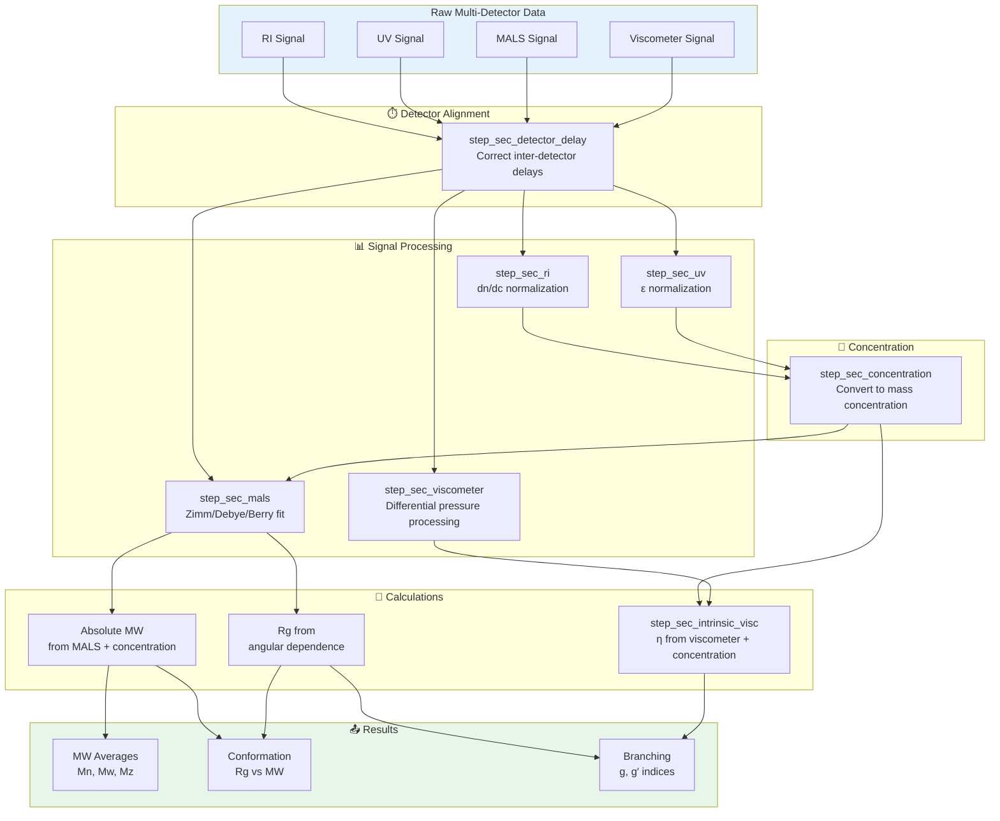
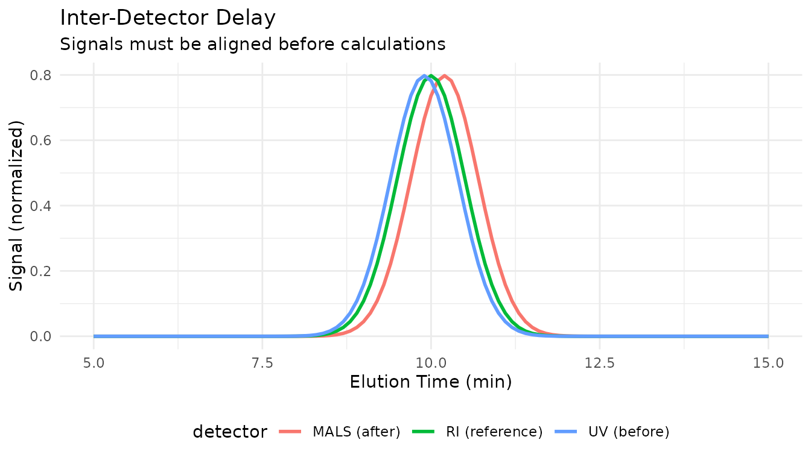
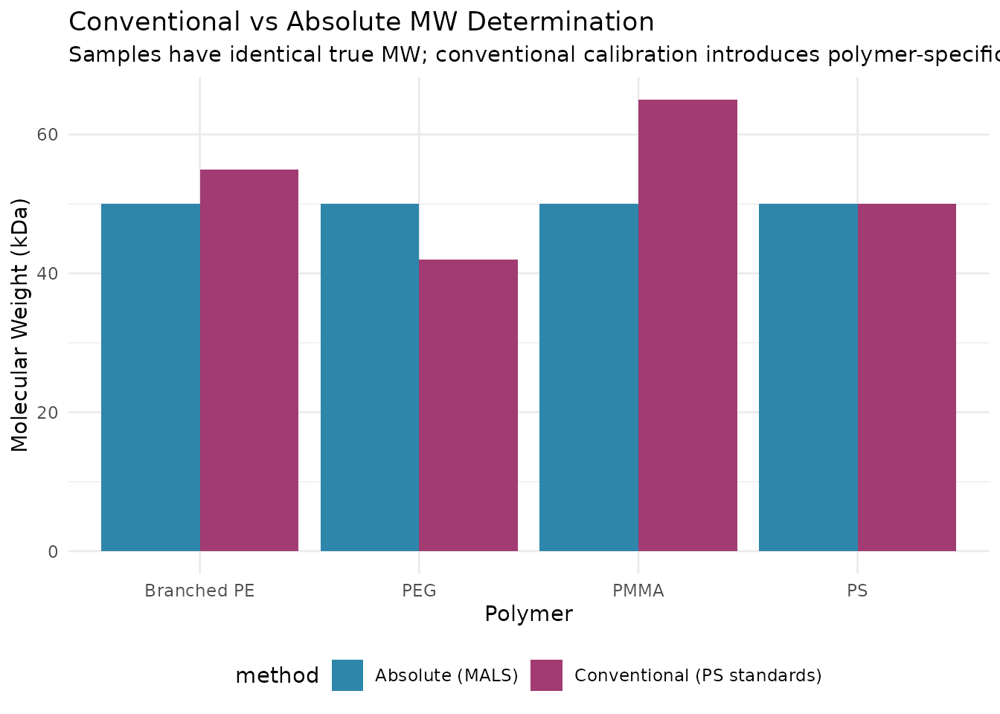

# Multi-Detector SEC Analysis

## Overview

Multi-detector SEC (also called “triple detection”) combines
concentration detectors (RI, UV) with molecular weight detectors (MALS)
and/or viscometers to provide absolute molecular weight and structural
information without calibration standards.

This vignette covers:

1.  Detector configurations and their purposes
2.  Inter-detector delay correction
3.  Triple detection workflows (RI + UV + MALS)
4.  Calculating absolute molecular weight

### Multi-Detector Workflow

In multi-detector SEC (“triple detection”), signals from concentration
detectors (RI, UV) and molecular weight detectors (MALS) are processed
together. First, inter-detector delays are corrected to align peaks.
Then each detector signal is processed: RI/UV for concentration, MALS
for absolute MW via angular extrapolation, and viscometer for intrinsic
viscosity. The concentration data feeds into MALS calculations to
determine absolute molecular weight and radius of gyration.



*Note: MALS requires concentration data to calculate absolute molecular
weight. The viscometer outputs differential pressure, which is combined
with concentration in
[`step_sec_intrinsic_visc()`](https://jameshwade.github.io/measure-sec/reference/step_sec_intrinsic_visc.md)
to calculate intrinsic viscosity \[η\].*

## Setup

``` r
library(measure)
#> Loading required package: recipes
#> Loading required package: dplyr
#> 
#> Attaching package: 'dplyr'
#> The following objects are masked from 'package:stats':
#> 
#>     filter, lag
#> The following objects are masked from 'package:base':
#> 
#>     intersect, setdiff, setequal, union
#> 
#> Attaching package: 'recipes'
#> The following object is masked from 'package:stats':
#> 
#>     step
library(measure.sec)
library(recipes)
library(dplyr)
library(ggplot2)
```

## Detector Types

### Concentration Detectors

| Detector | Signal              | Best For                                      |
|----------|---------------------|-----------------------------------------------|
| **RI**   | Refractive index    | Universal detection, mass-based concentration |
| **UV**   | Absorbance          | Chromophore-containing samples                |
| **DAD**  | Multi-wavelength UV | Complex samples, composition                  |

### Molecular Weight Detectors

| Detector | Signal                 | Output          |
|----------|------------------------|-----------------|
| **MALS** | Multi-angle scattering | Absolute Mw, Rg |
| **LALS** | Low-angle (7-15°)      | Absolute Mw     |
| **RALS** | Right-angle (90°)      | Relative Mw     |

### Hydrodynamic Detectors

| Detector       | Signal                | Output                     |
|----------------|-----------------------|----------------------------|
| **Viscometer** | Differential pressure | Intrinsic viscosity, \[η\] |
| **DLS**        | Dynamic scattering    | Hydrodynamic radius, Rh    |

## Example Dataset

``` r
data(sec_triple_detect, package = "measure.sec")

# Select samples with all three detectors
samples <- sec_triple_detect |>
  filter(sample_type == "sample") |>
  head(3)

glimpse(samples)
#> Rows: 3
#> Columns: 11
#> $ sample_id        <chr> "PMMA-Low", "PMMA-Low", "PMMA-Low"
#> $ sample_type      <chr> "sample", "sample", "sample"
#> $ polymer_type     <chr> "pmma", "pmma", "pmma"
#> $ elution_time     <dbl> 5.00, 5.01, 5.02
#> $ ri_signal        <dbl> 0.0002177879, 0.0000000000, 0.0002307149
#> $ uv_signal        <dbl> 0, 0, 0
#> $ mals_signal      <dbl> 3.454417e-06, 1.210776e-05, 1.804800e-05
#> $ known_mw         <dbl> 25000, 25000, 25000
#> $ known_dispersity <dbl> 1.8, 1.8, 1.8
#> $ dn_dc            <dbl> 0.084, 0.084, 0.084
#> $ extinction_coef  <dbl> 0.1, 0.1, 0.1
```

## Inter-Detector Delay Correction

When detectors are connected in series, each experiences a different
delay. Proper alignment is critical:



Use
[`step_sec_detector_delay()`](https://jameshwade.github.io/measure-sec/reference/step_sec_detector_delay.md)
to correct for these delays:

``` r
rec <- recipe(
  ri_signal + uv_signal + mals_signal + elution_time + dn_dc + extinction_coef ~ sample_id,
  data = samples
) |>
  update_role(sample_id, new_role = "id") |>
  # Convert all detector signals to measure format
  step_measure_input_long(ri_signal, location = vars(elution_time), col_name = "ri") |>
  step_measure_input_long(uv_signal, location = vars(elution_time), col_name = "uv") |>
  step_measure_input_long(mals_signal, location = vars(elution_time), col_name = "mals") |>
  # Correct inter-detector delays
  # Positive values = detector is downstream (later)
  # Negative values = detector is upstream (earlier)
  step_sec_detector_delay(
    reference = "ri",
    delay_volumes = c(uv = -0.05, mals = 0.15)
  )
```

### Determining Delay Values

Delay volumes should be determined experimentally:

1.  **Inject a narrow standard** (e.g., low MW polymer)
2.  **Measure peak apex times** on each detector
3.  **Calculate delays** relative to reference detector
4.  **Convert time to volume**: delay_volume = delay_time × flow_rate

## Triple Detection Workflow

A complete triple detection recipe:

``` r
# Complete triple detection recipe
# Note: This example shows the full pattern; some steps may require
# additional configuration depending on your detector setup
rec_triple <- recipe(
  ri_signal + uv_signal + mals_signal + elution_time + dn_dc + extinction_coef ~ sample_id,
  data = samples
) |>
  update_role(sample_id, new_role = "id") |>
  # Step 1: Convert signals to measure format
  step_measure_input_long(ri_signal, location = vars(elution_time), col_name = "ri") |>
  step_measure_input_long(uv_signal, location = vars(elution_time), col_name = "uv") |>
  step_measure_input_long(mals_signal, location = vars(elution_time), col_name = "mals") |>

  # Step 2: Correct inter-detector delays
  step_sec_detector_delay(
    reference = "ri",
    delay_volumes = c(uv = -0.05, mals = 0.15)
  ) |>

  # Step 3: Baseline correction
  step_sec_baseline(measures = c("ri", "uv", "mals")) |>

  # Step 4: Process each detector
  step_sec_ri(measures = "ri", dn_dc_column = "dn_dc") |>
  step_sec_uv(measures = "uv", extinction_column = "extinction_coef") |>
  step_sec_mals(measures = "mals", dn_dc_column = "dn_dc") |>

  # Step 5: Convert to concentration
  step_sec_concentration(measures = "ri", detector = "ri") |>

  # Step 6: Calculate MW averages from MALS
  step_sec_mw_averages(mw_column = "mw_mals")

prepped_triple <- prep(rec_triple)
result_triple <- bake(prepped_triple, new_data = NULL)

# View results
result_triple |>
  select(sample_id, mw_mn, mw_mw, mw_mz, mw_dispersity)
```

## Light Scattering Detectors

### MALS: Multi-Angle Light Scattering

MALS provides absolute molecular weight by measuring scattering at
multiple angles:

``` r
# Process MALS data
# Note: MALS processing requires specific detector configuration
rec_mals <- recipe(
  mals_signal + elution_time + dn_dc ~ sample_id,
  data = samples
) |>
  update_role(sample_id, new_role = "id") |>
  step_measure_input_long(mals_signal, location = vars(elution_time), col_name = "mals") |>
  step_sec_baseline(measures = "mals") |>
  step_sec_mals(
    measures = "mals",
    dn_dc_column = "dn_dc",
    wavelength = 658,  # Laser wavelength in nm
    angles = c(35, 50, 75, 90, 105, 120, 145)  # Detector angles
  )
```

Key MALS parameters:

- **dn/dc**: Refractive index increment (mL/g)
- **Wavelength**: Laser wavelength (typically 658 or 690 nm)
- **Angles**: Detector positions for Zimm/Debye analysis

### LALS: Low-Angle Light Scattering

For samples where angular extrapolation is problematic:

``` r
step_sec_lals(
  measures = "lals",
  dn_dc_column = "dn_dc",
  angle = 7  # Low angle (degrees)
)
```

### RALS: Right-Angle Light Scattering

Cost-effective alternative for routine MW screening:

``` r
step_sec_rals(
  measures = "rals",
  dn_dc_column = "dn_dc"
)
```

## Viscometer Detection

Add intrinsic viscosity for Mark-Houwink analysis:

``` r
# Note: This requires viscometer data (visc_signal) and pre-calculated concentration
rec_visc <- recipe(
  visc_signal + elution_time ~ sample_id,
  data = samples
) |>
  update_role(sample_id, new_role = "id") |>
  step_measure_input_long(visc_signal, location = vars(elution_time), col_name = "visc") |>
  step_sec_baseline(measures = "visc") |>
  step_sec_viscometer(measures = "visc") |>
  step_sec_intrinsic_visc(
    visc_col = "visc",
    conc_col = "concentration"
  )
```

## Universal Calibration

With viscometry data, you can apply universal calibration across polymer
types:

``` r
# Mark-Houwink parameters for different polymers
# [η] = K × M^a

# Apply universal calibration
step_sec_universal_cal(
  visc_col = "intrinsic_visc",
  reference_k = 1.14e-4,  # PS in THF
  reference_a = 0.716,
  sample_k = 6.0e-5,      # PMMA in THF
  sample_a = 0.73
)
```

## Complete Quadruple Detection Example

Full workflow with RI, UV, MALS, and viscometer:

``` r
# Complete quadruple detection example
# Note: This requires viscometer data (visc_signal) which is not in sec_triple_detect
# The pattern shows the complete workflow for quad detection setups
rec_quad <- recipe(
  ri_signal + uv_signal + mals_signal + visc_signal + elution_time + dn_dc + extinction_coef ~ sample_id,
  data = samples
) |>
  update_role(sample_id, new_role = "id") |>
  # Input all four detectors
  step_measure_input_long(ri_signal, location = vars(elution_time), col_name = "ri") |>
  step_measure_input_long(uv_signal, location = vars(elution_time), col_name = "uv") |>
  step_measure_input_long(mals_signal, location = vars(elution_time), col_name = "mals") |>
  step_measure_input_long(visc_signal, location = vars(elution_time), col_name = "visc") |>

  # Delay correction (all relative to RI)
  step_sec_detector_delay(
    reference = "ri",
    delay_volumes = c(uv = -0.05, mals = 0.15, visc = 0.25)
  ) |>

  # Baseline correction
  step_sec_baseline(measures = c("ri", "uv", "mals", "visc")) |>

  # Process detectors
  step_sec_ri(measures = "ri", dn_dc_column = "dn_dc") |>
  step_sec_uv(measures = "uv", extinction_column = "extinction_coef") |>
  step_sec_mals(measures = "mals", dn_dc_column = "dn_dc") |>
  step_sec_viscometer(measures = "visc") |>

  # Concentration
  step_sec_concentration(measures = "ri", detector = "ri") |>

  # Intrinsic viscosity
  step_sec_intrinsic_visc(visc_col = "visc", conc_col = "concentration") |>

  # MW averages
  step_sec_mw_averages(mw_column = "mw_mals") |>

  # MW distribution
  step_sec_mw_distribution(
    signal_col = "ri",
    mw_column = "mw_mals",
    output_type = "both"
  )

prepped_quad <- prep(rec_quad)
result_quad <- bake(prepped_quad, new_data = NULL)
```

## Comparing Conventional vs Absolute MW



## Troubleshooting

### Common Issues

1.  **Poor signal-to-noise on MALS**
    - Increase sample concentration
    - Check laser power and alignment
    - Filter mobile phase
2.  **Inconsistent dn/dc values**
    - Use offline refractometer for accurate dn/dc
    - Account for wavelength and temperature
3.  **Detector delay drift**
    - Re-calibrate delays with each column change
    - Check flow rate stability
4.  **High baseline noise on viscometer**
    - Check for air bubbles
    - Verify temperature equilibration

## Session Info

``` r
sessionInfo()
#> R version 4.5.2 (2025-10-31)
#> Platform: x86_64-pc-linux-gnu
#> Running under: Ubuntu 24.04.3 LTS
#> 
#> Matrix products: default
#> BLAS:   /usr/lib/x86_64-linux-gnu/openblas-pthread/libblas.so.3 
#> LAPACK: /usr/lib/x86_64-linux-gnu/openblas-pthread/libopenblasp-r0.3.26.so;  LAPACK version 3.12.0
#> 
#> locale:
#>  [1] LC_CTYPE=C.UTF-8       LC_NUMERIC=C           LC_TIME=C.UTF-8       
#>  [4] LC_COLLATE=C.UTF-8     LC_MONETARY=C.UTF-8    LC_MESSAGES=C.UTF-8   
#>  [7] LC_PAPER=C.UTF-8       LC_NAME=C              LC_ADDRESS=C          
#> [10] LC_TELEPHONE=C         LC_MEASUREMENT=C.UTF-8 LC_IDENTIFICATION=C   
#> 
#> time zone: UTC
#> tzcode source: system (glibc)
#> 
#> attached base packages:
#> [1] stats     graphics  grDevices utils     datasets  methods   base     
#> 
#> other attached packages:
#> [1] ggplot2_4.0.1          measure.sec_0.0.0.9000 measure_0.0.1.9001    
#> [4] recipes_1.3.1          dplyr_1.1.4           
#> 
#> loaded via a namespace (and not attached):
#>  [1] gtable_0.3.6        xfun_0.55           bslib_0.9.0        
#>  [4] lattice_0.22-7      vctrs_0.6.5         tools_4.5.2        
#>  [7] generics_0.1.4      parallel_4.5.2      tibble_3.3.0       
#> [10] pkgconfig_2.0.3     Matrix_1.7-4        data.table_1.18.0  
#> [13] RColorBrewer_1.1-3  S7_0.2.1            desc_1.4.3         
#> [16] lifecycle_1.0.4     compiler_4.5.2      farver_2.1.2       
#> [19] textshaping_1.0.4   codetools_0.2-20    htmltools_0.5.9    
#> [22] class_7.3-23        sass_0.4.10         yaml_2.3.12        
#> [25] prodlim_2025.04.28  tidyr_1.3.2         pillar_1.11.1      
#> [28] pkgdown_2.2.0       jquerylib_0.1.4     MASS_7.3-65        
#> [31] cachem_1.1.0        gower_1.0.2         rpart_4.1.24       
#> [34] parallelly_1.46.0   lava_1.8.2          tidyselect_1.2.1   
#> [37] digest_0.6.39       future_1.68.0       purrr_1.2.0        
#> [40] listenv_0.10.0      labeling_0.4.3      splines_4.5.2      
#> [43] fastmap_1.2.0       grid_4.5.2          cli_3.6.5          
#> [46] magrittr_2.0.4      survival_3.8-3      future.apply_1.20.1
#> [49] withr_3.0.2         scales_1.4.0        lubridate_1.9.4    
#> [52] timechange_0.3.0    rmarkdown_2.30      globals_0.18.0     
#> [55] nnet_7.3-20         timeDate_4051.111   ragg_1.5.0         
#> [58] evaluate_1.0.5      knitr_1.51          hardhat_1.4.2      
#> [61] rlang_1.1.6         Rcpp_1.1.0          glue_1.8.0         
#> [64] ipred_0.9-15        jsonlite_2.0.0      R6_2.6.1           
#> [67] systemfonts_1.3.1   fs_1.6.6
```
