# Multi-Detector SEC: Detector Integration and Workflows

## Overview

Multi-detector SEC combines concentration detectors (RI, UV) with
molecular weight detectors (light scattering) and/or viscometers to
provide absolute molecular weight and structural information. This
vignette focuses on **integrating multiple detectors** into a unified
workflow.

This vignette covers:

1.  Detector types and their roles
2.  Inter-detector delay correction (critical!)
3.  Building multi-detector recipes
4.  Viscometer integration and intrinsic viscosity
5.  Universal calibration

For detailed information on specific light scattering detectors, see:

- [MALS
  Detection](https://jameshwade.github.io/measure-sec/articles/mals-detection.md) -
  Multi-angle analysis for Rg and large molecules
- [LALS/RALS
  Detection](https://jameshwade.github.io/measure-sec/articles/lals-rals-detection.md) -
  Single-angle alternatives

## Setup

``` r
library(measure)
#> Loading required package: recipes
#> Loading required package: dplyr
#> 
#> Attaching package: 'dplyr'
#> The following objects are masked from 'package:stats':
#> 
#>     filter, lag
#> The following objects are masked from 'package:base':
#> 
#>     intersect, setdiff, setequal, union
#> 
#> Attaching package: 'recipes'
#> The following object is masked from 'package:stats':
#> 
#>     step
library(measure.sec)
library(recipes)
library(dplyr)
library(ggplot2)
```

## Multi-Detector Workflow

The key to multi-detector SEC is proper orchestration of signals. Each
detector provides different information, and they must be aligned before
calculations.



``` mermaid
flowchart TB
    subgraph Input["Raw Multi-Detector Data"]
        A1[RI Signal]
        A2[UV Signal]
        A3[Light Scattering<br>MALS/LALS/RALS]
        A4[Viscometer Signal]
    end

    subgraph Align["⏱️ Detector Alignment"]
        B[step_sec_detector_delay<br>Correct inter-detector delays]
    end

    subgraph Process["📊 Signal Processing"]
        C1[step_sec_ri<br>dn/dc normalization]
        C2[step_sec_uv<br>ε normalization]
        C3[step_sec_mals/lals/rals<br>Light scattering processing]
        C4[step_sec_viscometer<br>Differential pressure]
    end

    subgraph Concentration["📏 Concentration"]
        D0[step_sec_concentration<br>Convert to mass concentration]
    end

    subgraph Calculate["🔬 Calculations"]
        D2[Absolute MW<br>from LS + concentration]
        D4[step_sec_intrinsic_visc<br>η from viscometer + concentration]
    end

    subgraph Results["📤 Results"]
        E1[MW Averages<br>Mn, Mw, Mz]
        E3[Mark-Houwink<br>Universal Calibration]
    end

    A1 & A2 & A3 & A4 --> B
    B --> C1 & C2 & C3 & C4
    C1 & C2 --> D0
    D0 --> C3
    D0 --> D4
    C3 --> D2
    C4 --> D4
    D2 --> E1
    D4 --> E3

    style Input fill:#e3f2fd
    style Results fill:#e8f5e9
```

## Detector Types

### Concentration Detectors

| Detector | Signal              | Best For                                      |
|----------|---------------------|-----------------------------------------------|
| **RI**   | Refractive index    | Universal detection, mass-based concentration |
| **UV**   | Absorbance          | Chromophore-containing samples                |
| **DAD**  | Multi-wavelength UV | Complex samples, composition                  |

### Molecular Weight Detectors

| Detector | When to Use                    | See Also                                                                                        |
|----------|--------------------------------|-------------------------------------------------------------------------------------------------|
| **MALS** | Large molecules, need Rg       | [MALS Detection](https://jameshwade.github.io/measure-sec/articles/mals-detection.md)           |
| **LALS** | Medium molecules, no Rg needed | [LALS/RALS Detection](https://jameshwade.github.io/measure-sec/articles/lals-rals-detection.md) |
| **RALS** | Small molecules, QC screening  | [LALS/RALS Detection](https://jameshwade.github.io/measure-sec/articles/lals-rals-detection.md) |

### Hydrodynamic Detectors

| Detector       | Signal                | Output                    |
|----------------|-----------------------|---------------------------|
| **Viscometer** | Differential pressure | Intrinsic viscosity \[η\] |
| **DLS**        | Dynamic scattering    | Hydrodynamic radius Rh    |

## Example Dataset

``` r
data(sec_triple_detect, package = "measure.sec")

# Select sample data (excluding standards)
samples <- sec_triple_detect |>
  filter(sample_type == "sample")

glimpse(samples)
#> Rows: 14,007
#> Columns: 11
#> $ sample_id        <chr> "PMMA-Low", "PMMA-Low", "PMMA-Low", "PMMA-Low", "PMMA…
#> $ sample_type      <chr> "sample", "sample", "sample", "sample", "sample", "sa…
#> $ polymer_type     <chr> "pmma", "pmma", "pmma", "pmma", "pmma", "pmma", "pmma…
#> $ elution_time     <dbl> 5.00, 5.01, 5.02, 5.03, 5.04, 5.05, 5.06, 5.07, 5.08,…
#> $ ri_signal        <dbl> 2.177879e-04, 0.000000e+00, 2.307149e-04, 1.490633e-0…
#> $ uv_signal        <dbl> 0.000000e+00, 0.000000e+00, 0.000000e+00, 6.442527e-0…
#> $ mals_signal      <dbl> 3.454417e-06, 1.210776e-05, 1.804800e-05, 2.001408e-0…
#> $ known_mw         <dbl> 25000, 25000, 25000, 25000, 25000, 25000, 25000, 2500…
#> $ known_dispersity <dbl> 1.8, 1.8, 1.8, 1.8, 1.8, 1.8, 1.8, 1.8, 1.8, 1.8, 1.8…
#> $ dn_dc            <dbl> 0.084, 0.084, 0.084, 0.084, 0.084, 0.084, 0.084, 0.08…
#> $ extinction_coef  <dbl> 0.1, 0.1, 0.1, 0.1, 0.1, 0.1, 0.1, 0.1, 0.1, 0.1, 0.1…
```

## Inter-Detector Delay Correction

**This is the most critical step in multi-detector SEC.** When detectors
are connected in series, each experiences a different delay. If not
corrected, MW calculations will be wrong.


### Correcting Delays

Use
[`step_sec_detector_delay()`](https://jameshwade.github.io/measure-sec/reference/step_sec_detector_delay.md)
to align all detectors:

``` r
rec <- recipe(
  ri_signal + uv_signal + mals_signal + elution_time + dn_dc + extinction_coef ~ sample_id,
  data = samples
) |>
  update_role(sample_id, new_role = "id") |>
  # Convert all detector signals to measure format
  step_measure_input_long(ri_signal, location = vars(elution_time), col_name = "ri") |>
  step_measure_input_long(uv_signal, location = vars(elution_time), col_name = "uv") |>
  step_measure_input_long(mals_signal, location = vars(elution_time), col_name = "mals") |>
  # Correct inter-detector delays
  # Positive values = detector is downstream (later)
  # Negative values = detector is upstream (earlier)
  step_sec_detector_delay(
    reference = "ri",
    delay_volumes = c(uv = -0.05, mals = 0.15)
  )
```

### Determining Delay Values

Delay volumes should be determined experimentally:

1.  **Inject a narrow standard** (e.g., low MW polymer or toluene)
2.  **Measure peak apex times** on each detector
3.  **Calculate delays** relative to reference detector (usually RI)
4.  **Convert time to volume**: `delay_volume = delay_time × flow_rate`

**Tip**: Re-calibrate delays after column changes or major maintenance.

## Triple Detection Workflow

A complete “triple detection” recipe with RI, UV, and light scattering:

``` r
# Complete triple detection recipe
rec_triple <- recipe(
  ri_signal + uv_signal + mals_signal + elution_time + dn_dc + extinction_coef ~ sample_id,
  data = samples
) |>
  update_role(sample_id, new_role = "id") |>
  # Step 1: Convert signals to measure format
  step_measure_input_long(ri_signal, location = vars(elution_time), col_name = "ri") |>
  step_measure_input_long(uv_signal, location = vars(elution_time), col_name = "uv") |>
  step_measure_input_long(mals_signal, location = vars(elution_time), col_name = "mals") |>

  # Step 2: Correct inter-detector delays
  step_sec_detector_delay(
    reference = "ri",
    delay_volumes = c(uv = -0.05, mals = 0.15)
  ) |>

  # Step 3: Baseline correction
  step_sec_baseline(measures = c("ri", "uv", "mals")) |>

  # Step 4: Process concentration detectors
  step_sec_ri(measures = "ri", dn_dc_column = "dn_dc") |>
  step_sec_uv(measures = "uv", extinction_column = "extinction_coef") |>

  # Step 5: Convert to concentration (MUST come before MALS)
  step_sec_concentration(
    measures = "ri",
    detector = "ri",
    injection_volume = 100,       # µL
    sample_concentration = 2.0    # mg/mL
  ) |>

  # Step 6: Process MALS (requires concentration for absolute MW)
  step_sec_mals(mals_col = "mals", dn_dc_column = "dn_dc")

prepped_triple <- prep(rec_triple)
result_triple <- bake(prepped_triple, new_data = NULL)

# View results - MALS provides absolute MW at each slice
# For MW averages, you would integrate over the chromatogram
result_triple |>
  select(sample_id, starts_with("mw_"))
#> # A tibble: 7 × 2
#>   sample_id     mw_mals
#>   <chr>          <meas>
#> 1 PMMA-Low  [2,001 × 2]
#> 2 PMMA-Med  [2,001 × 2]
#> 3 PMMA-High [2,001 × 2]
#> 4 PEG-5K    [2,001 × 2]
#> 5 PEG-20K   [2,001 × 2]
#> 6 Copoly-A  [2,001 × 2]
#> 7 Copoly-B  [2,001 × 2]
```

## Viscometer Integration

The viscometer measures differential pressure across a capillary, which
relates to solution viscosity. Combined with concentration, this gives
**intrinsic viscosity \[η\]**—a key parameter for polymer
characterization.

### Why Intrinsic Viscosity Matters


### Viscometer Workflow

``` r
# Viscometer integration
# Note: Requires viscometer data (visc_signal)

rec_visc <- recipe(
  ri_signal + visc_signal + elution_time + dn_dc ~ sample_id,
  data = visc_samples
) |>
  update_role(sample_id, new_role = "id") |>
  # Input signals
  step_measure_input_long(ri_signal, location = vars(elution_time), col_name = "ri") |>
  step_measure_input_long(visc_signal, location = vars(elution_time), col_name = "visc") |>
  # Delay correction (viscometer typically last in line)
  step_sec_detector_delay(
    reference = "ri",
    delay_volumes = c(visc = 0.25)
  ) |>
  # Process detectors
  step_sec_baseline(measures = c("ri", "visc")) |>
  step_sec_ri(measures = "ri", dn_dc_column = "dn_dc") |>
  step_sec_viscometer(measures = "visc") |>
  # Get concentration
  step_sec_concentration(
    measures = "ri",
    detector = "ri",
    injection_volume = 100,
    sample_concentration = 2.0
  ) |>
  # Calculate intrinsic viscosity
  step_sec_intrinsic_visc(
    visc_col = "visc",
    conc_col = "concentration"
  )
```

### Intrinsic Viscosity Output

The
[`step_sec_intrinsic_visc()`](https://jameshwade.github.io/measure-sec/reference/step_sec_intrinsic_visc.md)
step calculates \[η\] at each elution slice:

| Output           | Description                             |
|------------------|-----------------------------------------|
| `intrinsic_visc` | Intrinsic viscosity \[η\] at each slice |

This can be combined with MW data for Mark-Houwink analysis or branching
calculations.

## Universal Calibration

Universal calibration uses the principle that **hydrodynamic volume**
(not molecular weight) determines elution time. The hydrodynamic volume
is proportional to \[η\] × M.

### The Universal Calibration Principle

$$\log\left( \lbrack\eta\rbrack \times M \right)_{\text{sample}} = \log\left( \lbrack\eta\rbrack \times M \right)_{\text{standard}}$$

This allows you to determine MW for any polymer type using standards of
a different polymer (typically polystyrene).


### Applying Universal Calibration

``` r
# Universal calibration with Mark-Houwink parameters
# Convert PS calibration to another polymer type

step_sec_universal_cal(
  visc_col = "intrinsic_visc",
  # PS reference parameters (from calibration standards)
  reference_k = 1.14e-4,
  reference_a = 0.716,
  # Sample parameters (from literature or measurement)
  sample_k = 6.0e-5,      # e.g., PMMA in THF
  sample_a = 0.73
)
```

### Mark-Houwink Parameters

Common Mark-Houwink parameters (\[η\] = K × M^a):

| Polymer | Solvent | K (dL/g)    | a     |
|---------|---------|-------------|-------|
| PS      | THF     | 1.14 × 10⁻⁴ | 0.716 |
| PMMA    | THF     | 6.0 × 10⁻⁵  | 0.73  |
| PEG     | Water   | 1.25 × 10⁻⁴ | 0.78  |
| PVP     | Water   | 2.8 × 10⁻⁵  | 0.64  |

**Note**: Values are temperature and solvent dependent. Use literature
values for your specific conditions.

## Complete Quadruple Detection

Full workflow combining RI, UV, light scattering, and viscometer:

``` r
# Complete quadruple detection workflow
rec_quad <- recipe(
  ri_signal + uv_signal + mals_signal + visc_signal +
    elution_time + dn_dc + extinction_coef ~ sample_id,
  data = quad_samples
) |>
  update_role(sample_id, new_role = "id") |>
  # Input all detectors
  step_measure_input_long(ri_signal, location = vars(elution_time), col_name = "ri") |>
  step_measure_input_long(uv_signal, location = vars(elution_time), col_name = "uv") |>
  step_measure_input_long(mals_signal, location = vars(elution_time), col_name = "mals") |>
  step_measure_input_long(visc_signal, location = vars(elution_time), col_name = "visc") |>

  # Delay correction (all relative to RI)
  step_sec_detector_delay(
    reference = "ri",
    delay_volumes = c(uv = -0.05, mals = 0.15, visc = 0.25)
  ) |>

  # Baseline correction
  step_sec_baseline(measures = c("ri", "uv", "mals", "visc")) |>

  # Process concentration detectors
  step_sec_ri(measures = "ri", dn_dc_column = "dn_dc") |>
  step_sec_uv(measures = "uv", extinction_column = "extinction_coef") |>

  # Get concentration
  step_sec_concentration(
    measures = "ri",
    detector = "ri",
    injection_volume = 100,
    sample_concentration = 2.0
  ) |>

  # Process MW detector (choose appropriate step)
  step_sec_mals(mals_col = "mals", dn_dc_column = "dn_dc") |>

  # Process viscometer
  step_sec_viscometer(measures = "visc") |>
  step_sec_intrinsic_visc(visc_col = "visc", conc_col = "concentration")
```

## Comparing Conventional vs Absolute MW


## Troubleshooting

### Common Issues

| Problem                  | Likely Cause           | Solution                              |
|--------------------------|------------------------|---------------------------------------|
| MW varies with injection | Delay values incorrect | Recalibrate with narrow standard      |
| Noisy viscometer signal  | Air bubbles            | Degas mobile phase, check connections |
| RI baseline drift        | Temperature variation  | Improve thermal control               |
| LS signal too weak       | Low concentration      | Increase injection mass               |

### Detector-Specific Troubleshooting

For light scattering issues, see: - [MALS
Detection](https://jameshwade.github.io/measure-sec/articles/mals-detection.md) -
MALS-specific troubleshooting - [LALS/RALS
Detection](https://jameshwade.github.io/measure-sec/articles/lals-rals-detection.md) -
Single-angle troubleshooting

## See Also

- [MALS
  Detection](https://jameshwade.github.io/measure-sec/articles/mals-detection.md) -
  Multi-angle light scattering for Rg
- [LALS/RALS
  Detection](https://jameshwade.github.io/measure-sec/articles/lals-rals-detection.md) -
  Single-angle alternatives
- [Getting
  Started](https://jameshwade.github.io/measure-sec/articles/getting-started.md) -
  Basic SEC workflow
- [Calibration
  Management](https://jameshwade.github.io/measure-sec/articles/calibration-management.md) -
  Save and reuse calibrations
- [Copolymer
  Composition](https://jameshwade.github.io/measure-sec/articles/copolymer-analysis.md) -
  Multi-detector composition analysis

## Session Info

``` r
sessionInfo()
#> R version 4.5.2 (2025-10-31)
#> Platform: x86_64-pc-linux-gnu
#> Running under: Ubuntu 24.04.3 LTS
#> 
#> Matrix products: default
#> BLAS:   /usr/lib/x86_64-linux-gnu/openblas-pthread/libblas.so.3 
#> LAPACK: /usr/lib/x86_64-linux-gnu/openblas-pthread/libopenblasp-r0.3.26.so;  LAPACK version 3.12.0
#> 
#> locale:
#>  [1] LC_CTYPE=C.UTF-8       LC_NUMERIC=C           LC_TIME=C.UTF-8       
#>  [4] LC_COLLATE=C.UTF-8     LC_MONETARY=C.UTF-8    LC_MESSAGES=C.UTF-8   
#>  [7] LC_PAPER=C.UTF-8       LC_NAME=C              LC_ADDRESS=C          
#> [10] LC_TELEPHONE=C         LC_MEASUREMENT=C.UTF-8 LC_IDENTIFICATION=C   
#> 
#> time zone: UTC
#> tzcode source: system (glibc)
#> 
#> attached base packages:
#> [1] stats     graphics  grDevices utils     datasets  methods   base     
#> 
#> other attached packages:
#> [1] ggplot2_4.0.1          measure.sec_0.0.0.9000 measure_0.0.1.9001    
#> [4] recipes_1.3.1          dplyr_1.1.4           
#> 
#> loaded via a namespace (and not attached):
#>  [1] gtable_0.3.6        xfun_0.55           bslib_0.9.0        
#>  [4] lattice_0.22-7      vctrs_0.6.5         tools_4.5.2        
#>  [7] generics_0.1.4      parallel_4.5.2      tibble_3.3.0       
#> [10] pkgconfig_2.0.3     Matrix_1.7-4        data.table_1.18.0  
#> [13] RColorBrewer_1.1-3  S7_0.2.1            desc_1.4.3         
#> [16] lifecycle_1.0.4     compiler_4.5.2      farver_2.1.2       
#> [19] textshaping_1.0.4   codetools_0.2-20    htmltools_0.5.9    
#> [22] class_7.3-23        sass_0.4.10         yaml_2.3.12        
#> [25] prodlim_2025.04.28  tidyr_1.3.2         pillar_1.11.1      
#> [28] pkgdown_2.2.0       jquerylib_0.1.4     MASS_7.3-65        
#> [31] cachem_1.1.0        gower_1.0.2         rpart_4.1.24       
#> [34] parallelly_1.46.0   lava_1.8.2          tidyselect_1.2.1   
#> [37] digest_0.6.39       future_1.68.0       purrr_1.2.0        
#> [40] listenv_0.10.0      labeling_0.4.3      splines_4.5.2      
#> [43] fastmap_1.2.0       grid_4.5.2          cli_3.6.5          
#> [46] magrittr_2.0.4      utf8_1.2.6          survival_3.8-3     
#> [49] future.apply_1.20.1 withr_3.0.2         scales_1.4.0       
#> [52] lubridate_1.9.4     timechange_0.3.0    rmarkdown_2.30     
#> [55] globals_0.18.0      nnet_7.3-20         timeDate_4051.111  
#> [58] ragg_1.5.0          evaluate_1.0.5      knitr_1.51         
#> [61] hardhat_1.4.2       rlang_1.1.6         Rcpp_1.1.0         
#> [64] glue_1.8.0          ipred_0.9-15        jsonlite_2.0.0     
#> [67] R6_2.6.1            systemfonts_1.3.1   fs_1.6.6
```
