```{r, include = FALSE}
knitr::opts_chunk$set(
  collapse = TRUE,
  comment = "#>",
  fig.width = 7,
  fig.height = 5
)
```

## Overview

**measure.sec** provides preprocessing steps for Size Exclusion Chromatography (SEC) and Gel Permeation Chromatography (GPC) data analysis. It extends the [measure](https://github.com/JamesHWade/measure) package using the [recipes](https://recipes.tidymodels.org/) framework.

This vignette covers:

1. Installation and setup
2. Understanding the data model
3. A basic single-detector workflow
4. Calculating molecular weight averages

### Basic Workflow Overview

A typical SEC analysis starts with raw detector signals, converts them to the measure format, applies baseline correction, processes detector signals with appropriate normalization factors, then either applies calibration from standards (conventional) or uses light scattering for absolute molecular weight (MALS).

```mermaid
flowchart TD
    A[Raw Chromatogram<br>RI, UV, MALS signals] --> B[step_measure_input_long<br>Convert to measure format]
    B --> C[step_sec_baseline<br>Baseline correction]
    C --> D[step_sec_ri / step_sec_uv<br>Detector processing with dn/dc or ε]
    D --> E{Calibration<br>method?}
    E -->|"Standards available<br>(same polymer type)"| F[step_sec_conventional_cal<br>Polynomial fit to standards]
    E -->|"MALS detector<br>(absolute MW needed)"| G[step_sec_mals<br>Angular extrapolation<br>Zimm/Debye/Berry]
    F --> H[step_sec_mw_averages<br>Calculate Mn, Mw, Mz]
    G --> I[Absolute MW & Rg<br>directly from MALS]
    H --> J[Results<br>MW averages, distributions, plots]
    I --> J

    style A fill:#e1f5fe
    style J fill:#c8e6c9
```



*Choose **conventional calibration** when you have narrow MW standards of the same polymer type. Choose **MALS** when you need absolute MW without polymer-specific standards or when analyzing unknown polymers.*

## Installation

```{r install, eval = FALSE}
# Install from GitHub
# install.packages("pak")
pak::pak("JamesHWade/measure")
pak::pak("JamesHWade/measure-sec")
```

## Setup

```{r setup}
library(measure)
library(measure.sec)
library(recipes)
library(dplyr)
library(ggplot2)
```

## The Data Model

SEC data in measure.sec uses the **measure** package's nested tibble structure:

- **`measure_tbl`**: A single chromatogram with `location` (elution time/volume) and `value` (detector response)
- **`measure_list`**: A list column containing multiple `measure_tbl` objects

This structure allows you to store complete chromatograms alongside sample metadata.

## Example Dataset

The package includes `sec_triple_detect`, a synthetic multi-detector SEC dataset:

```{r data}
data(sec_triple_detect, package = "measure.sec")

# Overview
glimpse(sec_triple_detect)
```

The dataset contains:

- 12 polymer samples (polystyrene, PMMA, PEG, copolymers)
- RI, UV, and MALS detector signals
- Known molecular weights and dispersities
- Sample-specific optical constants (dn/dc, extinction coefficients)

```{r samples}
# Sample types
sec_triple_detect |>
  distinct(sample_id, sample_type, polymer_type) |>
  print(n = 12)
```

## Basic Workflow: RI Detector Analysis

Let's analyze a polystyrene sample using the RI detector:

```{r basic-workflow}
# Select a single polystyrene standard
ps_sample <- sec_triple_detect |>
  filter(sample_id == "PS-50K")

# View the data structure
ps_sample |>
  select(sample_id, polymer_type, known_mw, ri_signal)
```

### Step 1: Create a Recipe

Recipes define a sequence of preprocessing steps. Start by converting raw signal columns to the measure format:
```{r recipe, eval = FALSE}
rec <- recipe(~., data = ps_sample) |>
  # Convert RI signal to measure format
  step_measure_input_long(
    ri_signal,
    location = vars(elution_time),
    col_name = "ri"
  )
```

### Step 2: Add Preprocessing Steps

Add baseline correction and RI processing:

```{r preprocess, eval = FALSE}
rec <- recipe(~., data = ps_sample) |>
  step_measure_input_long(
    ri_signal,
    location = vars(elution_time),
    col_name = "ri"
  ) |>
  # Baseline correction
  step_sec_baseline(measures = "ri") |>
  # RI detector processing with dn/dc
  step_sec_ri(measures = "ri", dn_dc_column = "dn_dc")
```

### Step 3: Prep and Bake

`prep()` learns parameters from the training data, `bake()` applies the transformations:

```{r prep-bake, eval = FALSE}
prepped <- prep(rec)
result <- bake(prepped, new_data = NULL)

# View the processed data
result |>
  select(sample_id, ri)
```

## Molecular Weight Averages

Calculate Mn, Mw, Mz, and dispersity using `step_sec_mw_averages()`:

```{r mw-averages, eval = FALSE}
rec <- recipe(~., data = ps_sample) |>
  step_measure_input_long(
    ri_signal,
    location = vars(elution_time),
    col_name = "ri"
  ) |>
  step_sec_baseline(measures = "ri") |>
  step_sec_ri(measures = "ri", dn_dc_column = "dn_dc") |>
  # Calculate MW averages using known MW values
  step_sec_mw_averages(mw_column = "known_mw")

prepped <- prep(rec)
result <- bake(prepped, new_data = NULL)

# View molecular weight results
result |>
  select(sample_id, mw_mn, mw_mw, mw_mz, mw_dispersity)
```

## Calibration Curves

For samples without absolute MW data, use calibration standards:

```{r calibration, fig.width=7, fig.height=5}
# Load polystyrene standards
data(sec_ps_standards, package = "measure.sec")

# View the standards
sec_ps_standards |>
  select(standard_name, mp, log_mp, retention_time) |>
  print(n = 8)

# Visualize calibration curve
ggplot(sec_ps_standards, aes(retention_time, log_mp)) +
  geom_point(size = 3, color = "#2E86AB") +
  geom_smooth(
    method = "lm",
    formula = y ~ poly(x, 3),
    se = TRUE,
    color = "#A23B72",
    fill = "#A23B72",
    alpha = 0.2
  ) +
  labs(
    x = "Retention Time (min)",
    y = expression(log[10](M[p])),
    title = "Polystyrene Calibration Curve"
  ) +
  theme_minimal()
```

Apply conventional calibration with `step_sec_conventional_cal()`:

```{r conventional-cal, eval = FALSE}
# Prepare standards for calibration
ps_cal <- sec_ps_standards |>
  select(retention = retention_time, log_mw = log_mp)

rec <- recipe(~., data = ps_sample) |>
  step_measure_input_long(
    ri_signal,
    location = vars(elution_time),
    col_name = "ri"
  ) |>
  step_sec_baseline(measures = "ri") |>
  # Apply calibration
  step_sec_conventional_cal(
    standards = ps_cal,
    fit_type = "cubic"
  ) |>
  step_sec_mw_averages(measures = "log_mw")

prepped <- prep(rec)
result <- bake(prepped, new_data = NULL)
```

## Available Steps

The package provides steps for:
### Preprocessing
- `step_sec_baseline()`: SEC-optimized baseline correction
- `step_sec_detector_delay()`: Correct inter-detector delays

### Detector Processing
- `step_sec_ri()`: RI detector with dn/dc
- `step_sec_uv()`: UV detector with extinction coefficient
- `step_sec_mals()`, `step_sec_lals()`, `step_sec_rals()`: Light scattering
- `step_sec_dls()`: Dynamic light scattering
- `step_sec_viscometer()`: Differential viscometer

### Molecular Weight
- `step_sec_mw_averages()`: Mn, Mw, Mz, dispersity
- `step_sec_mw_fractions()`: MW fractions above/below cutoffs
- `step_sec_mw_distribution()`: Differential/cumulative MWD
- `step_sec_conventional_cal()`: Narrow standard calibration
- `step_sec_universal_cal()`: Universal calibration

### Composition & Protein
- `step_sec_uv_ri_ratio()`: UV/RI ratio for heterogeneity
- `step_sec_composition()`: Copolymer composition
- `step_sec_aggregates()`: HMWS/monomer/LMWS quantitation
- `step_sec_protein()`: Complete protein SEC workflow

## Next Steps

For more detailed workflows, see:

- `vignette("triple-detection")`: Multi-detector SEC with MALS
- `vignette("protein-sec")`: Protein aggregate analysis
- `vignette("copolymer-analysis")`: Composition analysis
- `vignette("system-suitability")`: QC and SST testing
- `vignette("sec-analysis")`: Comprehensive reference

## Session Info

```{r session-info}
sessionInfo()
```
