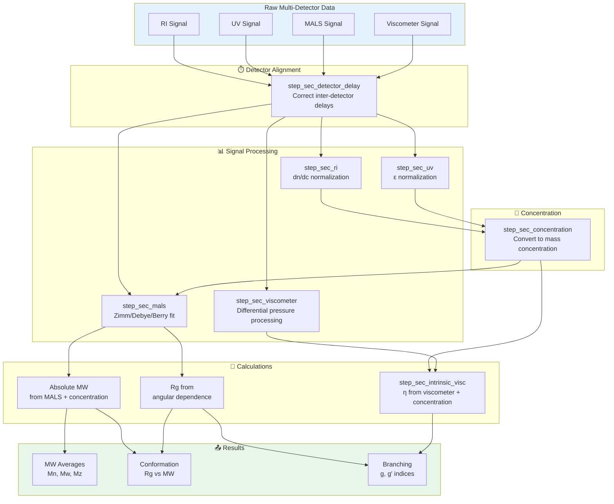

```{r, include = FALSE}
knitr::opts_chunk$set(
  collapse = TRUE,
  comment = "#>",
  fig.width = 7,
  fig.height = 5
)
```

## Overview

Multi-detector SEC (also called "triple detection") combines concentration detectors (RI, UV) with molecular weight detectors (MALS) and/or viscometers to provide absolute molecular weight and structural information without calibration standards.

This vignette covers:

1. Detector configurations and their purposes
2. Inter-detector delay correction
3. Triple detection workflows (RI + UV + MALS)
4. Calculating absolute molecular weight

### Multi-Detector Workflow

In multi-detector SEC ("triple detection"), signals from concentration detectors (RI, UV) and molecular weight detectors (MALS) are processed together. First, inter-detector delays are corrected to align peaks. Then each detector signal is processed: RI/UV for concentration, MALS for absolute MW via angular extrapolation, and viscometer for intrinsic viscosity. The concentration data feeds into MALS calculations to determine absolute molecular weight and radius of gyration.



*Note: MALS requires concentration data to calculate absolute molecular weight. The viscometer outputs differential pressure, which is combined with concentration in `step_sec_intrinsic_visc()` to calculate intrinsic viscosity [η].*

## Setup

```{r setup}
library(measure)
library(measure.sec)
library(recipes)
library(dplyr)
library(ggplot2)
```

## Detector Types

### Concentration Detectors

| Detector | Signal | Best For |
|----------|--------|----------|
| **RI** | Refractive index | Universal detection, mass-based concentration |
| **UV** | Absorbance | Chromophore-containing samples |
| **DAD** | Multi-wavelength UV | Complex samples, composition |

### Molecular Weight Detectors

| Detector | Signal | Output |
|----------|--------|--------|
| **MALS** | Multi-angle scattering | Absolute Mw, Rg |
| **LALS** | Low-angle (7-15°) | Absolute Mw |
| **RALS** | Right-angle (90°) | Relative Mw |

### Hydrodynamic Detectors

| Detector | Signal | Output |
|----------|--------|--------|
| **Viscometer** | Differential pressure | Intrinsic viscosity, [η] |
| **DLS** | Dynamic scattering | Hydrodynamic radius, Rh |

## Example Dataset

```{r data}
data(sec_triple_detect, package = "measure.sec")

# Select samples with all three detectors
samples <- sec_triple_detect |>
  filter(sample_type == "sample") |>
  head(3)

glimpse(samples)
```

## Inter-Detector Delay Correction

When detectors are connected in series, each experiences a different delay. Proper alignment is critical:

```{r detector-delay-concept, echo = FALSE, fig.width=7, fig.height=4}
# Simulate detector delay visualization
time <- seq(5, 15, by = 0.1)
n_points <- length(time)

# Create signals for each detector
ri_signal <- dnorm(time, mean = 10, sd = 0.5)
uv_signal <- dnorm(time, mean = 9.9, sd = 0.5)   # UV slightly before (earlier peak)
mals_signal <- dnorm(time, mean = 10.2, sd = 0.5) # MALS after (later peak)

delay_data <- tibble(
  time = rep(time, 3),
  signal = c(ri_signal, uv_signal, mals_signal),
  detector = rep(c("RI (reference)", "UV (before)", "MALS (after)"), each = n_points)
)

ggplot(delay_data, aes(time, signal, color = detector)) +
  geom_line(linewidth = 1) +
  labs(
    x = "Elution Time (min)",
    y = "Signal (normalized)",
    title = "Inter-Detector Delay",
    subtitle = "Signals must be aligned before calculations"
  ) +
  theme_minimal() +
  theme(legend.position = "bottom")
```

Use `step_sec_detector_delay()` to correct for these delays:

```{r detector-delay}
rec <- recipe(
  ri_signal + uv_signal + mals_signal + elution_time + dn_dc + extinction_coef ~ sample_id,
  data = samples
) |>
  update_role(sample_id, new_role = "id") |>
  # Convert all detector signals to measure format
  step_measure_input_long(ri_signal, location = vars(elution_time), col_name = "ri") |>
  step_measure_input_long(uv_signal, location = vars(elution_time), col_name = "uv") |>
  step_measure_input_long(mals_signal, location = vars(elution_time), col_name = "mals") |>
  # Correct inter-detector delays
  # Positive values = detector is downstream (later)
  # Negative values = detector is upstream (earlier)
  step_sec_detector_delay(
    reference = "ri",
    delay_volumes = c(uv = -0.05, mals = 0.15)
  )
```

### Determining Delay Values

Delay volumes should be determined experimentally:

1. **Inject a narrow standard** (e.g., low MW polymer)
2. **Measure peak apex times** on each detector
3. **Calculate delays** relative to reference detector
4. **Convert time to volume**: delay_volume = delay_time × flow_rate

## Triple Detection Workflow

A complete triple detection recipe:

```{r triple-workflow, eval = FALSE}
# Complete triple detection recipe
# Note: This example shows the full pattern; some steps may require
# additional configuration depending on your detector setup
rec_triple <- recipe(
  ri_signal + uv_signal + mals_signal + elution_time + dn_dc + extinction_coef ~ sample_id,
  data = samples
) |>
  update_role(sample_id, new_role = "id") |>
  # Step 1: Convert signals to measure format
  step_measure_input_long(ri_signal, location = vars(elution_time), col_name = "ri") |>
  step_measure_input_long(uv_signal, location = vars(elution_time), col_name = "uv") |>
  step_measure_input_long(mals_signal, location = vars(elution_time), col_name = "mals") |>

  # Step 2: Correct inter-detector delays
  step_sec_detector_delay(
    reference = "ri",
    delay_volumes = c(uv = -0.05, mals = 0.15)
  ) |>

  # Step 3: Baseline correction
  step_sec_baseline(measures = c("ri", "uv", "mals")) |>

  # Step 4: Process each detector
  step_sec_ri(measures = "ri", dn_dc_column = "dn_dc") |>
  step_sec_uv(measures = "uv", extinction_column = "extinction_coef") |>
  step_sec_mals(measures = "mals", dn_dc_column = "dn_dc") |>

  # Step 5: Convert to concentration
  step_sec_concentration(measures = "ri", detector = "ri") |>

  # Step 6: Calculate MW averages from MALS
  step_sec_mw_averages(mw_column = "mw_mals")

prepped_triple <- prep(rec_triple)
result_triple <- bake(prepped_triple, new_data = NULL)

# View results
result_triple |>
  select(sample_id, mw_mn, mw_mw, mw_mz, mw_dispersity)
```

## Light Scattering Detectors

### MALS: Multi-Angle Light Scattering

MALS provides absolute molecular weight by measuring scattering at multiple angles:

```{r mals, eval = FALSE}
# Process MALS data
# Note: MALS processing requires specific detector configuration
rec_mals <- recipe(
  mals_signal + elution_time + dn_dc ~ sample_id,
  data = samples
) |>
  update_role(sample_id, new_role = "id") |>
  step_measure_input_long(mals_signal, location = vars(elution_time), col_name = "mals") |>
  step_sec_baseline(measures = "mals") |>
  step_sec_mals(
    measures = "mals",
    dn_dc_column = "dn_dc",
    wavelength = 658,  # Laser wavelength in nm
    angles = c(35, 50, 75, 90, 105, 120, 145)  # Detector angles
  )
```

Key MALS parameters:

- **dn/dc**: Refractive index increment (mL/g)
- **Wavelength**: Laser wavelength (typically 658 or 690 nm)
- **Angles**: Detector positions for Zimm/Debye analysis

### LALS: Low-Angle Light Scattering

For samples where angular extrapolation is problematic:

```{r lals, eval = FALSE}
step_sec_lals(
  measures = "lals",
  dn_dc_column = "dn_dc",
  angle = 7  # Low angle (degrees)
)
```

### RALS: Right-Angle Light Scattering

Cost-effective alternative for routine MW screening:

```{r rals, eval = FALSE}
step_sec_rals(
  measures = "rals",
  dn_dc_column = "dn_dc"
)
```

## Viscometer Detection

Add intrinsic viscosity for Mark-Houwink analysis:

```{r viscometer, eval = FALSE}
# Note: This requires viscometer data (visc_signal) and pre-calculated concentration
rec_visc <- recipe(
  visc_signal + elution_time ~ sample_id,
  data = samples
) |>
  update_role(sample_id, new_role = "id") |>
  step_measure_input_long(visc_signal, location = vars(elution_time), col_name = "visc") |>
  step_sec_baseline(measures = "visc") |>
  step_sec_viscometer(measures = "visc") |>
  step_sec_intrinsic_visc(
    visc_col = "visc",
    conc_col = "concentration"
  )
```

## Universal Calibration

With viscometry data, you can apply universal calibration across polymer types:

```{r universal-cal, eval = FALSE}
# Mark-Houwink parameters for different polymers
# [η] = K × M^a

# Apply universal calibration
step_sec_universal_cal(
  visc_col = "intrinsic_visc",
  reference_k = 1.14e-4,  # PS in THF
  reference_a = 0.716,
  sample_k = 6.0e-5,      # PMMA in THF
  sample_a = 0.73
)
```

## Complete Quadruple Detection Example

Full workflow with RI, UV, MALS, and viscometer:

```{r quad-detection, eval = FALSE}
# Complete quadruple detection example
# Note: This requires viscometer data (visc_signal) which is not in sec_triple_detect
# The pattern shows the complete workflow for quad detection setups
rec_quad <- recipe(
  ri_signal + uv_signal + mals_signal + visc_signal + elution_time + dn_dc + extinction_coef ~ sample_id,
  data = samples
) |>
  update_role(sample_id, new_role = "id") |>
  # Input all four detectors
  step_measure_input_long(ri_signal, location = vars(elution_time), col_name = "ri") |>
  step_measure_input_long(uv_signal, location = vars(elution_time), col_name = "uv") |>
  step_measure_input_long(mals_signal, location = vars(elution_time), col_name = "mals") |>
  step_measure_input_long(visc_signal, location = vars(elution_time), col_name = "visc") |>

  # Delay correction (all relative to RI)
  step_sec_detector_delay(
    reference = "ri",
    delay_volumes = c(uv = -0.05, mals = 0.15, visc = 0.25)
  ) |>

  # Baseline correction
  step_sec_baseline(measures = c("ri", "uv", "mals", "visc")) |>

  # Process detectors
  step_sec_ri(measures = "ri", dn_dc_column = "dn_dc") |>
  step_sec_uv(measures = "uv", extinction_column = "extinction_coef") |>
  step_sec_mals(measures = "mals", dn_dc_column = "dn_dc") |>
  step_sec_viscometer(measures = "visc") |>

  # Concentration
  step_sec_concentration(measures = "ri", detector = "ri") |>

  # Intrinsic viscosity
  step_sec_intrinsic_visc(visc_col = "visc", conc_col = "concentration") |>

  # MW averages
  step_sec_mw_averages(mw_column = "mw_mals") |>

  # MW distribution
  step_sec_mw_distribution(
    signal_col = "ri",
    mw_column = "mw_mals",
    output_type = "both"
  )

prepped_quad <- prep(rec_quad)
result_quad <- bake(prepped_quad, new_data = NULL)
```

## Comparing Conventional vs Absolute MW

```{r comparison, echo = FALSE, fig.width=7, fig.height=5}
# Simulated comparison
comparison <- tibble(
  method = rep(c("Conventional (PS standards)", "Absolute (MALS)"), each = 4),
  polymer = rep(c("PS", "PMMA", "PEG", "Branched PE"), 2),
  mw = c(
    # Conventional (relative to PS)
    50000, 65000, 42000, 55000,
    # Absolute (true values)
    50000, 50000, 50000, 50000
  )
)

ggplot(comparison, aes(polymer, mw / 1000, fill = method)) +
  geom_col(position = "dodge") +
  labs(
    x = "Polymer",
    y = "Molecular Weight (kDa)",
    title = "Conventional vs Absolute MW Determination",
    subtitle = "Samples have identical true MW; conventional calibration introduces polymer-specific bias"
  ) +
  scale_fill_manual(values = c("Conventional (PS standards)" = "#A23B72", "Absolute (MALS)" = "#2E86AB")) +
  theme_minimal() +
  theme(legend.position = "bottom")
```

## Troubleshooting

### Common Issues

1. **Poor signal-to-noise on MALS**
   - Increase sample concentration
   - Check laser power and alignment
   - Filter mobile phase

2. **Inconsistent dn/dc values**
   - Use offline refractometer for accurate dn/dc
   - Account for wavelength and temperature

3. **Detector delay drift**
   - Re-calibrate delays with each column change
   - Check flow rate stability

4. **High baseline noise on viscometer**
   - Check for air bubbles
   - Verify temperature equilibration

## See Also

- [Getting Started](getting-started.html) - Basic SEC workflow and concepts
- [Calibration Management](calibration-management.html) - Save and reuse calibrations
- [Copolymer Composition](copolymer-analysis.html) - Multi-detector composition analysis
- [System Suitability](system-suitability.html) - QC metrics and column performance

## Session Info

```{r session-info}
sessionInfo()
```
