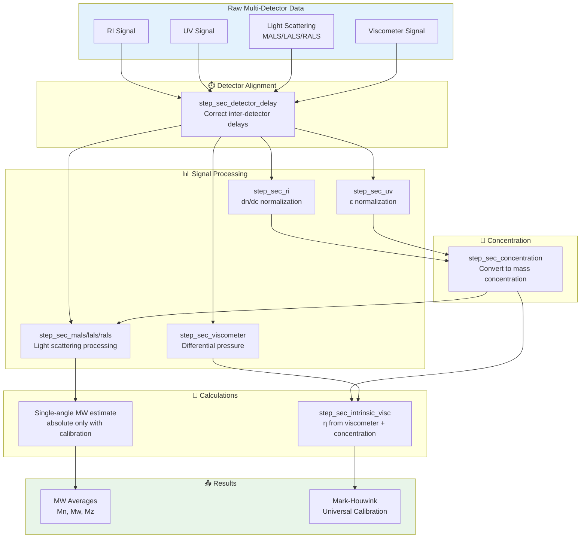

```{r, include = FALSE}
knitr::opts_chunk$set(
  collapse = TRUE,
  comment = "#>",
  fig.width = 7,
  fig.height = 4.5
)
```

For an executable check of signed RI conversion, concentration units and
clipped-signal diagnostics, see [Detector units and clipping](detector-qualification.html).

## Overview

Multi-detector SEC combines concentration measurements with scattering or
viscometer signals. Detector delays and signal processing affect slice-level
calculations, so the channels need to be aligned on a shared elution axis.

This guide shows the recipe structure and the roles of common SEC detectors.
The current `step_sec_mals()` step returns a single-angle estimate; absolute
values require a calibrated detector and concentration with declared units.

For a runnable delay correction using the package's raw example data, see the
[Tutorial: triple detection from raw data](tutorial-triple-detection.html).

## Setup

```{r setup}
library(measure)
library(measure.sec)
library(recipes)
library(dplyr)
library(ggplot2)
```

## Multi-detector workflow

Align detector channels to shared elution coordinates before matching values
at each slice.


```mermaid
flowchart TB
    subgraph Input["Raw Multi-Detector Data"]
        A1[RI Signal]
        A2[UV Signal]
        A3[Light Scattering<br>MALS/LALS/RALS]
        A4[Viscometer Signal]
    end

    subgraph Align["⏱️ Detector Alignment"]
        B[step_sec_detector_delay<br>Correct inter-detector delays]
    end

    subgraph Process["📊 Signal Processing"]
        C1[step_sec_ri<br>dn/dc normalization]
        C2[step_sec_uv<br>ε normalization]
        C3[step_sec_mals/lals/rals<br>Light scattering processing]
        C4[step_sec_viscometer<br>Differential pressure]
    end

    subgraph Concentration["📏 Concentration"]
        D0[step_sec_concentration<br>Convert to mass concentration]
    end

    subgraph Calculate["🔬 Calculations"]
        D2[Single-angle MW estimate<br>absolute only with calibration]
        D4[step_sec_intrinsic_visc<br>η from viscometer + concentration]
    end

    subgraph Results["📤 Results"]
        E1[MW Averages<br>Mn, Mw, Mz]
        E3[Mark-Houwink<br>Universal Calibration]
    end

    A1 & A2 & A3 & A4 --> B
    B --> C1 & C2 & C3 & C4
    C1 & C2 --> D0
    D0 --> C3
    D0 --> D4
    C3 --> D2
    C4 --> D4
    D2 --> E1
    D4 --> E3

    style Input fill:#e3f2fd
    style Results fill:#e8f5e9
```

## Detector types

### Concentration detectors

| Detector | Signal | Best For |
|----------|--------|----------|
| **RI** | Refractive index | Universal detection, mass-based concentration |
| **UV** | Absorbance | Chromophore-containing samples |
| **DAD** | Multi-wavelength UV | Complex samples, composition |

### Molecular-weight detectors

| Detector | When to Use | See Also |
|----------|-------------|----------|
| **MALS** | One-angle estimate; current step does not calculate Rg | [MALS Detection](mals-detection.html) |
| **LALS** | Low-angle single-angle estimate | [LALS/RALS Detection](lals-rals-detection.html) |
| **RALS** | Right-angle single-angle estimate | [LALS/RALS Detection](lals-rals-detection.html) |

### Hydrodynamic detectors

| Detector | Signal | Output |
|----------|--------|--------|
| **Viscometer** | Differential pressure | Intrinsic viscosity [η] |
| **DLS** | Dynamic scattering | Hydrodynamic radius Rh |

## Example dataset

```{r data}
data(sec_triple_detect, package = "measure.sec")

# Select sample data (excluding standards)
samples <- sec_triple_detect |>
  filter(sample_type == "sample")

glimpse(samples)
```

The dataset stores RI, UV, and MALS responses on separate numeric scales. This
plot shows one synthetic sample without rescaling the channels; the y-axis
units are not specified by the dataset.

```{r detector-responses, fig.cap = "Raw RI, UV, and MALS signals for PMMA-Med from the synthetic `sec_triple_detect` dataset. Each detector has its own vertical scale, so the panel heights do not compare response magnitude across detectors; the dataset does not declare response units.", fig.alt = "Faceted line chart of the synthetic `sec_triple_detect` PMMA-Med data with three panels in order: RI, UV, and MALS signal versus elution time from 5 to 25 minutes. Each panel has a separate vertical scale. The traces show detector-specific response profiles on a shared time axis; their heights are not directly comparable."}
response_plot <- samples |>
  filter(sample_id == "PMMA-Med") |>
  tidyr::pivot_longer(
    cols = c(ri_signal, uv_signal, mals_signal),
    names_to = "detector",
    names_pattern = "(.*)_signal",
    values_to = "signal"
  ) |>
  mutate(detector = factor(detector, levels = c("ri", "uv", "mals"),
                           labels = c("RI", "UV", "MALS")))

ggplot(response_plot, aes(elution_time, signal, color = detector)) +
  geom_line(linewidth = 0.6) +
  facet_wrap(~detector, nrow = 1, scales = "free_y") +
  scale_color_manual(values = c(RI = "#2E86AB", UV = "#A23B72",
                                MALS = "#F18F01")) +
  labs(
    x = "Elution time (min)",
    y = "Recorded signal (unit not declared)"
  ) +
  theme_minimal(base_size = 11) +
  theme(legend.position = "none")
```

## Inter-detector delay correction

Detectors connected in series can observe the same sample at different
elution coordinates. Correct measured delays before matching detector values
at each slice.

The package's [raw-data tutorial](tutorial-triple-detection.html) plots a delay
standard before and after interpolation-based alignment. The correction
samples each target at the reference coordinate plus its declared
target-minus-reference delay; positive and negative delays therefore move in
opposite directions.


### Correcting delays

Use `step_sec_detector_delay()` to align all detectors:

```{r detector-delay}
rec <- recipe(
  ri_signal + uv_signal + mals_signal + elution_time + dn_dc + extinction_coef ~ sample_id,
  data = samples
) |>
  update_role(sample_id, new_role = "id") |>
  # Convert all detector signals to measure format
  step_measure_input_long(ri_signal, location = vars(elution_time), col_name = "ri") |>
  step_measure_input_long(uv_signal, location = vars(elution_time), col_name = "uv") |>
  step_measure_input_long(mals_signal, location = vars(elution_time), col_name = "mals") |>
  # Correct inter-detector delays
  # Positive values = detector is downstream (later)
  # Negative values = detector is upstream (earlier)
  step_sec_detector_delay(
    reference = "ri",
    delay_volumes = c(uv = -0.05, mals = 0.15)
  )
```

### Determining delay values

Delay volumes should be determined experimentally:

1. **Inject a narrow standard** (e.g., low MW polymer or toluene)
2. **Measure peak apex times** on each detector
3. **Calculate delays** relative to reference detector (usually RI)
4. **Convert time to volume**: `delay_volume = delay_time × flow_rate`

**Tip**: Re-calibrate delays after column changes or major maintenance.

## Triple-detection workflow

A complete "triple detection" recipe with RI, UV, and light scattering:

```{r triple-workflow}
# Complete triple detection recipe
rec_triple <- recipe(
  ri_signal + uv_signal + mals_signal + elution_time + dn_dc + extinction_coef ~ sample_id,
  # UV normalization requires a positive extinction coefficient.
  data = dplyr::filter(samples, extinction_coef > 0)
) |>
  update_role(sample_id, new_role = "id") |>
  # Step 1: Convert signals to measure format
  step_measure_input_long(ri_signal, location = vars(elution_time), col_name = "ri") |>
  step_measure_input_long(uv_signal, location = vars(elution_time), col_name = "uv") |>
  step_measure_input_long(mals_signal, location = vars(elution_time), col_name = "mals") |>

  # Step 2: Correct inter-detector delays
  step_sec_detector_delay(
    reference = "ri",
    delay_volumes = c(uv = -0.05, mals = 0.15)
  ) |>

  # Step 3: Baseline correction
  step_sec_baseline(measures = c("ri", "uv", "mals")) |>

  # Step 4: Process concentration detectors
  step_sec_ri(measures = "ri", dn_dc_column = "dn_dc") |>
  step_sec_uv(measures = "uv", extinction_column = "extinction_coef") |>

  # Step 5: Convert to concentration (MUST come before MALS)
  step_sec_concentration(
    measures = "ri",
    detector = "ri",
    injection_volume = 100,       # µL
    sample_concentration = 2.0    # mg/mL
  ) |>

  # Step 6: Process MALS (absolute values also require detector calibration)
  step_sec_mals(mals_col = "mals", dn_dc_column = "dn_dc")

prepped_triple <- prep(rec_triple)
result_triple <- bake(prepped_triple, new_data = NULL)

# View results - output is relative without a scattering calibration constant
# For MW averages, you would integrate over the chromatogram
result_triple |>
  select(sample_id, starts_with("mw_"))
```

## Viscometer integration

The viscometer measures differential pressure across a capillary, which relates to solution viscosity. Combined with concentration, this gives **intrinsic viscosity [η]**—a key parameter for polymer characterization.

### Why intrinsic viscosity matters

Intrinsic viscosity relates polymer size in solution to concentration. The
Mark-Houwink relationship is `[η] = K × M^a`; its parameters depend on the
polymer and solution conditions.

### Viscometer workflow

```{r viscometer, eval = FALSE}
# Viscometer integration
# Note: Requires viscometer data (visc_signal)

rec_visc <- recipe(
  ri_signal + visc_signal + elution_time + dn_dc ~ sample_id,
  data = visc_samples
) |>
  update_role(sample_id, new_role = "id") |>
  # Input signals
  step_measure_input_long(ri_signal, location = vars(elution_time), col_name = "ri") |>
  step_measure_input_long(visc_signal, location = vars(elution_time), col_name = "visc") |>
  # Delay correction (viscometer typically last in line)
  step_sec_detector_delay(
    reference = "ri",
    delay_volumes = c(visc = 0.25)
  ) |>
  # Process detectors
  step_sec_baseline(measures = c("ri", "visc")) |>
  step_sec_ri(measures = "ri", dn_dc_column = "dn_dc") |>
  step_sec_viscometer(measures = "visc") |>
  # Get concentration
  step_sec_concentration(
    measures = "ri",
    detector = "ri",
    injection_volume = 100,
    sample_concentration = 2.0
  ) |>
  # Calculate intrinsic viscosity
  step_sec_intrinsic_visc(
    visc_col = "visc",
    conc_col = "concentration"
  )
```

### Intrinsic-viscosity output

The `step_sec_intrinsic_visc()` step calculates [η] at each elution slice:

| Output | Description |
|--------|-------------|
| `intrinsic_visc` | Intrinsic viscosity [η] at each slice |

This can be combined with MW data for Mark-Houwink analysis or branching calculations.

## Universal calibration

Universal calibration relates elution to hydrodynamic volume, commonly
expressed using `[η] × M`.

### The universal-calibration principle

$$\log([\eta] \times M)_{\text{sample}} = \log([\eta] \times M)_{\text{standard}}$$

The recipe below shows the available interface. Its parameters must come
from a calibration for the polymer and solution conditions.

### Applying universal calibration

```{r universal-cal, eval = FALSE}
# Universal calibration with Mark-Houwink parameters
# Convert PS calibration to another polymer type

step_sec_universal_cal(
  visc_col = "intrinsic_visc",
  # PS reference parameters (from calibration standards)
  reference_k = 1.14e-4,
  reference_a = 0.716,
  # Sample parameters (from literature or measurement)
  sample_k = 6.0e-5,      # e.g., PMMA in THF
  sample_a = 0.73
)
```

### Mark-Houwink parameters

Use Mark-Houwink parameters measured or reported for the polymer, solvent,
and temperature in the method. Values from other conditions may not apply.

## Quadruple-detection workflow

Full workflow combining RI, UV, light scattering, and viscometer:

```{r quad-detection, eval = FALSE}
# Complete quadruple detection workflow
rec_quad <- recipe(
  ri_signal + uv_signal + mals_signal + visc_signal +
    elution_time + dn_dc + extinction_coef ~ sample_id,
  data = quad_samples
) |>
  update_role(sample_id, new_role = "id") |>
  # Input all detectors
  step_measure_input_long(ri_signal, location = vars(elution_time), col_name = "ri") |>
  step_measure_input_long(uv_signal, location = vars(elution_time), col_name = "uv") |>
  step_measure_input_long(mals_signal, location = vars(elution_time), col_name = "mals") |>
  step_measure_input_long(visc_signal, location = vars(elution_time), col_name = "visc") |>

  # Delay correction (all relative to RI)
  step_sec_detector_delay(
    reference = "ri",
    delay_volumes = c(uv = -0.05, mals = 0.15, visc = 0.25)
  ) |>

  # Baseline correction
  step_sec_baseline(measures = c("ri", "uv", "mals", "visc")) |>

  # Process concentration detectors
  step_sec_ri(measures = "ri", dn_dc_column = "dn_dc") |>
  step_sec_uv(measures = "uv", extinction_column = "extinction_coef") |>

  # Get concentration
  step_sec_concentration(
    measures = "ri",
    detector = "ri",
    injection_volume = 100,
    sample_concentration = 2.0
  ) |>

  # Process MW detector (choose appropriate step)
  step_sec_mals(mals_col = "mals", dn_dc_column = "dn_dc") |>

  # Process viscometer
  step_sec_viscometer(measures = "visc") |>
  step_sec_intrinsic_visc(visc_col = "visc", conc_col = "concentration")
```

## Comparing molecular-weight results

A conventional calibration reports values on the scale of its standards.
Light-scattering estimates use detector response and concentration; absolute
values require a suitable instrument calibration constant. Compare results
only when the calibration basis and units are recorded.

## Troubleshooting

### Common issues

| Problem | Likely Cause | Solution |
|---------|--------------|----------|
| MW varies with injection | Delay values incorrect | Recalibrate with narrow standard |
| Noisy viscometer signal | Air bubbles | Degas mobile phase, check connections |
| RI baseline drift | Temperature variation | Improve thermal control |
| LS signal too weak | Low concentration | Increase injection mass |

### Detector-specific troubleshooting

For light scattering issues, see:
- [MALS Detection](mals-detection.html) - MALS-specific troubleshooting
- [LALS/RALS Detection](lals-rals-detection.html) - Single-angle troubleshooting

## See also

- [MALS Detection](mals-detection.html) - Single-angle implementation and multi-angle limits
- [LALS/RALS Detection](lals-rals-detection.html) - Single-angle alternatives
- [Getting Started](getting-started.html) - Basic SEC workflow
- [Calibration Management](calibration-management.html) - Save and reuse calibrations
- [Copolymer Composition](copolymer-analysis.html) - Multi-detector composition analysis

## Session info

```{r session-info}
sessionInfo()
```
