```{r, include = FALSE}
knitr::opts_chunk$set(
  collapse = TRUE,
  comment = "#>",
  fig.width = 7,
  fig.height = 5
)
```

## Overview

Multi-detector SEC combines concentration detectors (RI, UV) with molecular weight detectors (light scattering) and/or viscometers to provide absolute molecular weight and structural information. This vignette focuses on **integrating multiple detectors** into a unified workflow.

This vignette covers:

1. Detector types and their roles
2. Inter-detector delay correction (critical!)
3. Building multi-detector recipes
4. Viscometer integration and intrinsic viscosity
5. Universal calibration

For detailed information on specific light scattering detectors, see:

- [MALS Detection](mals-detection.html) - Multi-angle analysis for Rg and large molecules
- [LALS/RALS Detection](lals-rals-detection.html) - Single-angle alternatives

## Why Multi-Detector SEC?

### The Limitation of Conventional SEC

Conventional SEC with a single concentration detector (RI or UV) relies on **column calibration** with narrow standards of known molecular weight. This approach has a fundamental limitation: it assumes your sample has the same relationship between hydrodynamic size and molecular weight as the calibration standards. For a polystyrene sample measured with polystyrene standards, this works well. But what about other polymers, proteins, or branched structures?

The problem is that SEC separates by **hydrodynamic volume**---how much space a molecule occupies in solution---not by molecular weight directly. A compact, branched polymer with MW = 100,000 Da might elute at the same time as a linear polymer with MW = 50,000 Da simply because they occupy similar volumes. Conventional calibration cannot distinguish between them.

### What Each Detector Adds

Multi-detector SEC overcomes this limitation by measuring molecular properties directly:

- **Concentration detectors (RI, UV)** tell you *how much* material is present at each elution slice. RI responds to refractive index changes (nearly universal), while UV detects chromophores (selective but sensitive).

- **Light scattering detectors (MALS, LALS, RALS)** measure molecular weight *directly* from the intensity of scattered light, independent of calibration standards. They also provide radius of gyration (Rg) for larger molecules, revealing information about molecular shape and structure.

- **Viscometers** measure intrinsic viscosity [η], which reflects molecular size and shape in solution. Combined with MW from light scattering, viscometry reveals branching and conformation through the Mark-Houwink relationship.

### When to Use Absolute vs Relative MW

**Use conventional calibration** (relative MW) when:
- Your sample is the same polymer type as your standards (e.g., PS sample with PS standards)
- You need fast screening and don't require absolute values
- Relative comparison between samples is sufficient

**Use multi-detector SEC** (absolute MW) when:
- Your sample differs structurally from available standards
- You're analyzing proteins, copolymers, or branched polymers
- Regulatory requirements demand absolute MW values
- You need structural information beyond molecular weight (Rg, branching, conformation)

The additional complexity of multi-detector systems is justified when accurate absolute measurements matter---and for proteins and complex polymers, they almost always do.

## Setup

```{r setup}
library(measure)
library(measure.sec)
library(recipes)
library(dplyr)
library(ggplot2)
```

## Multi-Detector Workflow

The key to multi-detector SEC is proper orchestration of signals. Each detector provides different information, and they must be aligned before calculations.

```mermaid
flowchart TB
    subgraph Input["Raw Multi-Detector Data"]
        A1[RI Signal]
        A2[UV Signal]
        A3[Light Scattering<br>MALS/LALS/RALS]
        A4[Viscometer Signal]
    end

    subgraph Align["⏱️ Detector Alignment"]
        B[step_sec_detector_delay<br>Correct inter-detector delays]
    end

    subgraph Process["📊 Signal Processing"]
        C1[step_sec_ri<br>dn/dc normalization]
        C2[step_sec_uv<br>ε normalization]
        C3[step_sec_mals/lals/rals<br>Light scattering processing]
        C4[step_sec_viscometer<br>Differential pressure]
    end

    subgraph Concentration["📏 Concentration"]
        D0[step_sec_concentration<br>Convert to mass concentration]
    end

    subgraph Calculate["🔬 Calculations"]
        D2[Absolute MW<br>from LS + concentration]
        D4[step_sec_intrinsic_visc<br>η from viscometer + concentration]
    end

    subgraph Results["📤 Results"]
        E1[MW Averages<br>Mn, Mw, Mz]
        E3[Mark-Houwink<br>Universal Calibration]
    end

    A1 & A2 & A3 & A4 --> B
    B --> C1 & C2 & C3 & C4
    C1 & C2 --> D0
    D0 --> C3
    D0 --> D4
    C3 --> D2
    C4 --> D4
    D2 --> E1
    D4 --> E3

    style Input fill:#e3f2fd
    style Results fill:#e8f5e9
```



## Detector Types

### Concentration Detectors

| Detector | Signal | Best For |
|----------|--------|----------|
| **RI** | Refractive index | Universal detection, mass-based concentration |
| **UV** | Absorbance | Chromophore-containing samples |
| **DAD** | Multi-wavelength UV | Complex samples, composition |

### Molecular Weight Detectors

| Detector | When to Use | See Also |
|----------|-------------|----------|
| **MALS** | Large molecules, need Rg | [MALS Detection](mals-detection.html) |
| **LALS** | Medium molecules, no Rg needed | [LALS/RALS Detection](lals-rals-detection.html) |
| **RALS** | Small molecules, QC screening | [LALS/RALS Detection](lals-rals-detection.html) |

### Hydrodynamic Detectors

| Detector | Signal | Output |
|----------|--------|--------|
| **Viscometer** | Differential pressure | Intrinsic viscosity [η] |
| **DLS** | Dynamic scattering | Hydrodynamic radius Rh |

## Example Dataset

```{r data}
data(sec_triple_detect, package = "measure.sec")

# Select sample data (excluding standards)
samples <- sec_triple_detect |>
  filter(sample_type == "sample")

glimpse(samples)
```

## Inter-Detector Delay Correction

**This is the most critical step in multi-detector SEC.** When detectors are connected in series, each experiences a different delay. If not corrected, MW calculations will be wrong.

```{r detector-delay-concept, echo = FALSE, fig.width=7, fig.height=4}
# Simulate detector delay visualization
time <- seq(5, 15, by = 0.1)
n_points <- length(time)

# Create signals for each detector with different delays
ri_signal <- dnorm(time, mean = 10, sd = 0.5)
uv_signal <- dnorm(time, mean = 9.9, sd = 0.5)   # UV before RI
ls_signal <- dnorm(time, mean = 10.2, sd = 0.5)  # LS after RI
visc_signal <- dnorm(time, mean = 10.4, sd = 0.5) # Visc last

delay_data <- tibble(
  time = rep(time, 4),
  signal = c(ri_signal, uv_signal, ls_signal, visc_signal),
  detector = factor(
    rep(c("RI (reference)", "UV (before)", "LS (after)", "Viscometer (last)"),
    each = n_points),
    levels = c("UV (before)", "RI (reference)", "LS (after)", "Viscometer (last)")
  )
)

ggplot(delay_data, aes(time, signal, color = detector)) +
  geom_line(linewidth = 1) +
  labs(
    x = "Elution Time (min)",
    y = "Signal (normalized)",
    title = "Inter-Detector Delay",
    subtitle = "All signals must be aligned to the same elution time before calculations"
  ) +
  scale_color_manual(values = c("#E8751A", "#2E86AB", "#A23B72", "#1A936F")) +
  theme_minimal() +
  theme(legend.position = "bottom")
```

### Correcting Delays

Use `step_sec_detector_delay()` to align all detectors:

```{r detector-delay}
rec <- recipe(
  ri_signal + uv_signal + mals_signal + elution_time + dn_dc + extinction_coef ~ sample_id,
  data = samples
) |>
  update_role(sample_id, new_role = "id") |>
  # Convert all detector signals to measure format
  step_measure_input_long(ri_signal, location = vars(elution_time), col_name = "ri") |>
  step_measure_input_long(uv_signal, location = vars(elution_time), col_name = "uv") |>
  step_measure_input_long(mals_signal, location = vars(elution_time), col_name = "mals") |>
  # Correct inter-detector delays
  # Positive values = detector is downstream (later)
  # Negative values = detector is upstream (earlier)
  step_sec_detector_delay(
    reference = "ri",
    delay_volumes = c(uv = -0.05, mals = 0.15)
  )
```

### Determining Delay Values

Delay volumes should be determined experimentally:

1. **Inject a narrow standard** (e.g., low MW polymer or toluene)
2. **Measure peak apex times** on each detector
3. **Calculate delays** relative to reference detector (usually RI)
4. **Convert time to volume**: `delay_volume = delay_time × flow_rate`

**Tip**: Re-calibrate delays after column changes or major maintenance.

## Triple Detection Workflow

A complete "triple detection" recipe with RI, UV, and light scattering:

```{r triple-workflow}
# Complete triple detection recipe
rec_triple <- recipe(
  ri_signal + uv_signal + mals_signal + elution_time + dn_dc + extinction_coef ~ sample_id,
  data = samples
) |>
  update_role(sample_id, new_role = "id") |>
  # Step 1: Convert signals to measure format
  step_measure_input_long(ri_signal, location = vars(elution_time), col_name = "ri") |>
  step_measure_input_long(uv_signal, location = vars(elution_time), col_name = "uv") |>
  step_measure_input_long(mals_signal, location = vars(elution_time), col_name = "mals") |>

  # Step 2: Correct inter-detector delays
  step_sec_detector_delay(
    reference = "ri",
    delay_volumes = c(uv = -0.05, mals = 0.15)
  ) |>

  # Step 3: Baseline correction
  step_sec_baseline(measures = c("ri", "uv", "mals")) |>

  # Step 4: Process concentration detectors
  step_sec_ri(measures = "ri", dn_dc_column = "dn_dc") |>
  step_sec_uv(measures = "uv", extinction_column = "extinction_coef") |>

  # Step 5: Convert to concentration (MUST come before MALS)
  step_sec_concentration(
    measures = "ri",
    detector = "ri",
    injection_volume = 100,       # µL
    sample_concentration = 2.0    # mg/mL
  ) |>

  # Step 6: Process MALS (requires concentration for absolute MW)
  step_sec_mals(mals_col = "mals", dn_dc_column = "dn_dc")

prepped_triple <- prep(rec_triple)
result_triple <- bake(prepped_triple, new_data = NULL)

# View results - MALS provides absolute MW at each slice
# For MW averages, you would integrate over the chromatogram
result_triple |>
  select(sample_id, starts_with("mw_"))
```

## Viscometer Integration

The viscometer measures differential pressure across a capillary, which relates to solution viscosity. Combined with concentration, this gives **intrinsic viscosity [η]**—a key parameter for polymer characterization.

### Why Intrinsic Viscosity Matters

```{r viscosity-concept, echo = FALSE, fig.width=7, fig.height=4}
# Show relationship between [η], MW, and structure
mw_range <- seq(1000, 1000000, length.out = 100)

# Mark-Houwink equation: [η] = K × M^a
# Different K and a values for different polymers
eta_linear <- 1.14e-4 * mw_range^0.716  # Linear PS
eta_branched <- 0.8e-4 * mw_range^0.5   # Branched polymer

viscosity_data <- tibble(
  mw = rep(mw_range, 2),
  eta = c(eta_linear, eta_branched),
  structure = rep(c("Linear polymer", "Branched polymer"), each = length(mw_range))
)

ggplot(viscosity_data, aes(mw / 1000, eta, color = structure)) +
  geom_line(linewidth = 1.2) +
  scale_x_log10() +
  scale_y_log10() +
  labs(
    x = "Molecular Weight (kDa)",
    y = "Intrinsic Viscosity [η] (dL/g)",
    title = "Mark-Houwink Relationship",
    subtitle = "[η] = K × M^a — structure affects the relationship",
    color = NULL
  ) +
  scale_color_manual(values = c("#2E86AB", "#A23B72")) +
  theme_minimal() +
  theme(legend.position = "bottom")
```

### Viscometer Workflow

```{r viscometer, eval = FALSE}
# Viscometer integration
# Note: Requires viscometer data (visc_signal)

rec_visc <- recipe(
  ri_signal + visc_signal + elution_time + dn_dc ~ sample_id,
  data = visc_samples
) |>
  update_role(sample_id, new_role = "id") |>
  # Input signals
  step_measure_input_long(ri_signal, location = vars(elution_time), col_name = "ri") |>
  step_measure_input_long(visc_signal, location = vars(elution_time), col_name = "visc") |>
  # Delay correction (viscometer typically last in line)
  step_sec_detector_delay(
    reference = "ri",
    delay_volumes = c(visc = 0.25)
  ) |>
  # Process detectors
  step_sec_baseline(measures = c("ri", "visc")) |>
  step_sec_ri(measures = "ri", dn_dc_column = "dn_dc") |>
  step_sec_viscometer(measures = "visc") |>
  # Get concentration
  step_sec_concentration(
    measures = "ri",
    detector = "ri",
    injection_volume = 100,
    sample_concentration = 2.0
  ) |>
  # Calculate intrinsic viscosity
  step_sec_intrinsic_visc(
    visc_col = "visc",
    conc_col = "concentration"
  )
```

### Intrinsic Viscosity Output

The `step_sec_intrinsic_visc()` step calculates [η] at each elution slice:

| Output | Description |
|--------|-------------|
| `intrinsic_visc` | Intrinsic viscosity [η] at each slice |

This can be combined with MW data for Mark-Houwink analysis or branching calculations.

## Universal Calibration

Universal calibration uses the principle that **hydrodynamic volume** (not molecular weight) determines elution time. The hydrodynamic volume is proportional to [η] × M.

### The Universal Calibration Principle

$$\log([\eta] \times M)_{\text{sample}} = \log([\eta] \times M)_{\text{standard}}$$

This allows you to determine MW for any polymer type using standards of a different polymer (typically polystyrene).

```{r universal-cal-concept, echo = FALSE, fig.width=7, fig.height=4}
# Universal calibration curve
elution_vol <- seq(12, 22, by = 0.5)

# Simulated log(η*M) vs elution volume (same for all polymers)
log_eta_m <- 7 - 0.3 * elution_vol

universal_data <- tibble(
  elution_vol = elution_vol,
  log_eta_m = log_eta_m
)

ggplot(universal_data, aes(elution_vol, log_eta_m)) +
  geom_line(linewidth = 1.2, color = "#2E86AB") +
  labs(
    x = "Elution Volume (mL)",
    y = "log([η] × M)",
    title = "Universal Calibration Curve",
    subtitle = "Same curve applies to all polymers regardless of structure"
  ) +
  theme_minimal()
```

### Applying Universal Calibration

```{r universal-cal, eval = FALSE}
# Universal calibration with Mark-Houwink parameters
# Convert PS calibration to another polymer type

step_sec_universal_cal(
  visc_col = "intrinsic_visc",
  # PS reference parameters (from calibration standards)
  reference_k = 1.14e-4,
  reference_a = 0.716,
  # Sample parameters (from literature or measurement)
  sample_k = 6.0e-5,      # e.g., PMMA in THF
  sample_a = 0.73
)
```

### Mark-Houwink Parameters

Common Mark-Houwink parameters ([η] = K × M^a):

| Polymer | Solvent | K (dL/g) | a |
|---------|---------|----------|---|
| PS | THF | 1.14 × 10⁻⁴ | 0.716 |
| PMMA | THF | 6.0 × 10⁻⁵ | 0.73 |
| PEG | Water | 1.25 × 10⁻⁴ | 0.78 |
| PVP | Water | 2.8 × 10⁻⁵ | 0.64 |

**Note**: Values are temperature and solvent dependent. Use literature values for your specific conditions.

## Complete Quadruple Detection

Full workflow combining RI, UV, light scattering, and viscometer:

```{r quad-detection, eval = FALSE}
# Complete quadruple detection workflow
rec_quad <- recipe(
  ri_signal + uv_signal + mals_signal + visc_signal +
    elution_time + dn_dc + extinction_coef ~ sample_id,
  data = quad_samples
) |>
  update_role(sample_id, new_role = "id") |>
  # Input all detectors
  step_measure_input_long(ri_signal, location = vars(elution_time), col_name = "ri") |>
  step_measure_input_long(uv_signal, location = vars(elution_time), col_name = "uv") |>
  step_measure_input_long(mals_signal, location = vars(elution_time), col_name = "mals") |>
  step_measure_input_long(visc_signal, location = vars(elution_time), col_name = "visc") |>

  # Delay correction (all relative to RI)
  step_sec_detector_delay(
    reference = "ri",
    delay_volumes = c(uv = -0.05, mals = 0.15, visc = 0.25)
  ) |>

  # Baseline correction
  step_sec_baseline(measures = c("ri", "uv", "mals", "visc")) |>

  # Process concentration detectors
  step_sec_ri(measures = "ri", dn_dc_column = "dn_dc") |>
  step_sec_uv(measures = "uv", extinction_column = "extinction_coef") |>

  # Get concentration
  step_sec_concentration(
    measures = "ri",
    detector = "ri",
    injection_volume = 100,
    sample_concentration = 2.0
  ) |>

  # Process MW detector (choose appropriate step)
  step_sec_mals(mals_col = "mals", dn_dc_column = "dn_dc") |>

  # Process viscometer
  step_sec_viscometer(measures = "visc") |>
  step_sec_intrinsic_visc(visc_col = "visc", conc_col = "concentration")
```

## Comparing Conventional vs Absolute MW

```{r comparison, echo = FALSE, fig.width=7, fig.height=5}
# Simulated comparison showing bias from conventional calibration
comparison <- tibble(
  method = rep(c("Conventional (PS standards)", "Absolute (Light Scattering)"), each = 4),
  polymer = rep(c("PS", "PMMA", "PEG", "Branched PE"), 2),
  mw = c(
    # Conventional (relative to PS - biased for non-PS)
    50000, 65000, 42000, 55000,
    # Absolute (true values)
    50000, 50000, 50000, 50000
  )
)

ggplot(comparison, aes(polymer, mw / 1000, fill = method)) +
  geom_col(position = "dodge") +
  labs(
    x = "Polymer",
    y = "Molecular Weight (kDa)",
    title = "Conventional vs Absolute MW Determination",
    subtitle = "Samples have identical true MW; conventional calibration introduces polymer-specific bias",
    fill = NULL
  ) +
  scale_fill_manual(values = c("Conventional (PS standards)" = "#A23B72", "Absolute (Light Scattering)" = "#2E86AB")) +
  theme_minimal() +
  theme(legend.position = "bottom")
```

## Troubleshooting

### Common Issues

| Problem | Likely Cause | Solution |
|---------|--------------|----------|
| MW varies with injection | Delay values incorrect | Recalibrate with narrow standard |
| Noisy viscometer signal | Air bubbles | Degas mobile phase, check connections |
| RI baseline drift | Temperature variation | Improve thermal control |
| LS signal too weak | Low concentration | Increase injection mass |

### Detector-Specific Troubleshooting

For light scattering issues, see:
- [MALS Detection](mals-detection.html) - MALS-specific troubleshooting
- [LALS/RALS Detection](lals-rals-detection.html) - Single-angle troubleshooting

## See Also

- [MALS Detection](mals-detection.html) - Multi-angle light scattering for Rg
- [LALS/RALS Detection](lals-rals-detection.html) - Single-angle alternatives
- [Getting Started](getting-started.html) - Basic SEC workflow
- [Calibration Management](calibration-management.html) - Save and reuse calibrations
- [Copolymer Composition](copolymer-analysis.html) - Multi-detector composition analysis

## Session Info

```{r session-info}
sessionInfo()
```
